# 2023年需要做什么

## 心智

### 学习效率

首先一定要看的是李笑来的《新生：七年就是一辈子》。

此外还有两个能够协助自己提高自己认知能力的教程。一个是Yjango的学习观：

另一个则是Yjango的断墨寻径：

### 脑科学

脑科学可以通过在B站上已经购买的两个课程来进行学习：

### 健康

增重采用的视频为：

正念则采用：

## 成为一位数据科学家

### 微积分

高等数学是进一步的学习统计学和概率论的基础知识。

采用的是Udemy上面的一个系列课程：

并且将会完成该课程的配套的训练。

此外有一个比较重要的课程，那就是**3Blue1Brown**的[【官方双语/合集】*微积分的本质* - 系列合集](https://www.bilibili.com/video/BV1qW411N7FU/?spm_id_from=333.337.search-card.all.click)，在学习开始，中途和结尾都可以反复观看这个视频来加深对于微积分的了解。

### 线性代数

线性代数入门采用的视频教程为麻省理工公开课的线性代数教程：

1. [麻省理工学院 - MIT - *线性代数*（我愿称之为*线性代数*教程天花板）](https://www.bilibili.com/video/BV16Z4y1U7oU/)
2. [麻省理工学院 - MIT - *线性代数*/中英文版，助教：陈莉楠（我愿称为最详](https://www.bilibili.com/video/BV1VZ4y1a76K/)

配套的书籍为：《[线性代数（第5版）](https://book.douban.com/subject/34820335/)》

Udemy的这位教微积分的老师也有一门线性代数的课程：

**3Blue1Brown**也有相关的视频：[【官方双语/合集】线性代数的本质 - 系列合集](https://www.bilibili.com/video/BV1ys411472E/)，需要进行反复的观看。

另外这里还有一个本书：

使用这本书可以进行Python语言来实现线性代数和微积分。

### 概率论与统计学

入门采用的视频教程为Udemy的这位老师的课程：

Udemy的这位老师还是一本与他人合作的课程：

最后也可以看一下**3Blue1Brown**的关于概率论的视频：

补充：

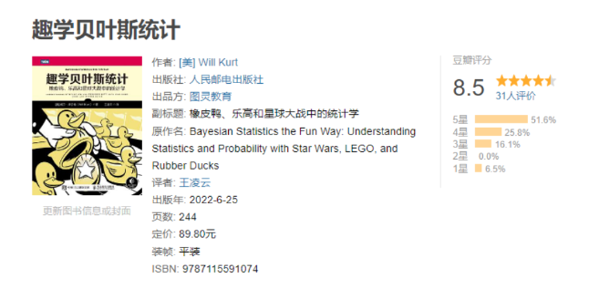

### Python语言

Python语言在先前已经学习了《Python编程：从入门到实践》，这里可以再使用Udemy的课程来快速的回顾一下Python语言：

复习Python语言之后需要进行大量的项目来进行实践，这里采用的是Angela Yu的课程：

然后就是Ardit Sulce的两个Python工程课程：

此外还有就是对Python语言的习题练习。

LintCode的Python习题：

牛客网的Python语言习题：

其他的一些Python课程：

### R语言

R语言的两门Udemy的教程为：

使用的书籍为：

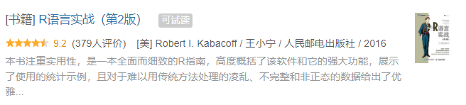

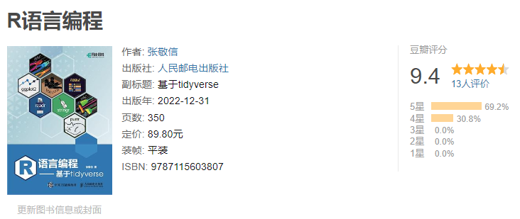

### 数据结构与算法

数据结构与算法并不是数据科学所需的知识，但是是计算机相关的必备的知识，在这里作为支线进行学习。

Python语言之前已经学了：

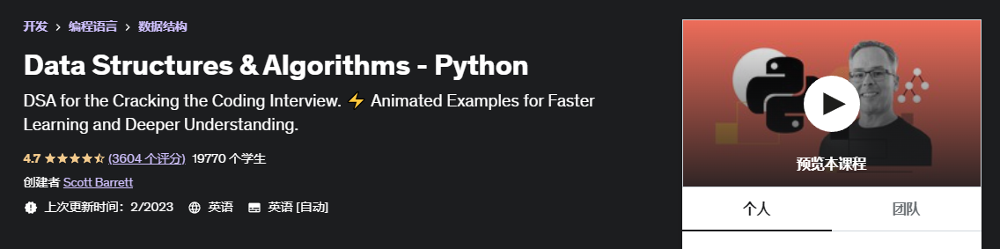

现在可以进一步的学习：

以及进行Python原因的LeetCode的练习：

### 人工智能

一个简单的介绍视频为：

### 数据分析

这本书：

接着上本书的书籍是：

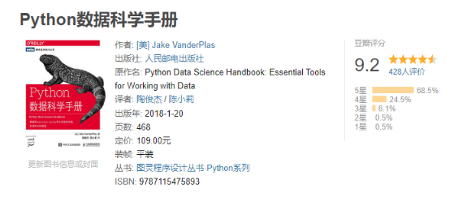

接着是牛客网提供的数据分析相关的习题：

完整的数据分析训练课程：

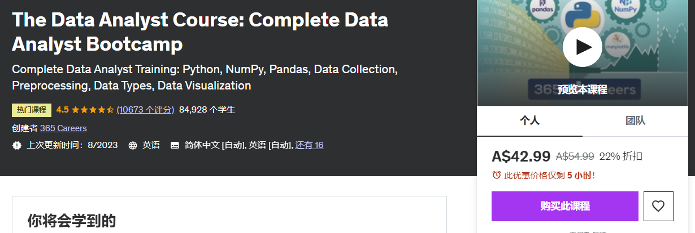

### 时间序列

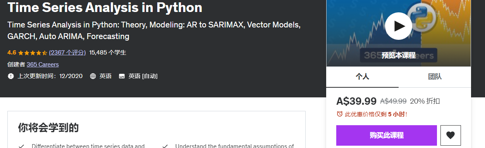

### 数据可视化

可视化的一个概览：

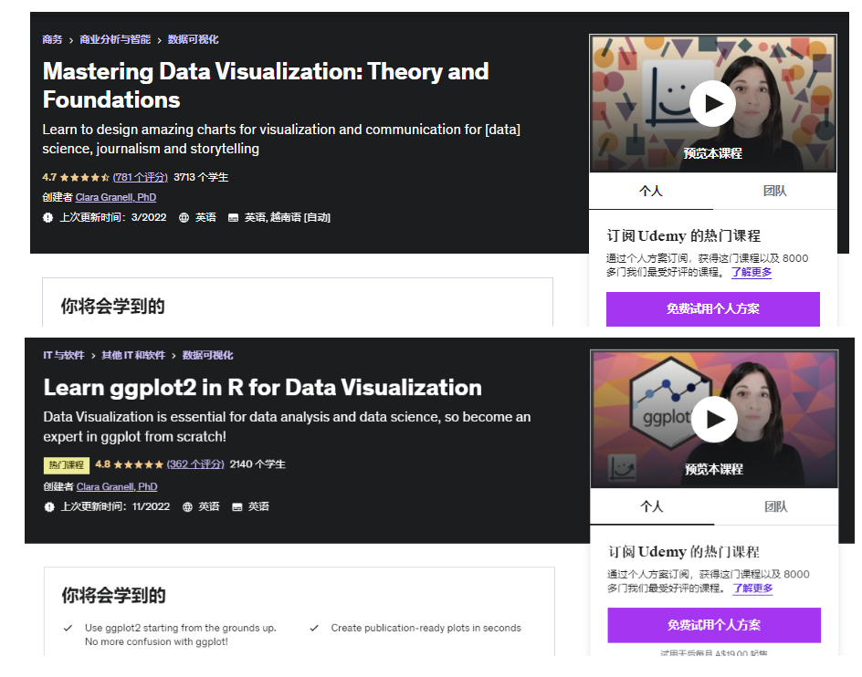

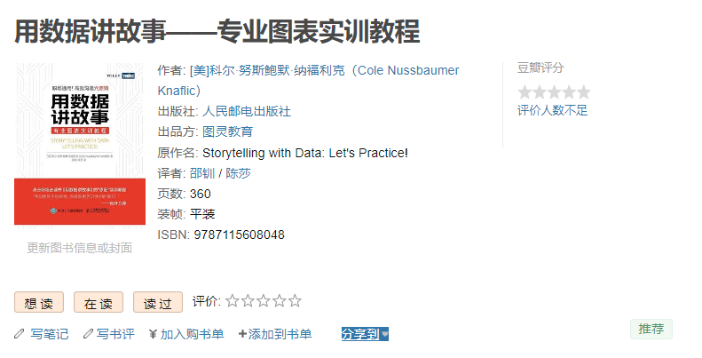

Python的可视化则采用这个Udemy教程：

### 数据科学

一个比较概括的课程：

R语言在Udemy上面关于数据科学的教程：

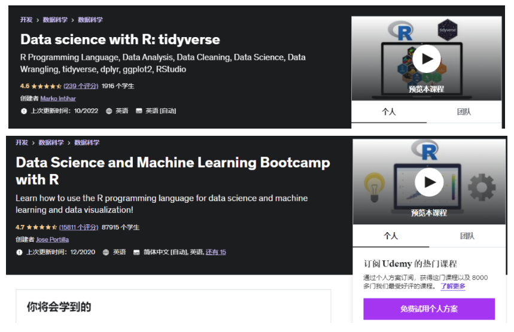

接着是Udemy的几门关于Python数据科学的书籍：

### 数据挖掘

数据挖掘采用的书籍为： [数据挖掘导论](https://www.douban.com/link2/?url=https%3A%2F%2Fbook.douban.com%2Fsubject%2F5377669%2F&query=数据挖掘导论&cat_id=1001&type=search&pos=0)

Udemy的课程为：

Bilibili的课程为：

### 机器学习

机器学习课程则为：

此外还有李沐和吴恩达的课程：

### 深度学习

从头开始搭建一个神经网络：

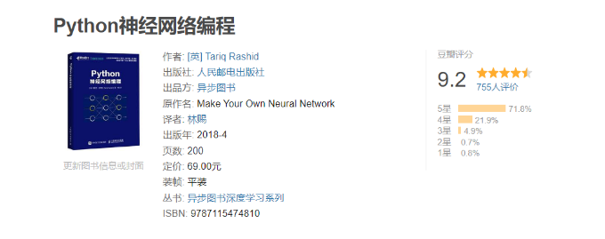

### 项目实战

学完之后一定要自己动手在项目上进行实践。

以及：

一个Kaggle的项目：

### 大数据

大数据首先需要会使用Linux系统。

Linux指令相关采用的教程是：

学完之后采用LintCode提供的Linux习题：

## 艺术

### 艺术史

以及现代艺术：

### 艺术理论

在B站上购买的：

## 英文

### 单词

单词使用的单词书有两本：

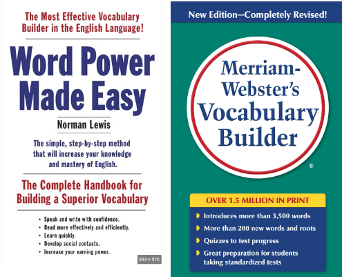

## 娱乐

### 纪录片

纪录片首先必看的是 人生七年系列：

此外，可以看一下这个集合中的纪录片的内容：

另外看大量的TED的演讲，虽然不是纪录片，但是也能够学习很多的内容。

### 电影

电影可以看一下豆瓣TOP 250中的感兴趣的电影，另外可以看一下每年推荐的电影。

豆瓣Top250：https://movie.douban.com/top250

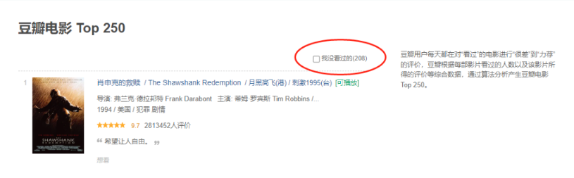

### 动漫

必看的系列：

1. Jojo的奇妙冒险
2. 进击的巨人 漫画 + 动画 全部
3. 剑风传奇 漫画 + 动画 全部

其他的还有一些老的经典的动漫。

### 小说

仙侠必读的是诛仙：

来自新世界：

轻小说必读的书籍为狼與辛香料系列：

## 游戏

- 魂系列游戏：艾尔登法环，上古之魂
- Rogue类：Risk of Rain，Risk of Rain Return，死亡细胞，Hades
- 银河战士恶魔城：神之亵渎，神之亵渎 II
- 像素游戏：Broforce
- 回合战略&策略：Hacknet
- 开放世界：塞尔达：旷野之息

# 成为一位数据科学家完成情况

## Python语言

**LintCode的Python习题：**

**牛客网的Python语言的专项习题**

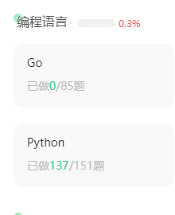

里面有大量的内容是Python2的东西，不是很推荐做这个东西。

**牛客网的在线编程的Python入门篇**

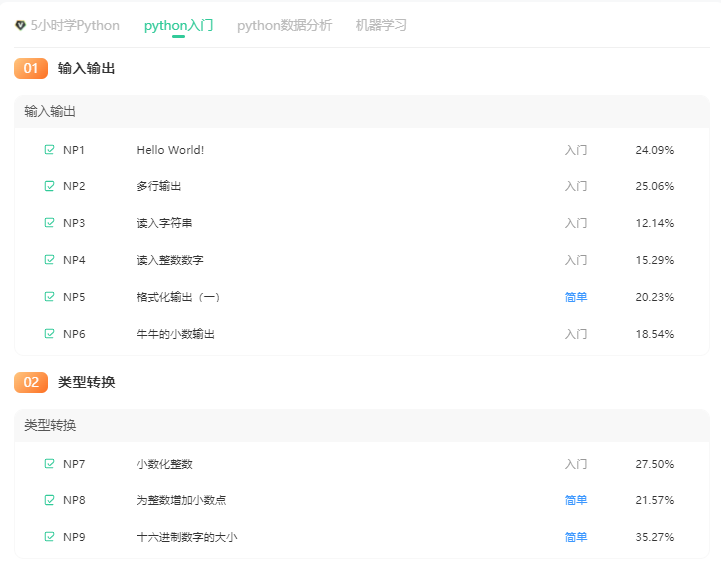

已经全部完成，不错。

**PythonTip的Python语言编程习题：**

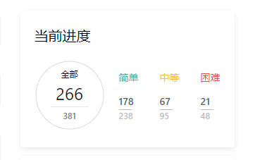

还可以，就是输入输出的格式和别的网站的有一些区别。

**Udemy的100 Python Practices的实现：**

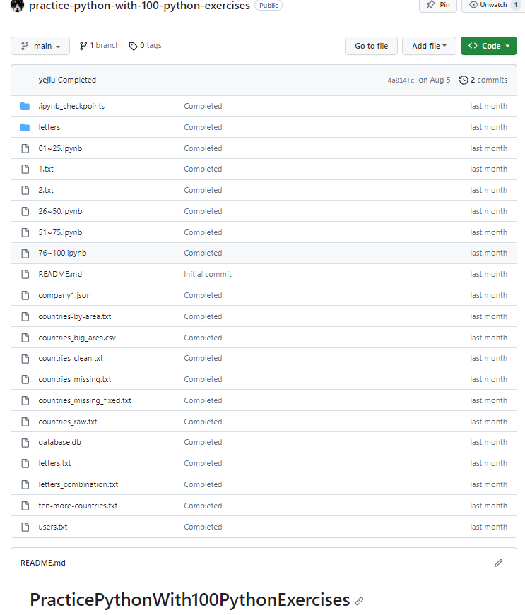

## R语言

**两门Udemy的R语言的课程：**

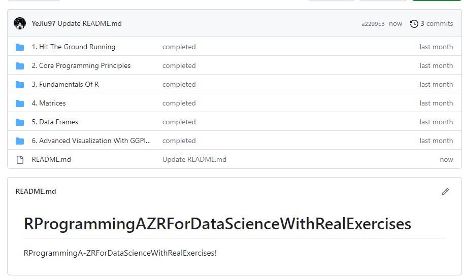

**RCrushCourses的笔记：**

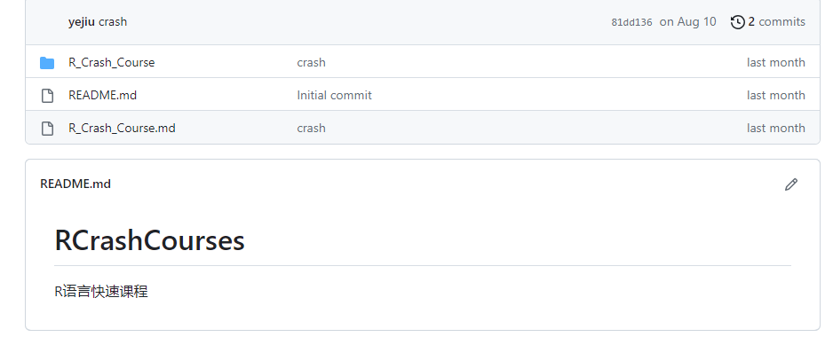

这个不记得是哪个的笔记了，可能是ggplot2 for visualization的R语言的部分。

# 娱乐

## 游戏的完成情况

**Risk Of Rain:**

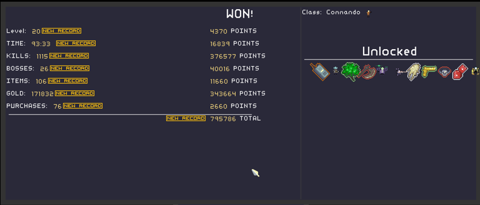

应该是已经通关了，完成了“Final Level”的关卡，重点是杀怪回血，多个飞行器辅助攻击和攻击性质的主动道具，有一些随机性，一定要想办法把地图里面能够拿到的道具都给拿了，运气没有不好的话，基本上就会变成爽游了。

**艾尔登法环：**

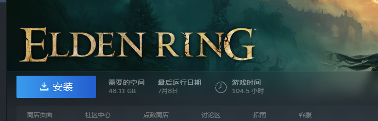

已经完成了一个周目，不过主要是一个好哥哥带着我跑的。艾尔登法环应该是到现在为止的魂系列开放系列的巅峰之作了，但是玩着没有那么印象深刻，我推测大概是这样的几个原因：游戏地图太过于空旷了，虽然是大世界，但是很多东西是重复的空旷的；一周目除非刻意刷级，不然的话经验是根本不够的；帧数不是非常的稳定，不知道是不是AMD显卡的问题。

这个游戏以后有时间的话，用N卡和等有较多的空闲时间的时候自己一个人好好的玩一遍，最多看一下攻略之类的，不然的话有一种围观的感觉。

**死亡细胞**

很不错，不过玩多了之后就有一些疲劳，这个游戏的一个解决方法是不同细胞数目会增加新的类型的怪，不过玩多了还是有一些疲劳，这可能是这种类型的游戏的通病。

**Hades**

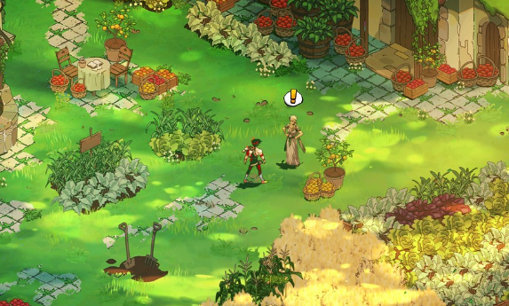

这也是一个非常优秀的作品，尤其是美术风格，不过和死亡细胞是同一个类型的作品，为了避免疲劳的方法是通过热度来限制给自己添加debuff，不过也是会面领着疲劳的问题。

**神之亵渎I**

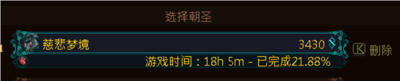

很有深度的作品，刚开头的雪山对新手的难度可能有点儿大了，主要是动作流畅度有些沉重，一周目很快就完成了，dlc的白蛇的地图的强度过高，和血污联动的跳跳乐后面的一张图太长了难度过高，别的都非常的好，游戏是风格非常的帮，个人认为轮回的解决才是真结局，至于登升的二周目，需要弄到红忏悔后期会从debuff变成buff。

**神之亵渎II**

刚出来之后花了10个小时左右：

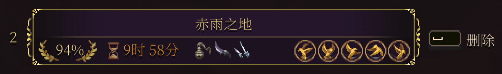

打完了最终的boss，但是不像第一代一样再次进入可以二周目进行debuff探索：

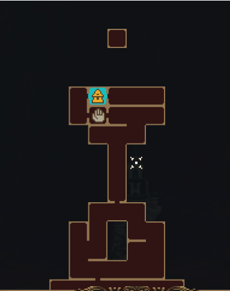

需要等官方更新补丁和DLC。

**Broforce**

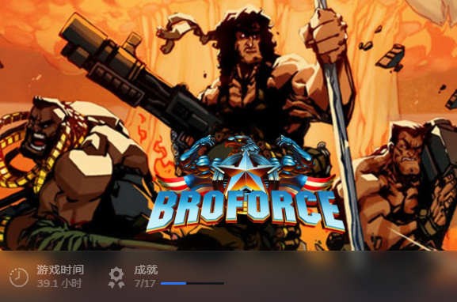

武装兄弟连，一款比较老的游戏，联机和别人一起玩非常有趣，建议在打折的时候购入，不要原价购买。

**塞尔达：荒野之吸**

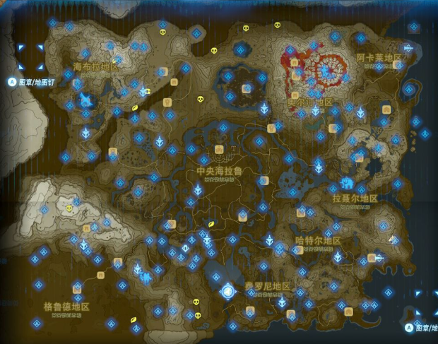

用台式机跑模拟器流畅度比在switch上面玩这个游戏流畅太多了，体验好了太多。玩下来的感觉只能够说这个游戏实在是太耐玩了，是玩过的开放世界中的巅峰之作。

