# 2023年需要完成什么

**心智认知**

- 学习效率：学习观，断墨寻径，新生：七年就是一辈子

- 脑科学：大脑与生活，脑科学新知20讲
- 如何做研究：研究是一门学问

**健康**

- 健身：卓叔增重，大师课：耐克大师级教练
- 正念：HeadSpace：正念冥想，大师课：正念

**数学**

- 数学思维：什么是数学 : 对思想和方法的基本研究，优美的数学思维（原书第2版） : 问题求解与证明
- 微积分：Become a Calculus Master系列，【官方双语/合集】微积分的本质 - 系列合集，微积分入门
- 线性代数：麻省理工公开课：线性代数，麻省理工公开课：线性代数习题课，线性代数第五版，Become a Linear Algebra Master，【官方双语/合集】线性代数的本质 - 系列合集，线性代数应该这样学 : 第3版
- 概率统计：Become a Probability&Statistics Master，Math for Data Science，概率论基础教程（原书第10版），趣学贝叶斯
- 另外的一本：程序员数学

**编程**

- Python：Python Pro 100 Days，Advanced Python Programming，The Python Mega Course，LintCode之类的网站的Python习题，The Art of Doing，Python Projects for Beginners
- R语言：R Programming A-Z tm系列，R语言实战，R数据科学
- SQL：SQL必知必会，MySQL必知必会，牛客网和LintCode的数据库习题
- 数据结构与算法：LeetCode in Python，算法精粹

**数据科学**

- 数据分析：Learn how to work with data，利用python进行数据分析，The Data Analyst Course
- 时间序列：Python for Time Series Data Analysis，Time series in Python
- 数据可视化：Mastering Data Visualization，用数据讲故事，Learn ggplot2 in R for Data Visualization
- 数据科学：The data science Course 20223，Python A-Z TM，Data Science A-Z TM
- 数据挖掘：Data Mining with R，R语言数据分析入门与数据挖掘
- 机器学习：白话机器学习的数学，吴恩达：机器学习，李沐：动手机器学习
- 深度学习：Python神经网络编程，深入学习入门，深度学习进阶，深度学习入门2，动手深度学习（如果时间足够）+ 李沐在Bilibili上面的课程
- 项目：Python数据科学项目实战，R数据科学项目实战，Python机器学习项目实战，Kaggle Master with Heart Attack
- Linux：The Linux Command Line Bootcamp

**英文**

- 单词：Word Power Made Easy，IELTS Vocabulary
- 语法：Master English Grammar
- 口语：Voice Training
- 写作：Score High IELTS Writing (General Training Module)，Score band 7 + in Academic IELTS Writing Task 1，Mastering IELTS Writing Task 2 (Achieve Band 7+ in 7 Hours)，Mastering IELTS Writing - Task 2 (Band 9 Model Answers)
- 雅思：The Complete IELTS Guide，IELTS Band 7+

**Web(如果时间足够)**

- Django：AcWing：Django，The Ultimate Django Series
- Web：AcWing：Web应用课，CS50 Python & JavaScript Web

**其他**

- 纪录片：人生七年，极简主义

- 动画：诛仙，雾山五行，鬼灭之刃，Jojo的奇妙冒险，打工吧魔王大人，剑风传奇，一些别的动画，进击的巨人
- 游戏：艾尔登发还，渎神，塞尔达，烟火，渎神II，Hacknet
- 小说阅读：狼与香辛料，来自新世界，诛仙
- 电影：看一些高分的经典的电影

# 编程

## Python编程

**TheModernPython3BootcampNotes**

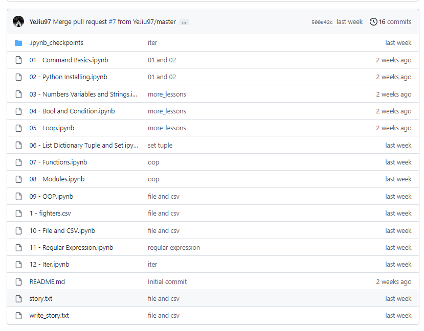

这个教程有关于爬虫的，这个先不准备管，还有一个关于数据库的内容，这个等学数据库的时候在看一下和更新。

**牛客网Python习题：**

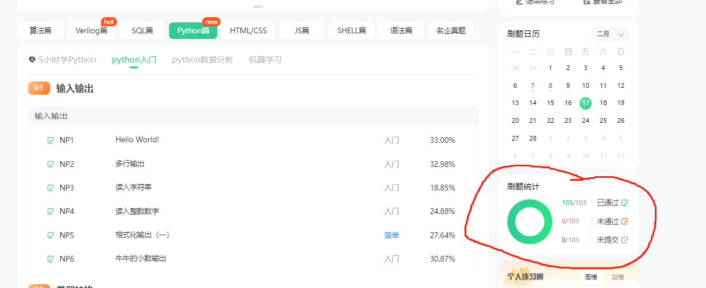

**LintCode：Python习题**

所有非VIP能够做的题目都已经完成：

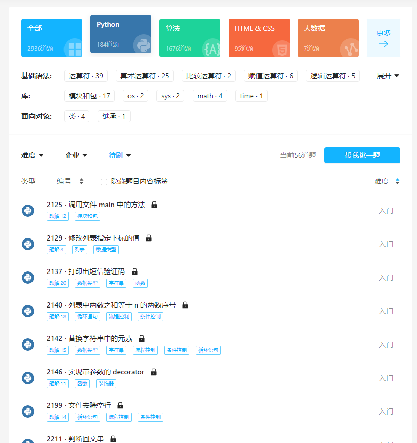

**PythonTip习题**

这个网站现在打不开了：

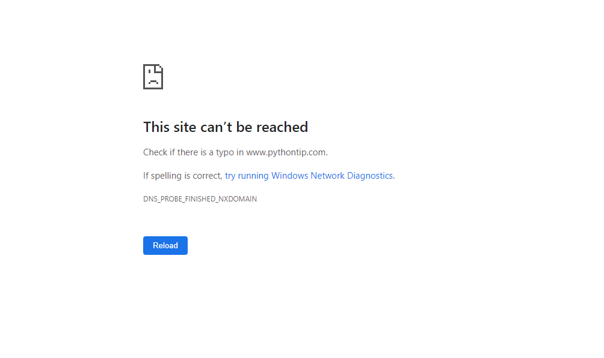

做了一半多的题目，大概一百道？不太记得了，忽然间打不开了，可能是因为难以盈利所以维持不下去了。

这个网站重新上线了，这是结果：

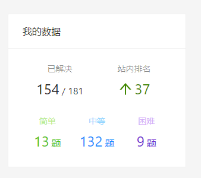

暂时就这样了，剩下的不太想做了，先去做别的。

**牛客网Python专项训练**

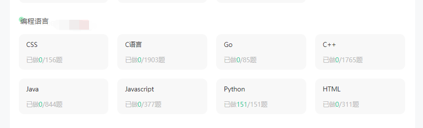

从结果来看，有些题目有一些旧了。比如说有些问题使用的是

```
print a
```

而不是

```
print(a)
```

还有就是有些功能在Python3.x中被实现了，而原先是没有的。

**完成了Practice Python With 100 Python Exercises：**

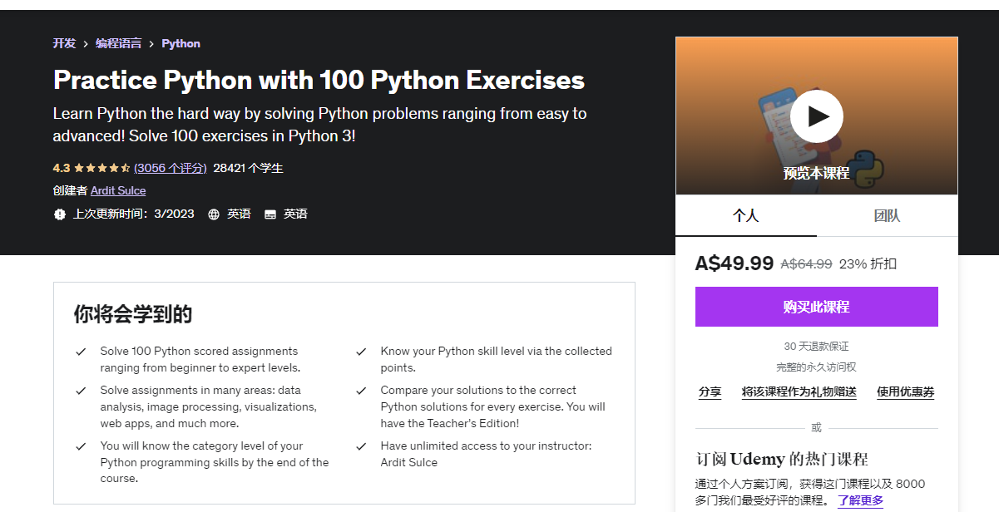

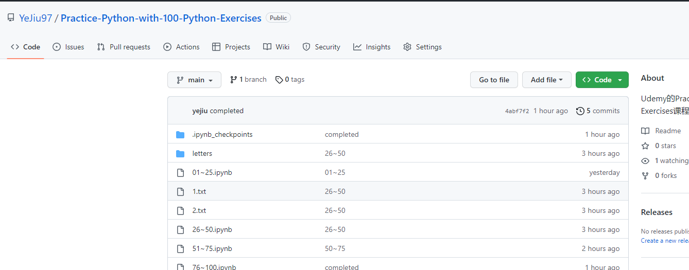

大约在90开始，涉及到sqlite和flask，这些看着做了，但是具体的需要之后学习的时候进行深入学习。

## C++语言

**LintCode：C++习题**

习题完成如下所示：

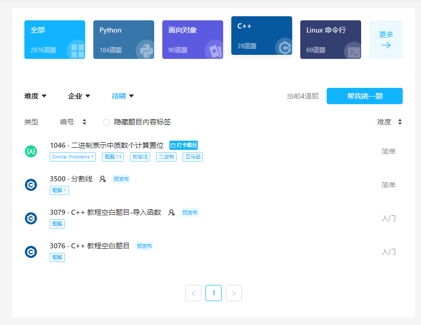

没有做的这三题点开显示的结果是没有此题，可能是没有正式发布，亦或者是哪里有什么问题。

**牛客网：C++**

2023/02/08，完成将近一半，面向对象以及之后的需要稍微复习一下再来做，熬夜不是很好的习惯，对脑子不是非常好：

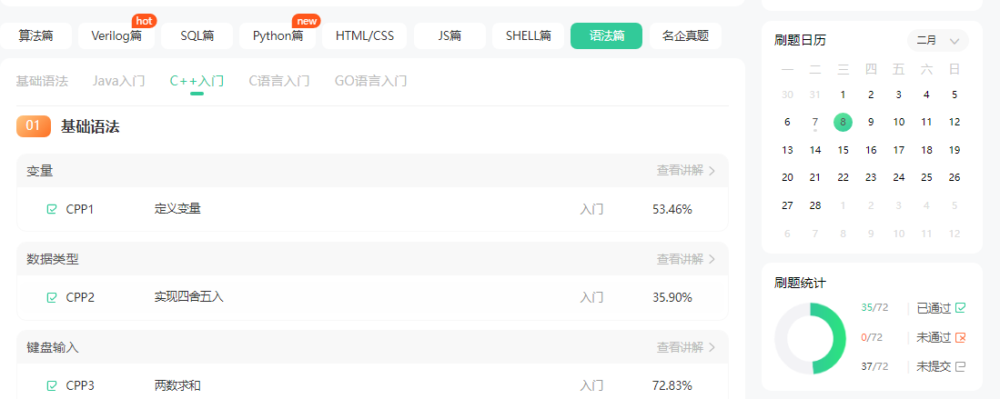

这章：


以及之后的内容等复习一下C++的知识点在回来做。

# 数据科学

## Linux

**The Linux Command Line Bootcamp: Beginner To Power User**

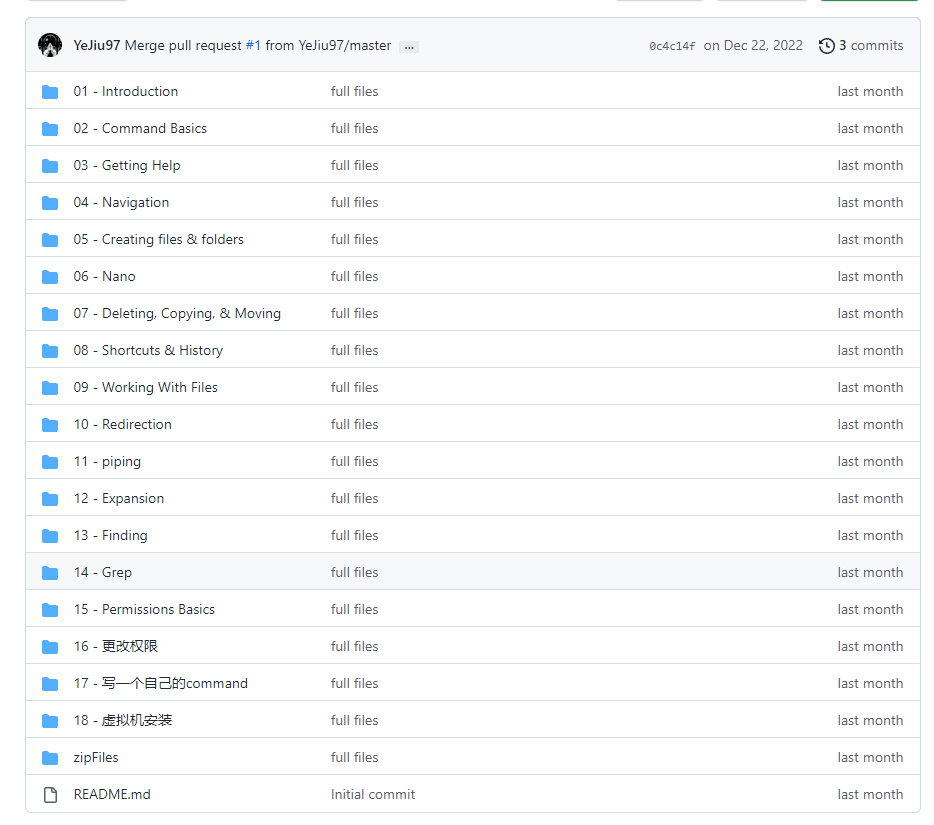

这个教程后面关于权限和写自己的command的部分还不是非常的理解，匆匆忙忙看过去了，其他的多做多用就可以了，不怎么用的很容易忘了。

**LintCode:Linux习题**

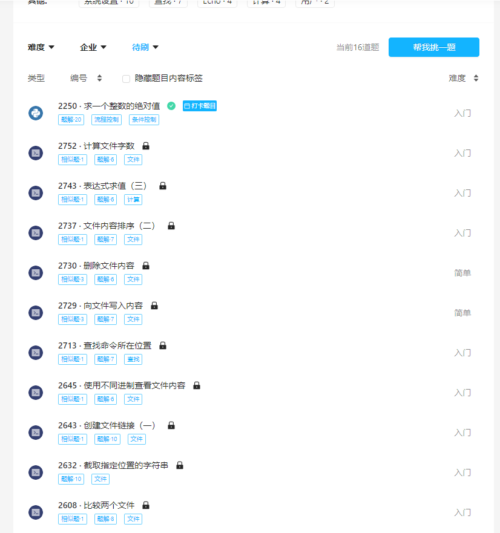

除了需要VIP的题目，其他的题目都已经完成，题目量不大，也没有什么难度，最多因为用得少所以需要查一下指令怎么用。

**牛客网：Linux专项训练**

2023/01/30：题目有一些比较简单，涉及到的是基础指令的使用，但是有一些比较困难，比如说关于gateway，group之类的，题目涉及的知识点比LintCode上面的要多：

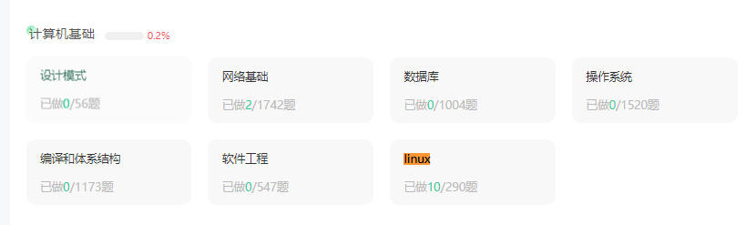

题目截止到日期位置只是试探性的做了一下，如果要接着做，需要系统性的学习一下Linux系统，而不是单纯的了解一些指令的使用。日后在回来做这个训练。

## 可视化

**概览**

观看的是Udemy的这门课程：


笔记地址为：[https://github.com/YeJiu97/visualization-ggplot2-notes/tree/main/00%20-%20MasterDataVisualization](https://github.com/YeJiu97/visualization-ggplot2-notes/tree/main/00 - MasterDataVisualization)

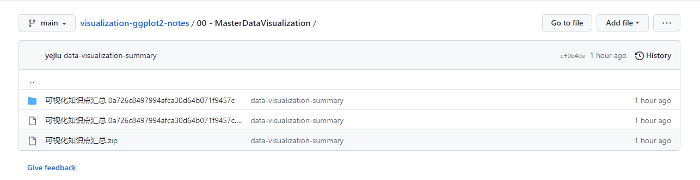

提供了一个不错的关于可视化的overview，但是更多的还是需要自己进行练习。

## 数据科学实战

**Kaggle Attack Heart Prediction**

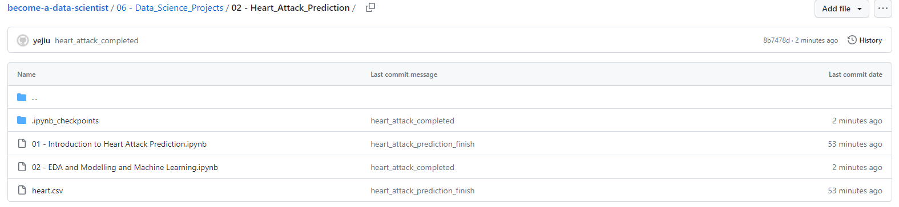

已经完成，感觉调用库非常的省事，但是更好的方法是先自己学习知识点和尝试自己写代码实现一下这个库的一些功能，然后再使用已经被搭建好的库，另外有一些库更新了内容，所以keyword发生了改变。

# 娱乐

## 小说

因为动漫，所以回过头去回顾了一下小说：

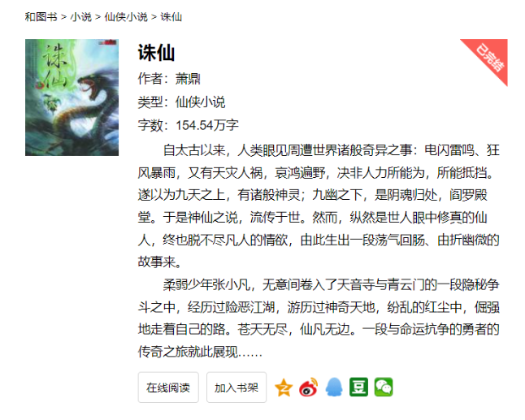

小说感觉有点儿烂尾了，主要是后半部分，感觉有些匆忙了。

这本书大体上有这样的一些问题：

1. 年龄的问题，碧瑶陆雪琪等人其实应该比主角张小凡年龄大了非常多，不过这里的年龄指的是生理年龄，心理年龄就不好讲了，毕竟是修仙的。
2. 小白和兽神是怎么认识的。。。？小白还认识玲珑么？
3. 兽神洞前有两个黑影，一个在兽神无了的时候一起无了，还有一个逃走了，说是有自己的目标要实现，这个目标是什么？后面有怎么样了？这和焚炎谷的计划又有什么关系？焚炎谷的计划后面又怎么样了？
4. 青龙是死了还是怎么样？朱雀和万剑一又是什么关系？周一仙又是谁？
5. 鬼先生的身世还是成谜，而且鬼王直接被四兽灵阵给腐蚀了，怎么鬼先生一点儿事情都没有？鬼先生被秒了，怎么鬼王又好好的？
6. 除此之外的话还有很多问题，最重要的一点儿在于，“天地不仁，以万物为刍狗”这个主题没有很好的展示出来

## 动画

**诛仙**

一剑诛仙，情撼九天。

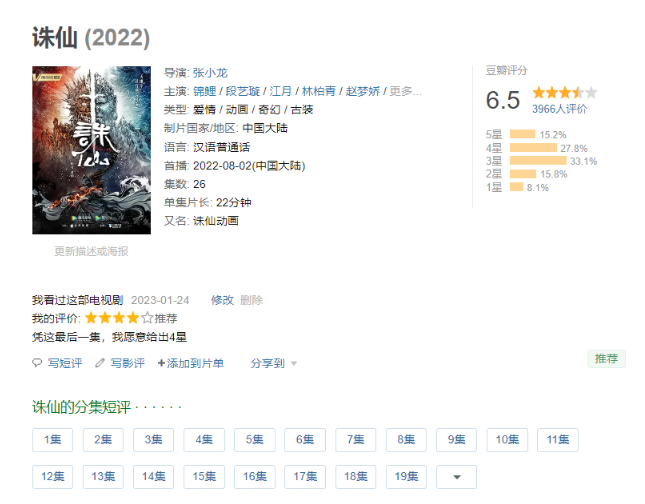

大过年的看碧瑶舍身挡剑，刀死我算了。

推荐两首歌：

1. [只为情故](https://www.bilibili.com/video/BV1Mx4y1u725/?spm_id_from=trigger_reload&vd_source=70cc82c6f851aaa826e5c863112d2113)
2. [【Hi-Res】【原创】诛仙《竹语》完整版，诛仙动画插曲](https://www.bilibili.com/video/BV1jM411C7Nm/?spm_id_from=333.337.search-card.all.click&vd_source=70cc82c6f851aaa826e5c863112d2113)

看消息是有第二部了：

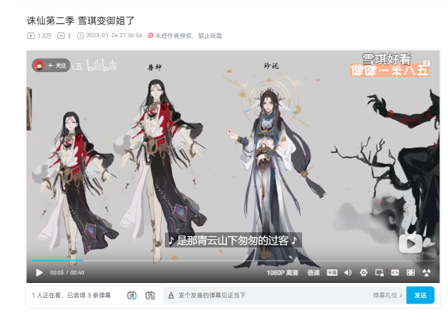

不过兽神的话，感觉太女性化了。按照女性来画然后说这是男的和按照男性来画，然后通过妆容服饰气质姿态来展示一种中性的美还是有一些区别的。玲珑非常好看，但是原著里面玲珑也没有多少出场的情况。

**来着深渊**

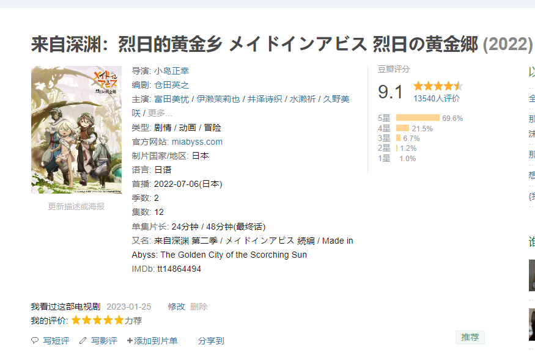

可以的，土笔，弹药包之后还能够整出煲仔饭这种狠活，实在是太厉害了。

**电锯人**

去年看的这个漫画，脑洞大开，今年看的动画，不过动画只动画化了漫画的一部分：


总体上感觉还行，三渲二看着有点儿奇怪，不过不是非常的影响。

**因为太怕痛就全点防御力了**

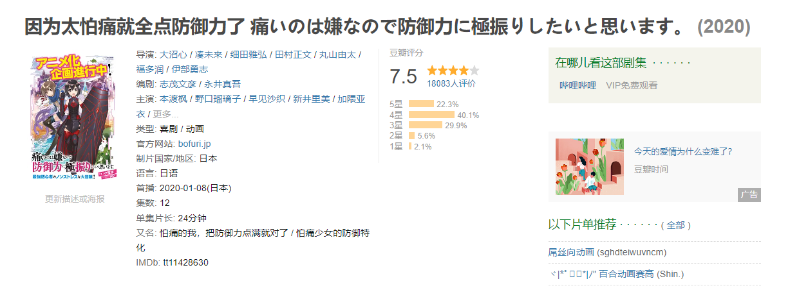

龙傲天文的性转版，从进攻变成防御。废萌番，不用带着脑子看，当爽文来看就好了。我跟人不是非常喜欢这种没有深度或者思考的番剧，但是总体趋势上是这样的一个走向。日漫的动漫从最开始的大剑，剑分传奇之类的青年向，有深度的动漫，逐渐的走向废萌，其实一定程度上也可以反应社会的变化。

**我立于百万生命之上**

我以为是异世界欢乐喜剧番，没想到直接给了我一刀：


这构图感觉有点儿经典啊：


我联想到的是：


这个场面更加的经典。滑稽.jpg

**在地下城寻求邂逅是否搞错了什么 第四季**

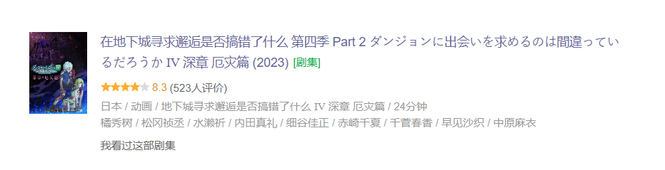

还不错，但是没有第一季看的时候观感那么好了，可能是因为时间过了。

**打工吧魔王大人第二季**

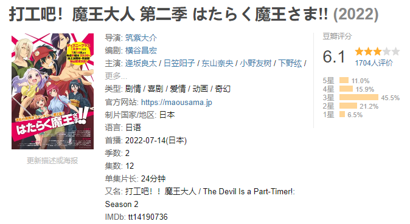

画质比第一季来的好，但是动作流畅度非常的低，很奇怪。另外小说的结尾烂了，只能够说很可惜。

## 电影

**剑风传奇 黄金时代 三部曲**

最开始看的电影是动画电影：

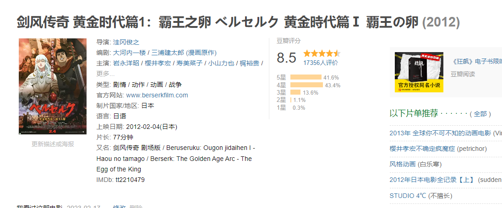

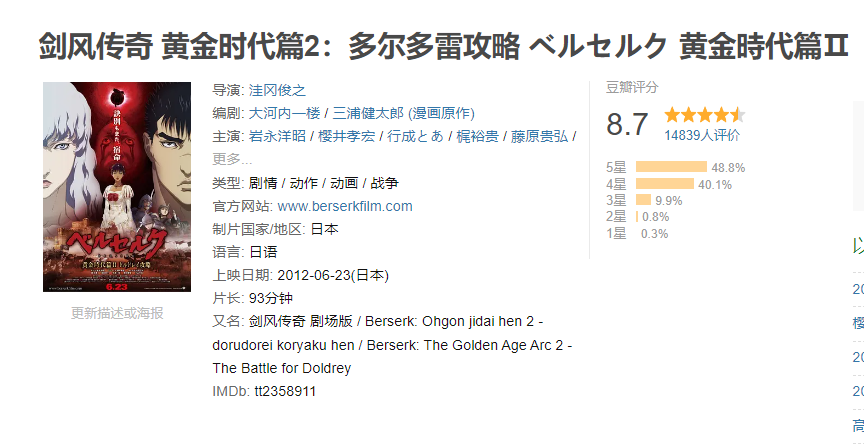

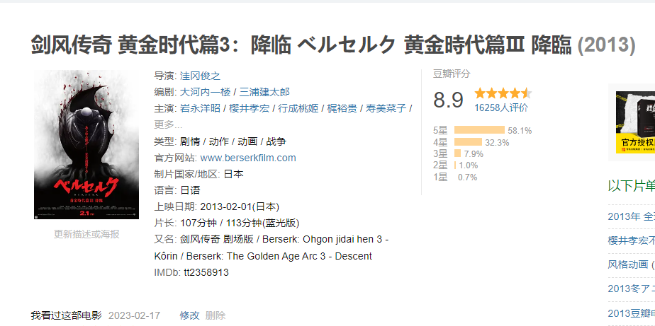

非常精彩，不要说和别的漫画比，就算是和经典文学比，也是不遑多让。叙事水平极高，人物关系错综复杂，并且剧情发展环环相扣。里面有很多我玩魂系列的候的人物的原型。

**楢山节考**


导演界的人类学家，“我将书写蛆虫，至死方休”，大师就是大师。

**摆渡人**

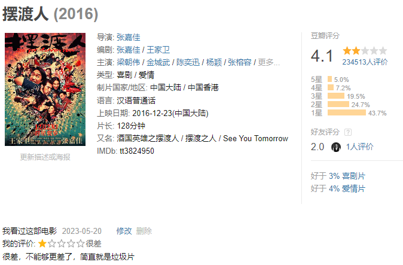

用“垃圾”两个字来进行形式，是对垃圾的侮辱。

## 游戏

**塞尔达：荒野之息**

打败了最终boss：

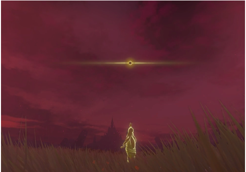

和公主重逢：


一个问题在于打完了就强制回到了主界面，如果选择继续游戏又从主殿开始，而不是除了这个最终boss之外让玩家能够继续探索，这里我觉得应该提升一下，参考黑魂3，可以在打完薪王的化身之后选择不进入下周目而是可以继续探索，塞尔达也可以选择在打完最终boss之后从初始台开始继续让玩家探索地图剩下来的容。

**英雄联盟**

13.1版本，黄金：

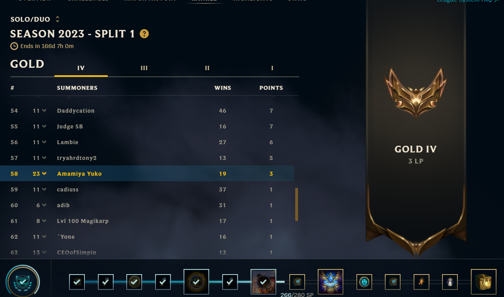

奖励到手，接下来随便打打。

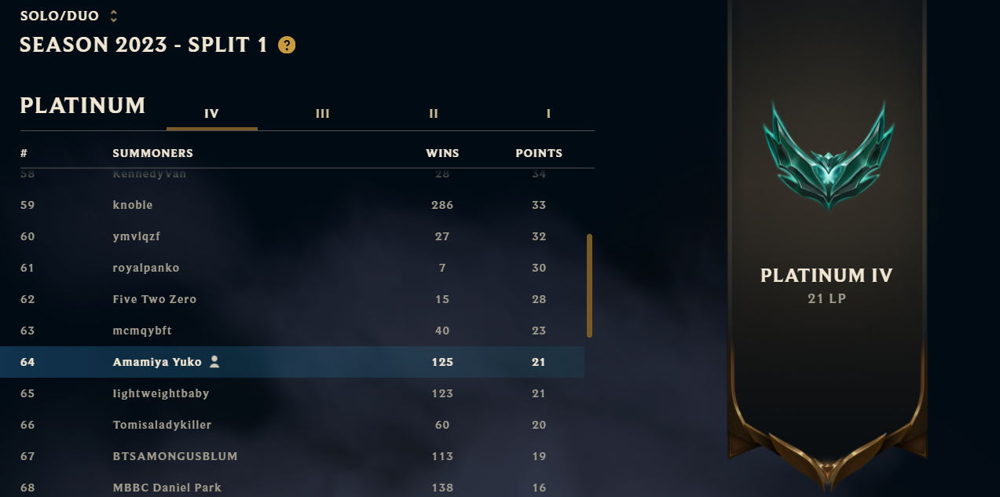

打不动了打不动了，换个小号玩玩。

**烟火**

这个游戏剩下最后一个成就没有解锁：

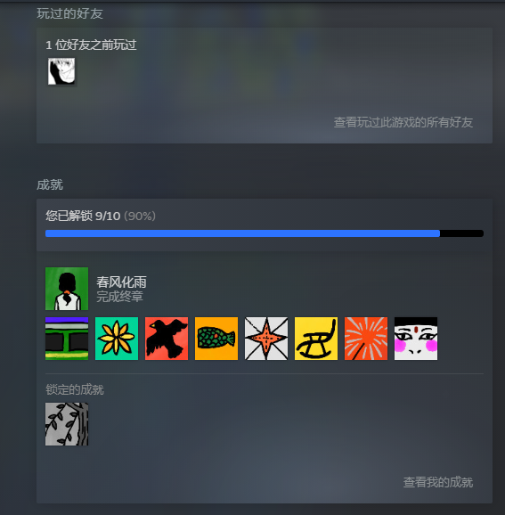

这个成就需要听完最后的歌曲，需要的话挂机一下就解锁了，但是已经卸载游戏了，不想再下载。

补充：其实就是一个视觉小说，也没有什么选项或者bad ending。

**渎神**

一周目10个小时基本完成了，但是花了6~7个小时去做收集和成就，还是没有全成就，有点儿难顶。。。

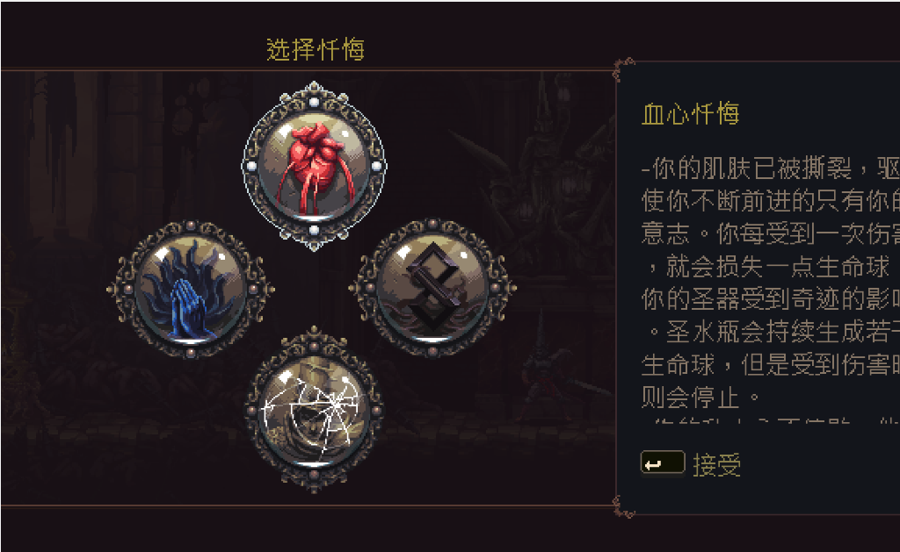

二周目，红忏悔，有点儿难顶。

**艾尔登法环**

为菈妮，我变成狼人模样，为菈妮，我染上了疯狂：


还有一些成就什么的没有做，之后开个新的存档做一下好了，这个存档被人带着打了一圈。