# 2023年需要完成什么

**2023年需要完成的心智目标。**

- [ ] 学习效率：《新生：七年就是一辈子》，Yjango的学习观和断墨寻径，为什么精英都是时间控，为什么精英这样用脑不会累
- [ ] 实践：原则，原则：应对变化中的世界秩序，穷查理宝典
- [ ] 脑科学：大脑与生活，脑科学新知20讲
- [ ] 健康：卓叔增重，28天健身，健身大师课
- [ ] 正念：Headspace正念，大师课：正念

**2023年需要完成的数据科学家的目标。**

- [ ] Python编程：100 Days of Code，Advanced Python Programming 10 OOP，The Python Mega Course
- [ ] R语言：R Programming A-Z TM，R Programming Advanced Analytics，R语言实战
- [ ] SQL：SQL必知必会，MySQL必知必会，The Complete SQL Bootcamp，The Ultimate MYSQL Bootcamp，SQLite for beginners，LintCode+LeetCode+NowCoder的数据库习题，sqlzoon和xuesql
- [ ] 数据结构与算法：Advanced Algorithms and Data Structures in Python，LeetCode In Python：50 Algorithm，算法面试通关40讲，算法精粹
- [ ] 人工智能：AI For Everyone，AI and Meta-Heuristics Python
- [ ] 数据分析：数据分析思维，戴你玩数据分析，利用Python进行数据分析，牛客网：Python数据分析，Python for Time Series Data Analysis，Survival Analysis in R
- [ ] 数据可视化：Master Data Visualization， 用数据讲故事，Learn ggplot2 in R，Tableau 2022 A-Z，Tableau 2022 Advanced: Master Tableau
- [ ] 数学：
  - [ ] 通识：什么是数学
  - [ ] 微积分：度量，Become a Calculus Master系列，简单微积分，微积分的本质
  - [ ] 线性代数：Become a Linear Algebra Master系列，线性应该这样学，线性代数的本质
  - [ ] 概率论与统计学：Become a Probability & Statistics Master，Math for Data Science Masterclass，统计学：基于R，统计学：从数据到结论
- [ ] 数据科学：
  - [ ] 数据科学：The Data Science Course: Complete Data Science Bootcamp，Data Science with R: Tidyverse， Data Science and Machine Learning Bootcamp with R， Python A-Z TM，Data Science A-Z TM，加州大学伯克利分校 数据科学
  - [ ] 数据挖掘：数据挖掘导论，Data Mining with R，R数据分析入门与数据挖掘基础
  - [ ] 机器学习：Machine Learning A-Z TM，Python for Data Science and Machine Learning Bootcamp
- [ ] 数据科学实战：Python数据科学项目实战，R数据科学实战，Kaggle Master with Heart Attack Prediction Kaggle Project
- [ ] Linux：Linux Administration，AcWing：Linux工程课
- [ ] 经济：逃不开的经济周期，债务危机

**2023年需要完成的插画目标。**

- [ ] 艺术史：艺术的故事，西方艺术理论与哲学

**2023年需要完成的英文目标。**

- [ ] 单词：Word Power Made Easy，IELTS Vocabulary
- [ ] 语法：KO大魔王，Master English Grammar
- [ ] 听力与口语：小鹿绅士的地道英语课，Voice Training
- [ ] 写作：Score High Ielts Writing (General Training Module)，Score band 7 + in Academic IELTS Writing Task 1，Mastering IELTS Writing Task 2 (Achieve Band 7+ in 7 Hours)，Mastering IELTS Writing - Task 2 (Band 9 Model Answers)
- [ ] 雅思备考：The Complete IELTS Guide，IELTS Band 7+，顾家北，雅思真题

**2023年需要完成的对自己的通识教育。**

- [ ] 哲学史：世界哲学史
- [ ] 批判性思维：学会提问，超越智商

**2023年需要完成的娱乐。**

- [ ] 纪录片：人生7年系列
- [ ] 动漫：jojo的奇妙冒险全系列（动画），进击的巨人 漫画 + 动画，剑风传奇 漫画 + 动画
- [ ] 小说：来自新世界，狼与辛香料
- [ ] 游戏：艾尔登法环，神之亵渎I，神之亵渎II，Hacknet，Hack Run，Hack Time，Hack Zero，SiFu，塞尔达：荒野之息，圣女战旗，上古之魂

# 编程编程

## Python编程

**TheModernPython3BootcampNotes**

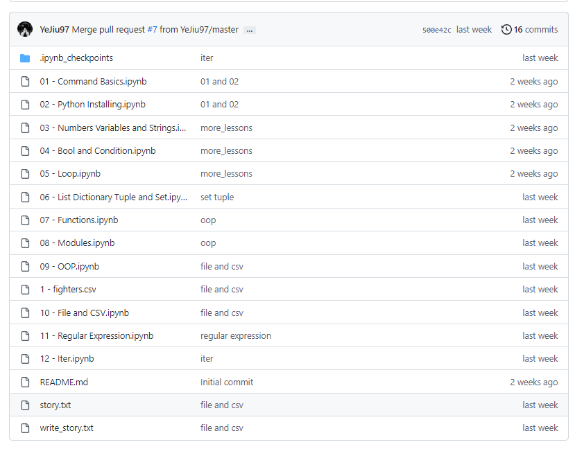

这个教程有关于爬虫的，这个先不准备管，还有一个关于数据库的内容，这个等学数据库的时候在看一下和更新。

**牛客网Python习题：**

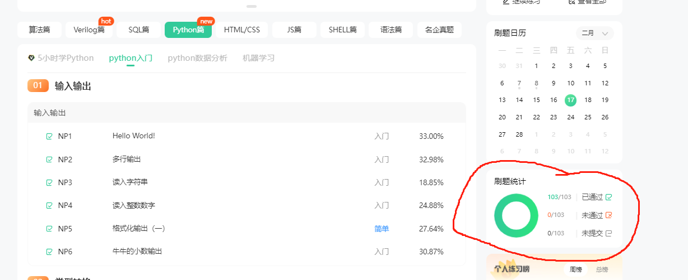

**LintCode：Python习题**

所有非VIP能够做的题目都已经完成：

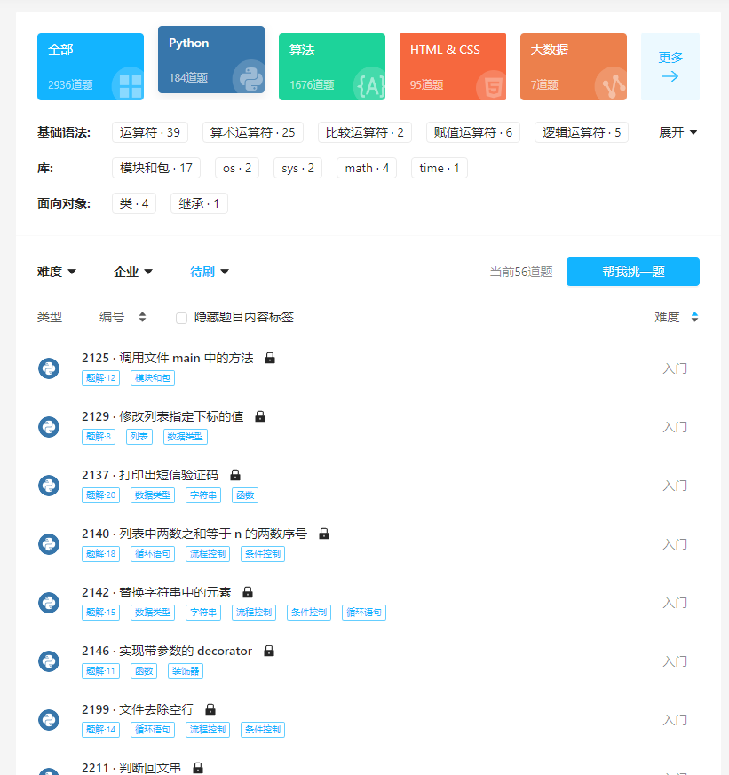

**PythonTip习题**

这个网站现在打不开了：

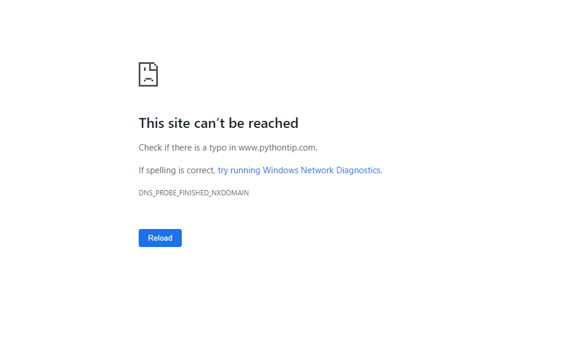

做了一半多的题目，大概一百道？不太记得了，忽然间打不开了，可能是因为难以盈利所以维持不下去了。

这个网站重新上线了，这是结果：

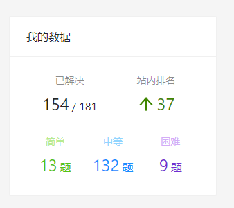

暂时就这样了，剩下的不太想做了，先去做别的。

**牛客网Python专项训练**

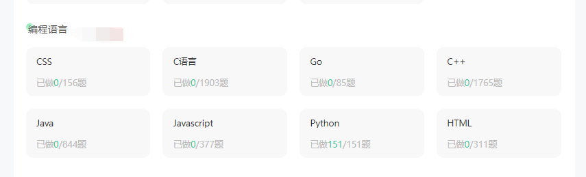

从结果来看，有些题目有一些旧了。比如说有些问题使用的是

```
print a
```

而不是

```
print(a)
```

还有就是有些功能在Python3.x中被实现了，而原先是没有的。

完成了Practice Python With 100 Python Exercises：

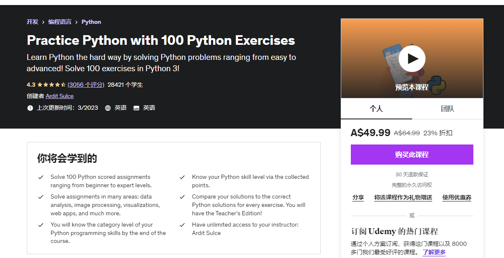

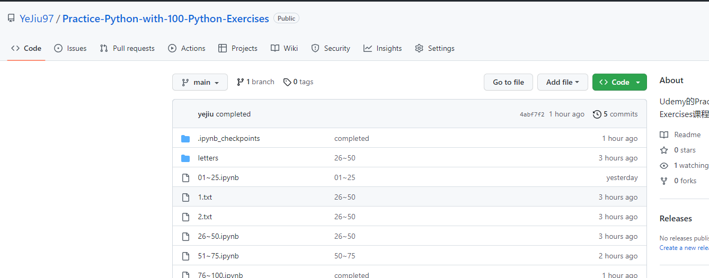

大约在90开始，涉及到sqlite和flask，这些看着做了，但是具体的需要之后学习的时候进行深入学习。

## C++语言

**LintCode：C++习题**

习题完成如下所示：

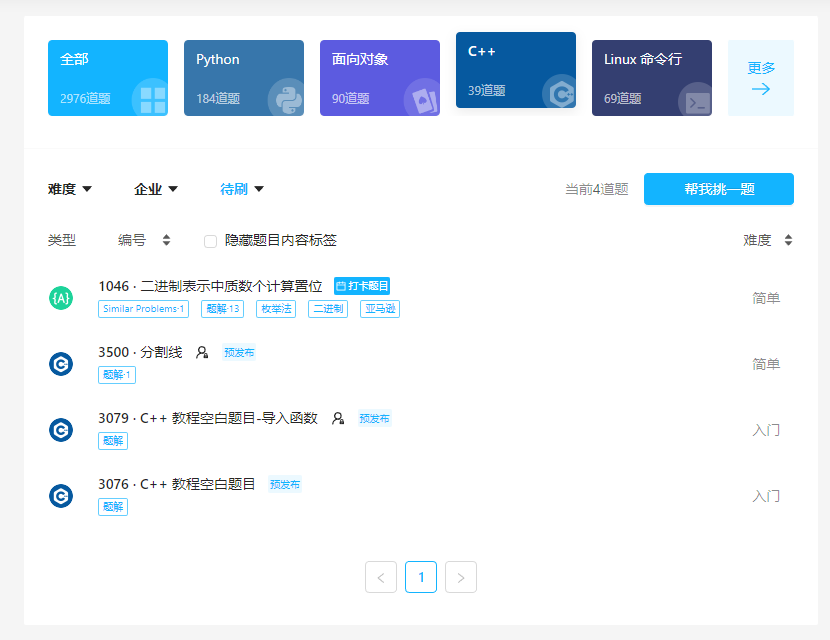

没有做的这三题点开显示的结果是没有此题，可能是没有正式发布，亦或者是哪里有什么问题。

**牛客网：C++**

2023/02/08，完成将近一半，面向对象以及之后的需要稍微复习一下再来做，熬夜不是很好的习惯，对脑子不是非常好：

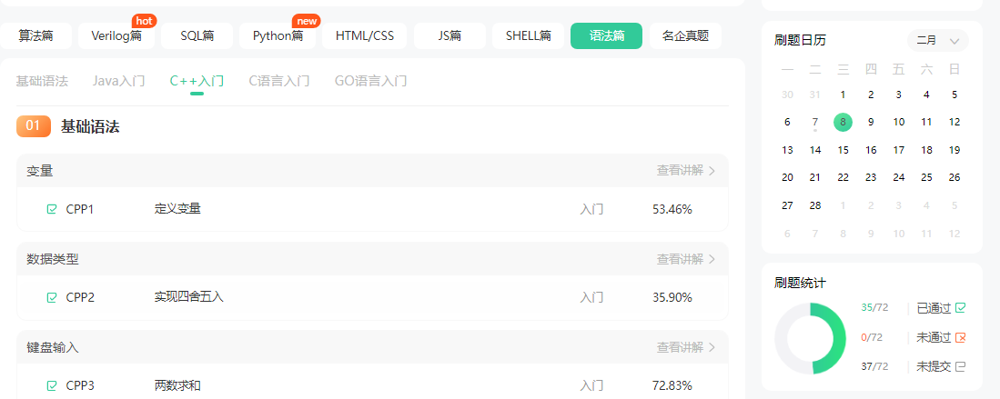

这章：

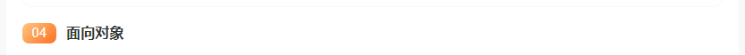

以及之后的内容等复习一下C++的知识点在回来做。