# 2024年需要做什么

## 心智认知

### 社会实践

达-瑞欧的《原则》：

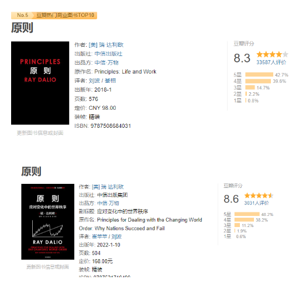

控制论：

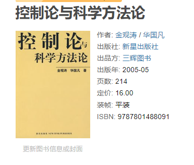

### 脑科学

大脑：

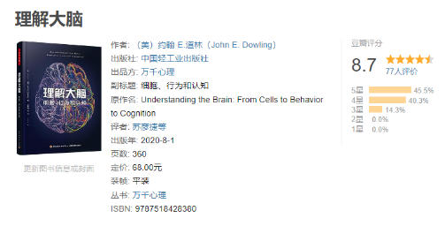

神经科学：

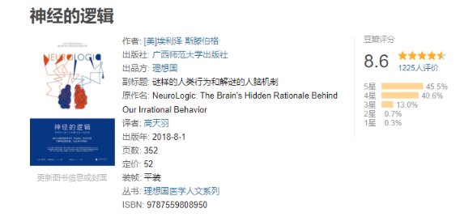

## 如何进行研究

书籍：

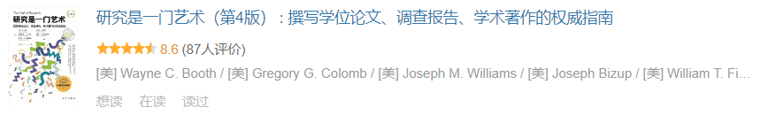

## 成为一位数据科学家

### 数学

#### 数学思维

在学习具体的数学之前，要对数学本身有着一个概览。

第一本需要看的书籍是，《[什么是数学 : 对思想和方法的基本研究](https://book.douban.com/subject/27061912/)》

这是关于这本书的简介：

> 《什么是数学》是世界著名的数学科普读物，它搜集了许多经典的数学珍品，对整个数学领域中的基本概念与方法，做了精深而生动的阐述。无论是数学专业人士，或是愿意作数学思考者都可以阅读本书。特别对中学数学教师、大学生和高中生，本书都是一本极好的参考书。

第二本需要看的书籍是，《[优美的数学思维（原书第2版） : 问题求解与证明](https://book.douban.com/subject/35197539/)》

这是关于书籍的简介：

> 本书以大量生动有趣的问题求解实例为背景，使用通俗易懂的语言，深入浅出地介绍优美的数学思维和严谨的证明方法，所涉及的数学内容不仅包含函数与集合、数学归纳法理论、组合计算与组合证明、整数理论、数理逻辑、图论等离散数学，而且包含微积分与实数理论等连续数学，覆盖了多个不同的数学领域。本书内容在逻辑上层层展开、环环相扣，形成一套相对完备的知识体系。本书的内容可以有效地激发学生的学习兴趣，唤醒学生的数学潜能和数学思维。

#### 微积分

**微积分的历史**

**微积分综合**

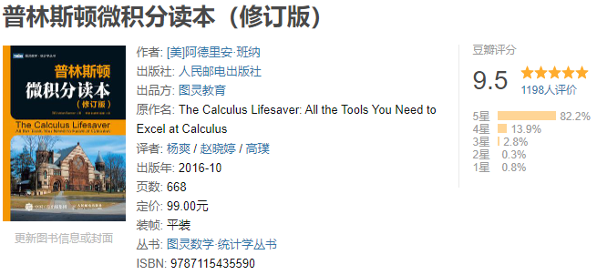

#### 线性代数

线性代数的应用：

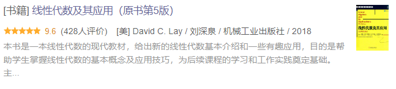

线性代数如何学习：

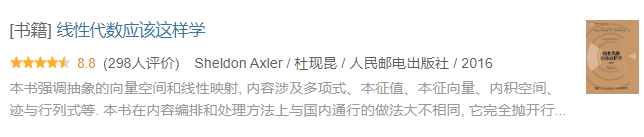

习题的答案在：http://linearalgebras.com/

#### 概率论与统计学

统计学的深入学习基于这两本教程：

1. [统计学（第4版） : 基于R](https://book.douban.com/subject/35377356/)
2. [统计学（第五版） : 从数据到结论](https://book.douban.com/subject/35694162/)

这两本书分别使用到了R语言和Python语言，对于使用R语言和Python语言来搞数据科学是一个很好的训练。

此外还有手头的两本书：

1. [统计学核心方法及其应用](https://book.douban.com/subject/30384807/)
2. [多元统计分析——基于R(第2版)（基于R应用的统计学丛书）](https://book.douban.com/subject/35052008/)

概率论的深入学习则采用这三本书：

1. [概率导论（第2版·修订版）](https://book.douban.com/subject/26694188/)
2. [概率论基础教程（原书第10版）](https://book.douban.com/subject/35868257/)
3. [概率论及其应用（卷1•第3版）](https://book.douban.com/subject/25794324/)

一本科普书籍：

### 编程

#### Python语言

使用Python实现设计模式：

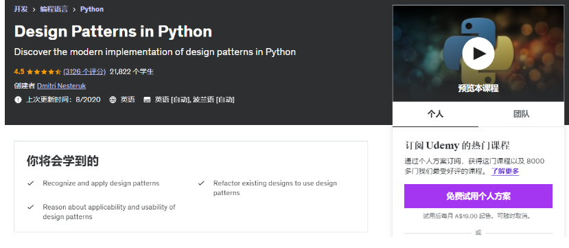

使用Python语言的技巧：

另外还有一些Python项目代码书籍，如果上述的内容已经完成了，但是有一些项目没有涉及到，则可以看一下和进行实现：

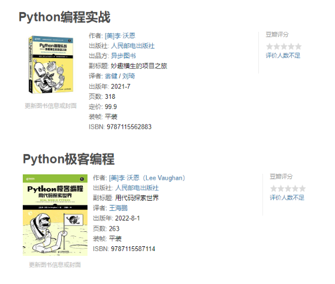

#### SQL

SQL所使用的两本书籍是：

使用的视频教程是：

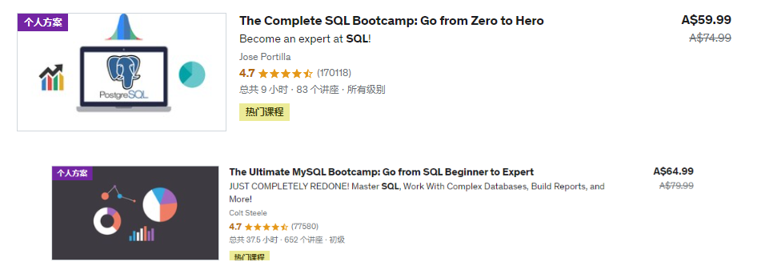

然后使用LIntCode和牛客网的习题来进行巩固：

还有LeetCode的习题：

还有的习题为：

1. https://sqlzoo.net/wiki/SQL_Tutorial/zh
2. http://xuesql.cn/

关于SQL的面试：

#### 数据结构与算法

进行求职面试之前，需要刷一些习题，可以使用：

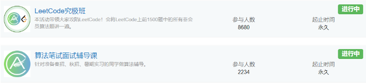

还有就是将LeetCode的经典的问题做一遍：

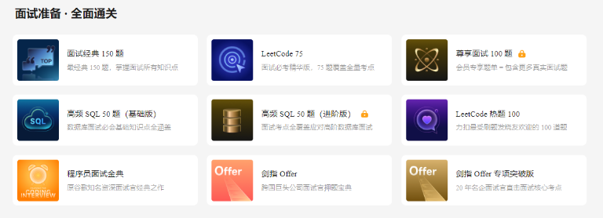

这里还有一门已经购买了的C++的算法基础课：

还有就是：

1. 编程珠玑
2. 编程珠玑-续

另外还有一本非常好的书籍：

求职的书籍：

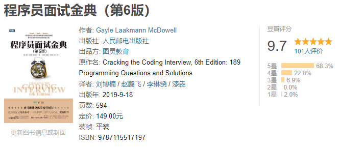

### 人工智能

 人工智能采取的教程为：

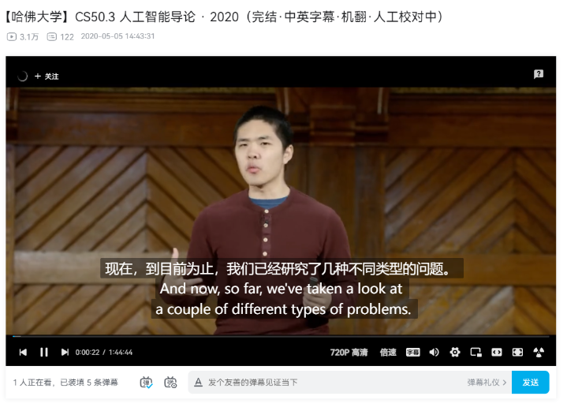

Bilibili的AI的竞赛：

### 数据分析

如何处理数据：

数据分析首先可以看的书籍是：

通过这本书可以对数据分析有着一个较为笼统的概括性的认知。

接着是学习B站上已经购买了的课程：

### 机器学习

R语言的机器学习：

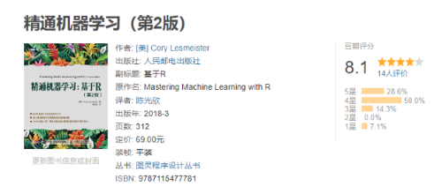

动手机器学习：

统计学习书籍：

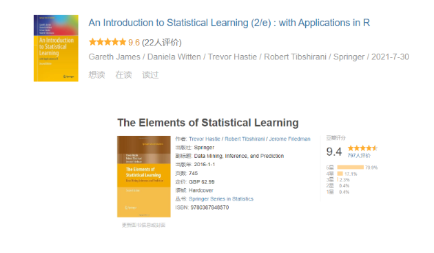

如何上面的内容都已经完成了，则可以完成这个课程：

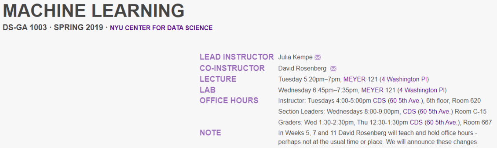

课程主页地址：https://davidrosenberg.github.io/ml2019/#home

课程核心内容：

1. 课程视频(Youtube): [https://youtu.be/U6M0m9c9_Js](https://link.zhihu.com/?target=https%3A//youtu.be/U6M0m9c9_Js)
2. 课程Slides和参考资料: [https://davidrosenberg.github.io/ml2019/#lectures](https://link.zhihu.com/?target=https%3A//davidrosenberg.github.io/ml2019/%23lectures)
3. 作业: [https://davidrosenberg.github.io](https://link.zhihu.com/?target=https%3A//davidrosenberg.github.io/ml2019/%23assignments)

### 深度学习

深度学习则采用：

动手深度学习配合李沐大佬在Bilibili上面的课程。

从入门到进阶：

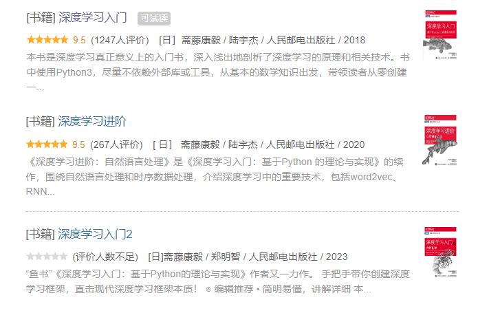

另一本高分课程：

### 数据科学实战

首先是面试准备：

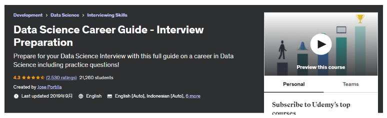

A collection of data science take home challenges：

机器学习项目项目实战：

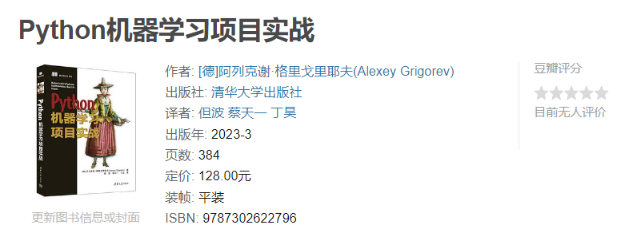

机器学习项目交付实战：

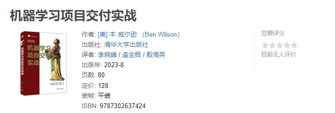

还有就是Kaggle的三十天训练营：

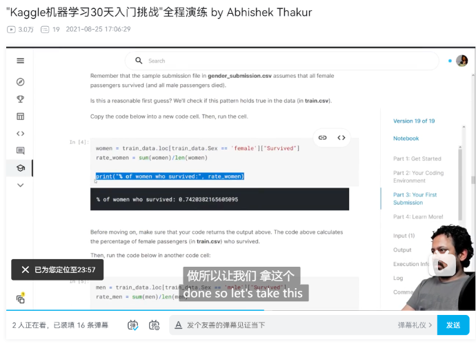

和鲸上面有一些训练营，可以用来进行练习：

### 强化学习与深度强化学习

强化学习入门：

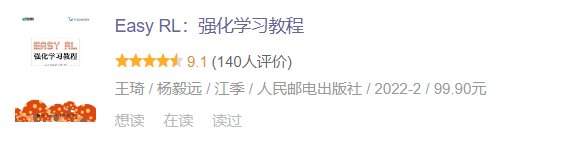

强化学习实战：

深度强化学习图解：

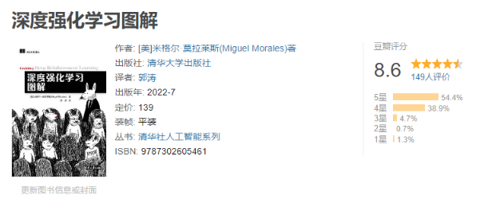

深度强化学习实战：

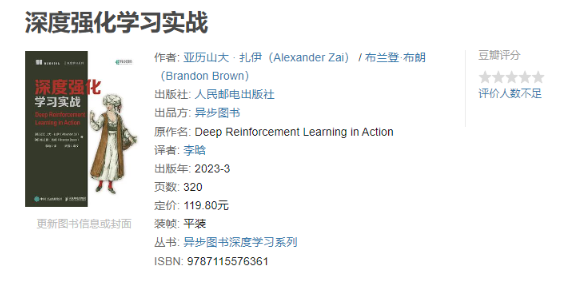

### 因果推断

### 大数据

Linux工程课则是使用AcWing的Linux课程：

系统性的学习则采用Udemy的课程：

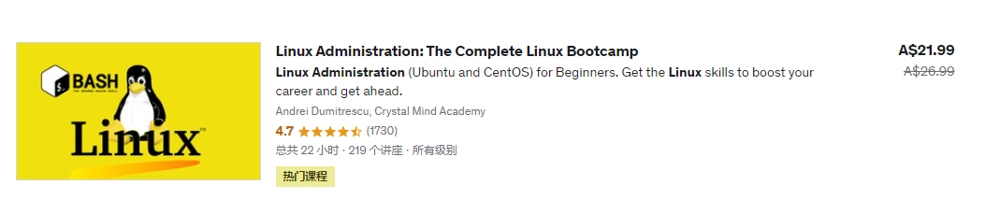

接着需要学习的是Spark使用的教程为：

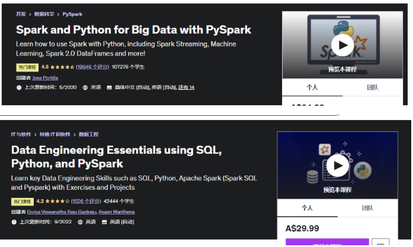

LintCode提供了大数据相关的习题：

不过只有7道题目，只能够说聊胜于无。

### 商业与经济

**经济**

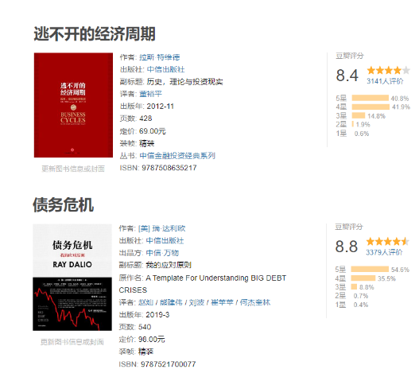

**商业**

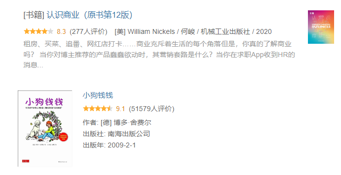

## 成为一位插画家

### 理论与历史

中国艺术史：

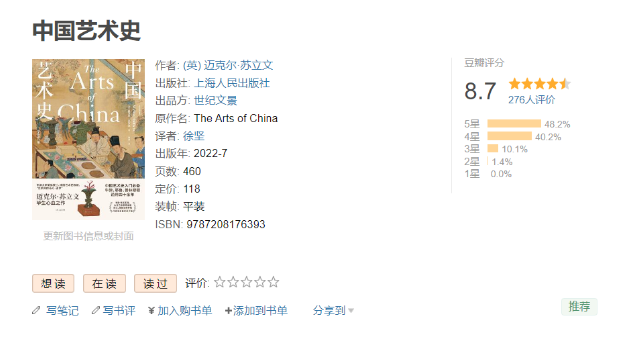

电影：

### 基础课程

首先需要使用的一个较为系统性的课程是：

还有就是顾佳艺的文艺复星球：色彩造型基础班。

## 英文

### 单词

使用的Udemy的课程是：

### 语法

除了单词之外，还需要理解英语的语法。

语法使用的是B站上的一个英语语法课程：

配合使用的Udemy的语法课程为：

### 听力与口语

口语课程首先可以使用的是B站的口语课程：

口音纠正则使用：

还有就是：

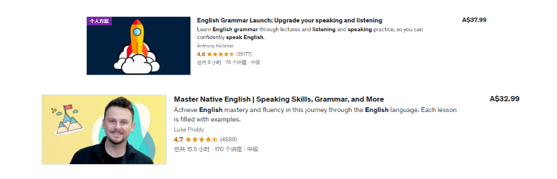

### 写作

写作采用这些课程：

1. Score High Ielts Writing (General Training Module)
2. Score band 7 + in Academic IELTS Writing Task 1
3. Mastering IELTS Writing Task 2 (Achieve Band 7+ in 7 Hours)
4. Mastering IELTS Writing - Task 2 (Band 9 Model Answers)

以及：

### 雅思备考

首先使用的是Udemy的课程：

接着需要使用的是雅思官方的习题集：

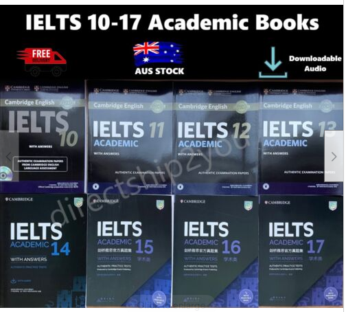

写作会采用顾家北的书籍：

和慎小嶷的书籍：

## Web 开发

**如果数据科学和插画的学习没有问题的话**

### HTMl/CSS

HTML+CSS的课程看这一门课就完事了：

另外需要使用LintCode的习题：

和牛客网的习题：

来完成知识点的巩固。

### JavaScript 和 Vue

JavaScript则采用Udemy的课程：

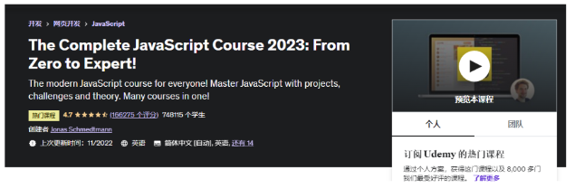

同样的，还有做习题：

接着是学习一下Vue这个框架：

### Django

Django首先使用的是AcWing的课程：

还有就是Udemy的课程：

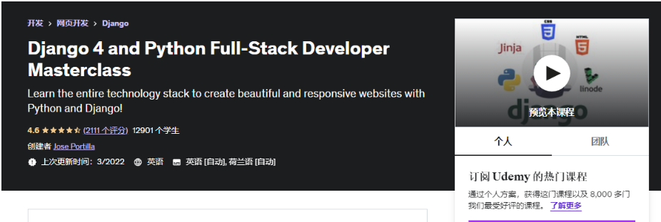

Mosh的：The Ultimate Django Series。

### Web课程

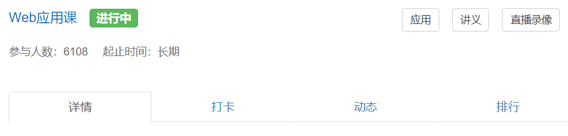

使用的项目Udemy的课程为：

还有就是：

补充一个2023 哈弗大学CS50 Python & JavaScript Web开发课程：

## 程语言补充学习

可以对其他的语言有一定程度的了解。

### C++语言

C++语言语法基础：

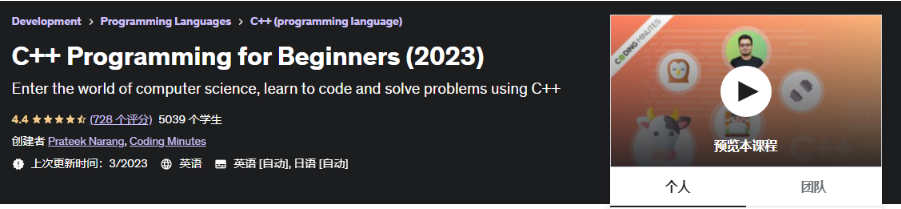

代码练习：

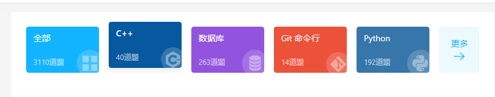

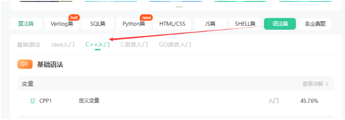

### Java语言

AcWing的Java语言：

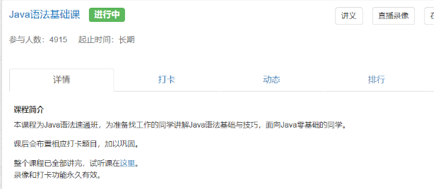

代码练习：

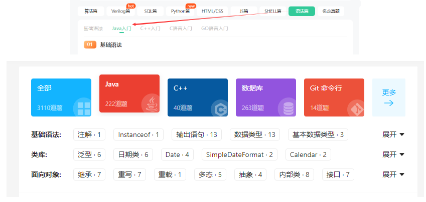

## 思维能力

### 思想史与哲学史

思想史：

哲学史：

### 存在主义与虚无主义

存在主义：

虚无主义：

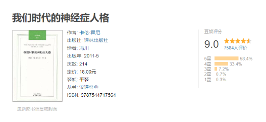

### 侯世达

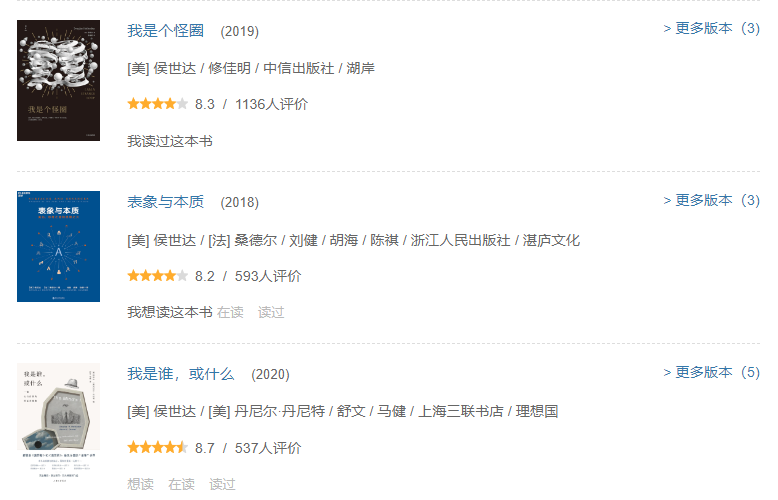

### 人类历史

裸猿：

贾雷德·戴蒙德：

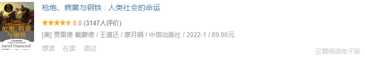

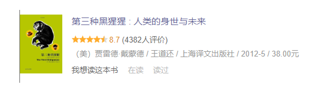

群居的艺术：

### 信息社会

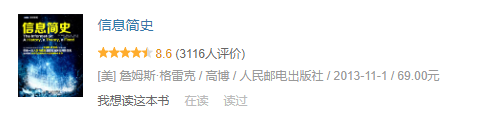

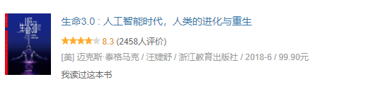

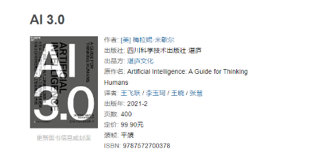

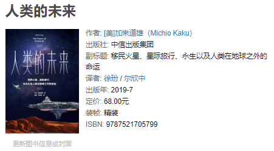

### 心理学

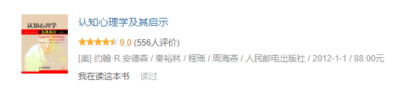

## 娱乐

### 纪录片

看一下这个集合中的纪录片的内容：

另外看大量的TED的演讲，虽然不是纪录片，但是也能够学习很多的内容。

### 电影

电影可以看一下豆瓣TOP 250中的感兴趣的电影，另外可以看一下每年推荐的电影。

豆瓣Top250：https://movie.douban.com/top250

### 动漫

动漫也可以看一下每年热点动漫，但是也需要看一下一些经典的动漫。

必看的系列：

1. Jojo的奇妙冒险
2. 进击的巨人 漫画 + 动画 全部
3. 剑风传奇 漫画 + 动画 全部
4. 藤本树全集
6. 伊藤潤二 全集
7. 沙村廣明系列

其他的还有一些老的经典的动漫。

### 小说

首先要阅读的推理小说是：

接着是阅读“京极堂”系列：

来自新世界：

轻小说必读的书籍为狼與辛香料系列：

另外看一些经典的或者知名的网络小说。

### 游戏

魂Like游戏：塞尔登法环，Eldest Souls，雨世界，堕落之主，皮诺曹的谎言。

Rogue类游戏：黎明前20分钟，血污：夜晚之仪式，Noita，The Last Faith，Crowsworn。

回合战略：八方旅人，八方旅人2，圣女战棋，三角战略。

编程游戏：Hack Run，Hack Run Zero，Hack Time，Hacknet。

精准平台跳跃：Celeste，茶杯头，空洞骑士，空洞骑士：丝绸之歌，奥日与黑暗森林，奥日与精灵意志，星之海。

角色扮演：塞尔达传说：荒野之息，塞尔达传说：王国之泪，P5R。

