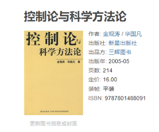
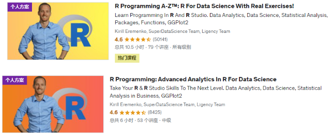
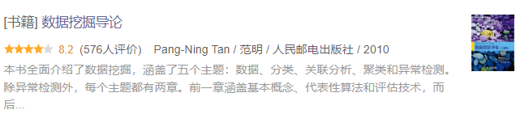
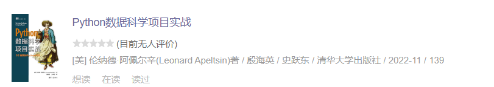
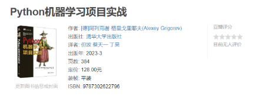
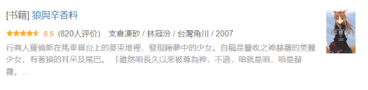

# 年度需要达成的目标

首要目标：完成数据科学家的大部分内容的学习。

次要目标：完成英语的学习。

辅助目标：尝试申请博士和进行研究。

# 提升自己的心智

## 学习技巧

李笑来的几本书籍：

YJango在Bilibili上面的两门公开课程：学习观和断墨寻径。

## 心智认知

桥水基金的创始人瑞·达利欧的几本书籍：

控制论书籍：

## 进行冥想

冥想首先采用的是HeadSpace的冥想课程：

接着是大师课：

# 成为一位数据科学家——编程

## Python

做大量的Python项目来回顾和练习Python语言。

首先是Udemy上面的Python的项目课程：

然后是一些关于Python实践的书籍：

然后可以使用网络上的一些Python习题：

其他的一些Python课程：

使用Python语言的技巧：

## R语言

R语言的两门Udemy的教程为：

使用的书籍为：

国内有一位推崇R语言的，有一本出版的书籍为：

## SQL语言

SQL所使用的两本书籍是：

使用的视频教程是：

然后使用LIntCode和牛客网的习题来进行巩固：

还有LeetCode的习题：

还有的习题为：

1. https://sqlzoo.net/wiki/SQL_Tutorial/zh
2. http://xuesql.cn/

## 数据结构与算法

练习：

一本非常好的书籍：

需要刷一些习题，可以使用：

将LeetCode的经典的问题做一遍：

# 成为一位数据科学家——数学

## 入门通识

在学习具体的数学之前，要对数学本身有着一个概览。

第一本需要看的书籍是，《[什么是数学 : 对思想和方法的基本研究](https://book.douban.com/subject/27061912/)》

这是关于这本书的简介：

> 《什么是数学》是世界著名的数学科普读物，它搜集了许多经典的数学珍品，对整个数学领域中的基本概念与方法，做了精深而生动的阐述。无论是数学专业人士，或是愿意作数学思考者都可以阅读本书。特别对中学数学教师、大学生和高中生，本书都是一本极好的参考书。

第二本需要看的书籍是，《[优美的数学思维（原书第2版） : 问题求解与证明](https://book.douban.com/subject/35197539/)》

这是关于书籍的简介：

> 本书以大量生动有趣的问题求解实例为背景，使用通俗易懂的语言，深入浅出地介绍优美的数学思维和严谨的证明方法，所涉及的数学内容不仅包含函数与集合、数学归纳法理论、组合计算与组合证明、整数理论、数理逻辑、图论等离散数学，而且包含微积分与实数理论等连续数学，覆盖了多个不同的数学领域。本书内容在逻辑上层层展开、环环相扣，形成一套相对完备的知识体系。本书的内容可以有效地激发学生的学习兴趣，唤醒学生的数学潜能和数学思维。

## 微积分与线性代数

高等数学是进一步的学习统计学和概率论的基础知识。

采用的是Udemy上面的一个系列课程：

并且将会完成该课程的配套的训练。

此外有一个比较重要的课程，那就是**3Blue1Brown**的[【官方双语/合集】*微积分的本质* - 系列合集](https://www.bilibili.com/video/BV1qW411N7FU/?spm_id_from=333.337.search-card.all.click)，在学习开始，中途和结尾都可以反复观看这个视频来加深对于微积分的了解。

线性代数入门采用的视频教程为麻省理工公开课的线性代数教程：

1. [麻省理工学院 - MIT - *线性代数*（我愿称之为*线性代数*教程天花板）](https://www.bilibili.com/video/BV16Z4y1U7oU/)
2. [麻省理工学院 - MIT - *线性代数*/中英文版，助教：陈莉楠（我愿称为最详](https://www.bilibili.com/video/BV1VZ4y1a76K/)

配套的书籍为：《[线性代数（第5版）](https://book.douban.com/subject/34820335/)》

Udemy的这位教微积分的老师也有一门线性代数的课程：

**3Blue1Brown**也有相关的视频：[【官方双语/合集】线性代数的本质 - 系列合集](https://www.bilibili.com/video/BV1ys411472E/)，需要进行反复的观看。

最后看的书籍为：[线性代数应该这样学 : 第3版](https://book.douban.com/subject/26886299/)，习题的答案在：http://linearalgebras.com/

## 概率论与统计学

入门采用的视频教程为Udemy的这位老师的课程：

Udemy的这位老师还是一本与他人合作的课程：

这两门课都可以用来进行快速的入门学习。

统计学的深入学习基于这两本教程：

1. [统计学（第4版） : 基于R](https://book.douban.com/subject/35377356/)
2. [统计学（第五版） : 从数据到结论](https://book.douban.com/subject/35694162/)

这两本书分别使用到了R语言和Python语言，对于使用R语言和Python语言来搞数据科学是一个很好的训练。

概率论的深入学习则采用这二本书：

1. [概率导论（第2版·修订版）](https://book.douban.com/subject/26694188/)
2. [概率论基础教程（原书第10版）](https://book.douban.com/subject/35868257/)

最后也可以看一下**3Blue1Brown**的关于概率论的视频：

另外还有一本科普书籍：

补充：

## 动手实践数学

这里还有一个本书：

使用这本书可以进行Python语言来实现线性代数和微积分。

使用Python实现统计学：

还有一本书：

# 数据科学家——数据分析

## 数据分析

学习B站上已经购买了的课程：

着是这本书：

Pandas进一步的学习：

接着是牛客网提供的数据分析相关的习题：

## 数据可视化

可视化的一个概览：

# 数据科学家——数据科学

## 通用人工智能

Bilibili的AI的竞赛：

## 数据科学概览

一个比较概括的课程：

接着是Udemy的几门关于Python数据科学的书籍：

## 数据挖掘

数据挖掘采用的书籍为： [数据挖掘导论](https://www.douban.com/link2/?url=https://book.douban.com/subject/5377669/&query=数据挖掘导论&cat_id=1001&type=search&pos=0)

Udemy的课程为：

Bilibili的课程为：

## 机器学习

最开始入门可以看一下吴恩达和李沐在Bilibili上面的机器学习的课程。

还有就是特征选择：

机器学习课程则为：

动手机器学习：

## 深度学习

深度学习的入门书籍采用：

入门到进阶：

一本高分课程：

最后采用的是李沐大佬的书籍：

动手深度学习配合李沐大佬在Bilibili上面的课程。

## 时间序列

Python时间序列：

R语言时间序列：

## 因果推断

Judea Pearl的统计因果推理入门：

还有就是因果推断书籍：

## 各种项目进行实战

学完之后一定要自己动手在项目上进行实践，首先是 a collection of data science take home challenges：

然后是:

以及：

机器学习项目项目实战：

一个Kaggle的项目：

还有就是Kaggle的三十天训练营：

# 英语学习

## 单词

单词使用的单词书有两本：

配合使用的Udemy的课程是：

## 语法

除了单词之外，还需要理解英语的语法。

## 听力与口语

口语课程首先可以使用的是B站的口语课程：

口音纠正则使用：

## 写作

写作采用这些课程：

1. Score High Ielts Writing (General Training Module)
2. Score band 7 + in Academic IELTS Writing Task 1
3. Mastering IELTS Writing Task 2 (Achieve Band 7+ in 7 Hours)
4. Mastering IELTS Writing - Task 2 (Band 9 Model Answers)

## 雅思备考

首先使用的是Udemy的课程：

接着需要使用的是雅思官方的习题集：

写作会采用顾家北的书籍：

和慎小嶷的书籍：

# 娱乐

## 纪录片

纪录片首先必看的是 人生七年系列：

另外看大量的TED的演讲，虽然不是纪录片，但是也能够学习很多的内容。

## 动漫

动漫也可以看一下每年热点动漫，但是也需要看一下一些经典的动漫。

2024年主要需要看的动漫：

- Jojo的奇妙冒险（仅动画）
- 进击的巨人（动画+漫画）
- 藤本树全集（动画+漫画）
- 沙村广明（漫画）
- 剑风传奇（漫画）

## 小说

来自新世界：

轻小说必读的书籍为狼與辛香料系列：

还有一本盲视。

## 游戏

**首先是一些魂Like游戏：**

**接着是两个类银河战士恶魔城游戏：**

**然后是编程游戏：**

**一个高清复刻的老游戏：**

**还有一个等打折入手的游戏：**

**休闲的时候可以玩一下：**

