# 心智认知

## 认知效率

**认知心理学**

基于心智认知的具体技巧：

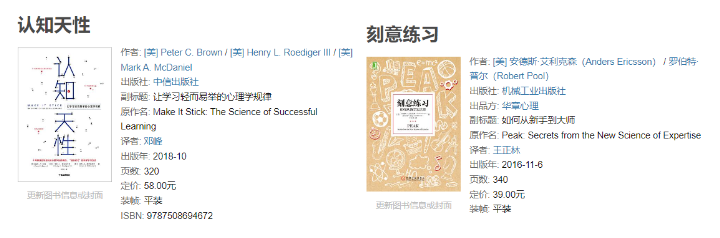

**脑科学**

Bilibili已经购买了的脑科学课程：

还有就是要警惕自己上瘾：

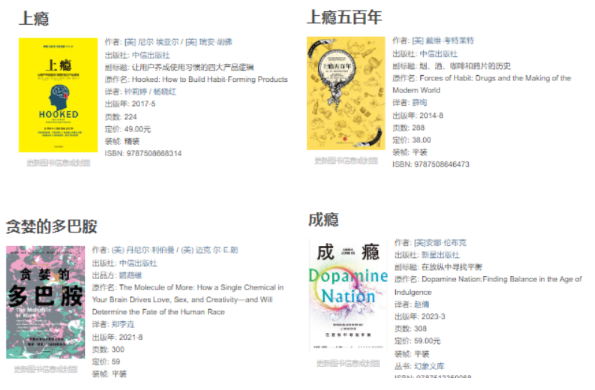

**学习技巧**

是Coursera上面的一门非常好的学习相关的课程：Learning how to learn。

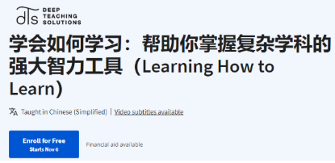

还有就是YJango在Bilibili上面的两门公开课程：学习观和断墨寻径。

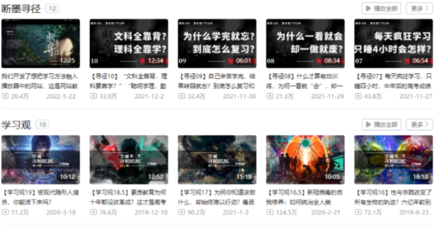

另外YJango在Bilibili上开了一个付费课程，可以报名一下感谢这些视频提供的帮助。

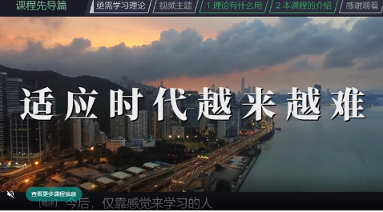

## 冥想与幸福

冥想采用的是HeadSpace的冥想课程和大师课：

# 成为数据科学家

## 编程语言

**Python语言**

Python语言在之前已经学过了《Python编程：从入门到实践》这本书。

现在需要做的是通过大量的练习来巩固一下和掌握一些更高的特性：

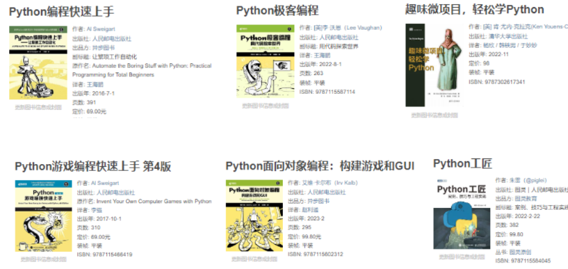

然后可以使用网络上的一些Python习题：

1. [Python Practice: 93 Unique Online Coding Exercises](https://www.dataquest.io/blog/python-practice/#core-practice)
2. https://www.lintcode.com/problem/?typeId=8
3. https://pynative.com/python-exercises-with-solutions/
4. [https://www.nowcoder.com/exam/oj?page=1&tab=Python%E7%AF%87&topicId=344](https://www.nowcoder.com/exam/oj?page=1&tab=Python篇&topicId=344)

**R语言编程**

为什么使用R语言

> R语言是一种用于数据分析和统计建模的编程语言和环境。它具有丰富的统计和数据可视化包，以及强大的数据操作和处理能力。数据科学家需要学习R语言，因为它是数据科学的重要工具之一，特别适用于统计分析、数据可视化和数据挖掘。R提供了专门用于数据科学的包，如ggplot2、dplyr和caret，使得数据分析和建模更加高效。此外，R拥有庞大的社区支持，有大量的开源资源和文档，使学习和解决数据科学问题更加便捷。学习R语言可以增加数据科学家的工具箱，帮助他们更好地理解数据、制定预测模型和进行深入的统计分析。

R语言的两门Udemy的教程为：

使用的书籍为：

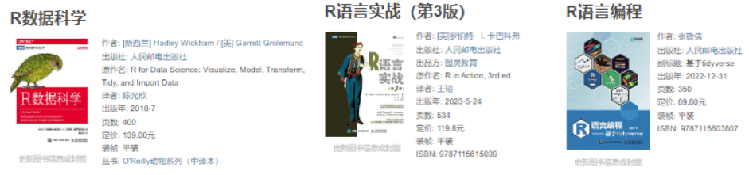

**SQL语言**

SQL的两本书籍：

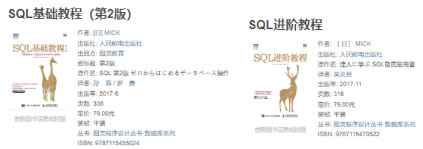

然后是大量的习题：

1. https://www.lintcode.com/problem/?typeId=3
2. https://sqlzoo.net/wiki/SQL_Tutorial/zh
3. http://xuesql.cn/
4. [https://www.nowcoder.com/exam/oj?page=1&tab=SQL%E7%AF%87&topicId=199](https://www.nowcoder.com/exam/oj?page=1&tab=SQL篇&topicId=199)
5. https://leetcode.cn/problemset/database/

## 数据分析

数据分析入门采用的书籍为：

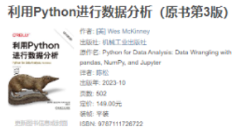

观看和学习在Bilibili上面购买的两门课程：

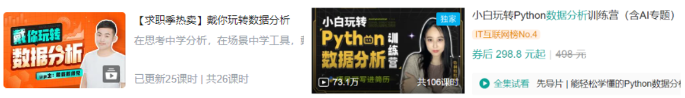

贝叶斯数据分析的书籍：

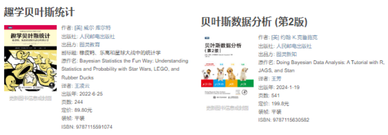

一些在线的练习：

一些在线的练习：

1. [https://www.nowcoder.com/exam/oj?page=1&tab=Python%E7%AF%87&topicId=326](https://www.nowcoder.com/exam/oj?page=1&tab=Python篇&topicId=326)
2. https://leetcode.cn/studyplan/30-days-of-pandas/

另外补充一本高性能Python和数据分析的书籍：

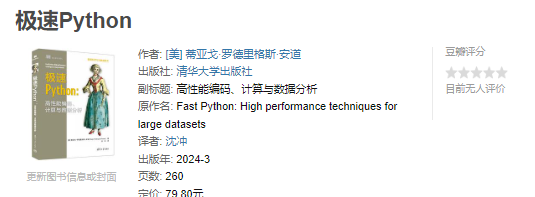

## 数据可视化

可视化的理论和练习：

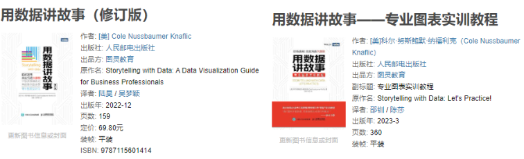

## 数据科学

**数据科学实战**

进行数据科学实战来提升自己的能力：

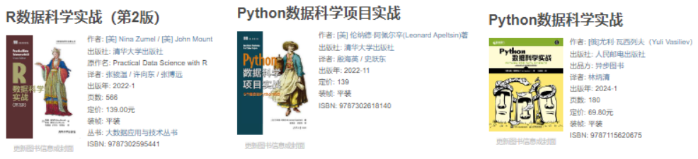

另外是一些Kaggle的实战课程：

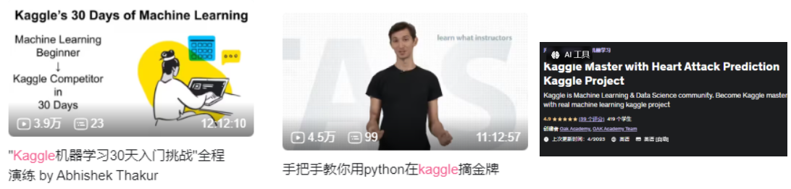

A collection of data science take home challenges：

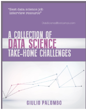

这本书可以最后用来进行训练。

大数据相关的两本书籍：

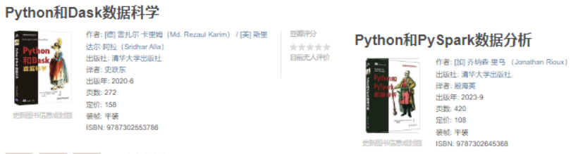

## 无监督学习

首先是最经典的书籍：

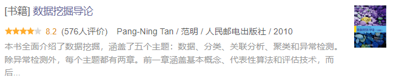

然后是Bilibili的课程：

## 机器学习

**机器学习入门**

机器学习的入门资料为：

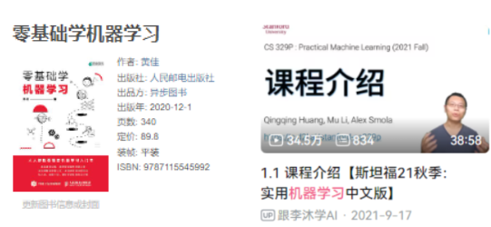

**机器学习实战**

首先量Manning出版社的两本书：

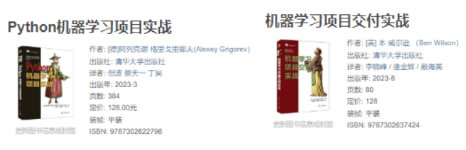

这里有一位老哥，这位老哥有一个简短的书籍：

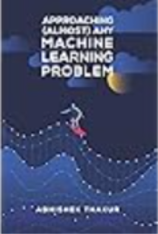

## 深度学习

最简单的入门书籍：

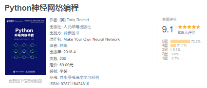

非常好的三本书籍：

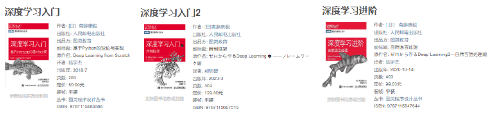

大佬的书籍：

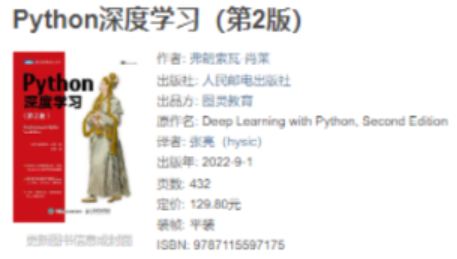

## 时间序列

Python语言的时间序列书籍：

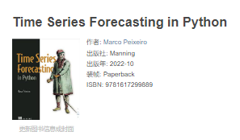

时间序列的实战：

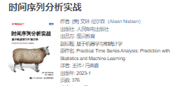

## 鸢尾花书籍系列

这是生姜DrGinger的系统性书籍：

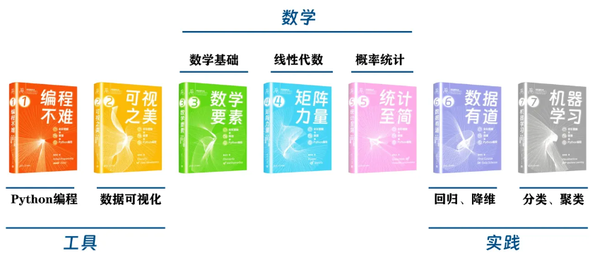

不是所有都出版了，但是可以将已经出版了的购买了的看完。

# 数学基础

## 通识与科普

## 程序员的数学

这两本书是快速的入门：

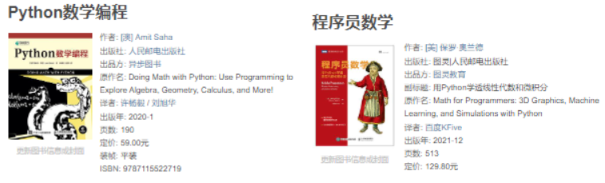

然后使用专门的数据科学/机器学习/深度学习相关的数学书籍来进行学习：

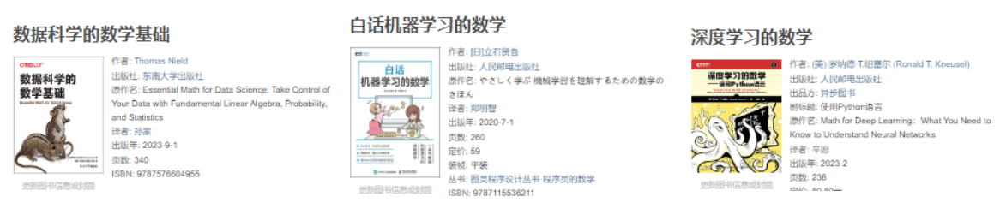

## 概率论与数理统计

统计思维或者历史：

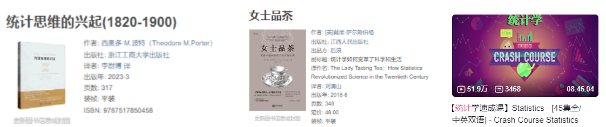

统计学的入门教程：

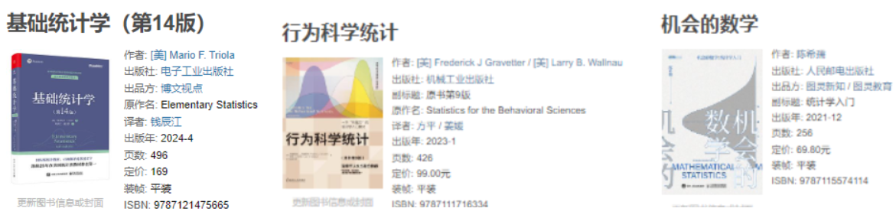

# 通识

## 经济学

推荐的一个书籍为：

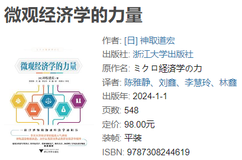

在这之后需要从经济学的视角来了解一下中国的情况：

1. [置身事内 : 中国政府与经济发展](https://book.douban.com/subject/35546622/)
2. [解读中国经济 : 聚焦新时代的关键问题](https://book.douban.com/subject/30329810/)
3. [结构性改革 : 中国经济的问题与对策](https://book.douban.com/subject/35147504/)
4. [中国经济改革进程 (第2版)](https://book.douban.com/subject/36198856/)
5. [以利为利 : 财政关系与地方政府行为](https://book.douban.com/subject/10587755/)

了解亚洲和全球的经济情况：

1. [亚洲大趋势](https://book.douban.com/subject/25893995/)
2. [逃不开的经济周期 : 历史，理论与投资现实](https://book.douban.com/subject/20272113/)
3. [经济状况，世界状况](https://book.douban.com/subject/36493902/)

还有就是达瑞欧的书籍和视频：

1. [债务危机 : 我的应对原则](https://book.douban.com/subject/30486499/)
2. [经济机器是如何运行的 （全集）](https://www.douban.com/link2/?url=https://www.bilibili.com/video/BV1zJ411L76N/&link2key=9beaaaff9e)

# 娱乐

## 电影

**电影**

[认识电影（修订第14版）](https://book.douban.com/subject/35459568/)：本书为长销40年的经典电影入门书《认识电影》第14次修订版。自问世以来，《认识电影》已被翻译为十几种语言，并被北京电影学院、北京大学、哈佛大学、MIT、纽约大学等知名院校指定为影视课程教材，深受全球读者和电影行业专业人士认可，被公认为了解电影艺术的入门佳作。

## 纪录片

首先推荐的纪录片是：[人生七年1 ](https://www.douban.com/link2/?url=https://movie.douban.com/subject/2123439/&query=人生七年&cat_id=1002&type=search&pos=0)，本部纪录片采访来自英国不同阶层的十四个七岁的小孩子，他们有的来自孤儿院有的是上层社会的小孩。此后每隔七年，艾普特都会重新采访当年的这些孩子。人生的轮回从这十四个七岁的孩子真实生活开始，“七岁看老”，在这童言无忌的问与答中，人生七年又七年，震撼上演。除此之外，你还可以看一下其他国家版的人生七年：[日本人生七年1](https://www.douban.com/link2/?url=https://movie.douban.com/subject/25832581/&query=人生七年&cat_id=1002&type=search&pos=11)，[美国人生七年1 ](https://www.douban.com/link2/?url=https://movie.douban.com/subject/25832608/&query=人生七年&cat_id=1002&type=search&pos=14)和 [俄国人生七年1](https://www.douban.com/link2/?url=https://movie.douban.com/subject/5983724/&query=人生七年&cat_id=1002&type=search&pos=16)，其实我也希望中国能够有一部 中国：人生七年的纪录片。

接着推荐的纪录片是：[监视资本主义：智能陷阱](https://www.douban.com/link2/?url=https://movie.douban.com/subject/34960008/&query=监视资本主义：智能陷阱+The+Social+Dilemma+(2020)&cat_id=1002&type=search&pos=0)，我们发推文、点赞、分享 — 但日益依赖社交媒体会带来什么后果？随着数字平台日益成为人们保持联系的重要方式，硅谷内部人士通过暴露屏幕另一侧的隐藏内容，揭示了社交媒体如何重新改写文明。还有推荐的是：[第四公民](https://www.douban.com/link2/?url=https://movie.douban.com/subject/26059437/&query=第四公民+Citizenfour+(2014)&cat_id=1002&type=search&pos=0)，[维基解密的抗争](https://www.douban.com/link2/?url=https://movie.douban.com/subject/5423352/&query=维基解密&cat_id=1002&type=search&pos=1) 和 [我们窃取秘密：维基解密的故事](https://www.douban.com/link2/?url=https://movie.douban.com/subject/20451129/&query=维基解密&cat_id=1002&type=search&pos=3)。华尔街相关的则推荐：[华尔街 (2010)，](https://movie.douban.com/subject/5294309/)大[空头 The Big Short (2015)（这](https://movie.douban.com/subject/26303622/)个应该是电影），麦道[夫：华尔街吸金恶霸 Madoff: The Monster of Wall Street (2023) 和 ](https://movie.douban.com/subject/36192429/)散户大[战华尔街：游戏驿站传奇 Eat the Rich: The GameStop Saga (2022)。资本与](https://movie.douban.com/subject/35948779/)消费：黑钱 第[一季 Dirty Money Season 1 (2018)，无节制消](https://movie.douban.com/subject/27664017/)费[的元凶 The Men Who Made Us Spend (2014)，为什么贫穷](https://movie.douban.com/subject/25945379/)？[，致肥元凶，](https://movie.douban.com/subject/20393972/?from=subject-page)资[本主义：](https://movie.douban.com/subject/25745560/?from=subject-page)一[个爱情故事 Capitalism: A Love Story (2009)，资本主义 C](https://movie.douban.com/subject/3073198/)a[pitalisme (2014)，阶级](https://movie.douban.com/subject/26425480/)分[化 School Swap: The Class Divide (2015)。](https://movie.douban.com/subject/26392858/)

一些当代的风云人物的纪录片：[回到太空 Return to Space (2022)，](https://movie.douban.com/subject/35809022/)马[斯克秀 The Elon Musk Show (2022)，火](https://movie.douban.com/subject/36117370/)星[时代：深入SpaceX MARS: Inside SpaceX (2018)，走进](https://movie.douban.com/subject/30422271/)比[尔：解码比尔·盖茨，特朗](https://movie.douban.com/subject/34807113/?from=subject-page)普[：一场美国梦，美国](https://movie.douban.com/subject/27194924/?from=subject-page)商[业大亨传奇，杰弗](https://movie.douban.com/subject/20277091/?from=subject-page)里[·爱泼斯坦：肮脏的财富。](https://movie.douban.com/subject/35067501/?from=subject-page)

## 游戏

魂系列游戏和魂Like游戏：

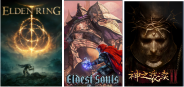

类银河战士恶魔城游戏：

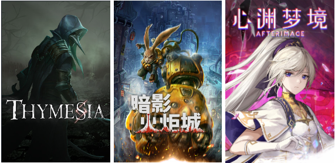

Rogue类游戏：

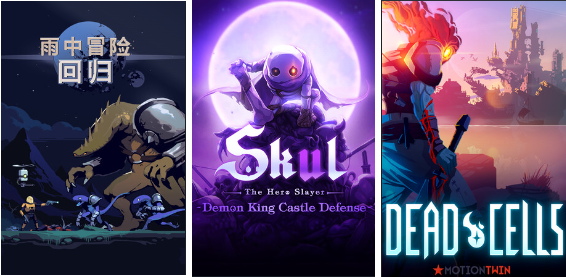

动作类游戏：

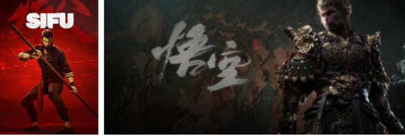

