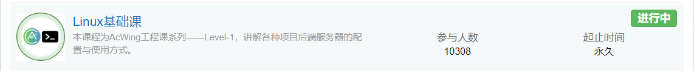

# 2024年需要做什么

## 需要完成的目标

需要完成的主要目标：完成“成为一位数据科学家”这一目标的大体内容。

需要完成的次要目标：提升自己的英语能力。

其他：看一些电影和纪录片，完成思想史和哲学史的学习，看一些小说和玩一些游戏。

## 提升自己的心智能力

### 学习技巧

首先一定要看的是李笑来的《新生：七年就是一辈子》。

此外还有两个能够协助自己提高自己认知能力的教程。一个是Yjango的学习观：

另一个则是Yjango的断墨寻径：

### 脑科学

脑科学可以通过在B站上已经购买的两个课程来进行学习：

### 健康

增重采用的视频为：

正念则采用：

## 成为一位数据科学家

### 微积分与线性代数

采用的是Udemy上面的一个系列课程：

并且将会完成该课程的配套的训练。

此外有一个比较重要的课程，那就是**3Blue1Brown**的[【官方双语/合集】*微积分的本质* - 系列合集](https://www.bilibili.com/video/BV1qW411N7FU/?spm_id_from=333.337.search-card.all.click)，在学习开始，中途和结尾都可以反复观看这个视频来加深对于微积分的了解。

线性代数入门采用的视频教程为麻省理工公开课的线性代数教程：

1. [麻省理工学院 - MIT - *线性代数*（我愿称之为*线性代数*教程天花板）](https://www.bilibili.com/video/BV16Z4y1U7oU/)
2. [麻省理工学院 - MIT - *线性代数*/中英文版，助教：陈莉楠（我愿称为最详](https://www.bilibili.com/video/BV1VZ4y1a76K/)

配套的书籍为：《[线性代数（第5版）](https://book.douban.com/subject/34820335/)》

Udemy的这位教微积分的老师也有一门线性代数的课程：

**3Blue1Brown**也有相关的视频：[【官方双语/合集】线性代数的本质 - 系列合集](https://www.bilibili.com/video/BV1ys411472E/)，需要进行反复的观看。

这里还有一个本书：

使用这本书可以进行Python语言来实现线性代数和微积分。

### 概率论与统计学

入门采用的视频教程为Udemy的这位老师的课程：

Udemy的这位老师还是一本与他人合作的课程：

这两门课都可以用来进行快速的入门学习。

统计学的深入学习基于这本教程：[统计学（第4版） : 基于R](https://book.douban.com/subject/35377356/)。

概率论则采取这两本书：

1. [概率导论（第2版·修订版）](https://book.douban.com/subject/26694188/)
2. [概率论基础教程（原书第10版）](https://book.douban.com/subject/35868257/)

最后也可以看一下**3Blue1Brown**的关于概率论的视频：

补充：

另外还有一本科普书籍：

### Python语言

进行大量的项目来进行实践，这里采用的是Angela Yu的课程：

然后就是Ardit Sulce的两个Python工程课程：

此外还有就是对Python语言的习题练习。

LintCode的Python习题：

牛客网的Python语言习题：

其他的一些Python课程：

### R语言

R语言的两门Udemy的教程为：

使用的书籍为：

### SQL

SQL所使用的两本书籍是：

使用的视频教程是：

然后使用LIntCode和牛客网的习题来进行巩固：

还有LeetCode的习题：

还有的习题为：

1. https://sqlzoo.net/wiki/SQL_Tutorial/zh
2. http://xuesql.cn/

### 数据结构与算法

现在可以进一步的学习：

以及进行Python原因的LeetCode的练习：

还有就是将LeetCode的经典的问题做一遍：

另外还有一本非常好的书籍：

### 数据分析

数据分析首先可以看的书籍是：

通过这本书可以对数据分析有着一个较为笼统的概括性的认知。

接着是学习B站上已经购买了的课程：

着是这本书：

接着是牛客网提供的数据分析相关的习题：

### 数据可视化

可视化书籍：

### 数据科学

一个比较概括的课程：

R语言在Udemy上面关于数据科学的教程：

接着是Udemy的几门关于Python数据科学的书籍：

### 数据挖掘

数据挖掘采用的书籍为： [数据挖掘导论](https://www.douban.com/link2/?url=https://book.douban.com/subject/5377669/&query=数据挖掘导论&cat_id=1001&type=search&pos=0)

Udemy的课程为：

Bilibili的课程为：

### 机器学习

机器学习课程则为：

R语言的机器学习：

动手机器学习：

统计学习书籍：

### 深度学习

深度学习的入门书籍采用：

快速的了解一下深度学习：

从入门到进阶：

一本高分课程：

最后采用的是李沐大佬的书籍：

动手深度学习配合李沐大佬在Bilibili上面的课程。

### 项目实战

学完之后一定要自己动手在项目上进行实践。

以及：

机器学习项目项目实战：

一个Kaggle的项目：

还有就是Kaggle的三十天训练营：

### 因果推断

首先是这个课程：

链接：https://www.bradyneal.com/causal-inference-course

Judea Pearl的统计因果推理入门：

还有就是因果推断书籍：

### Linux系统

大数据首先需要会使用Linux系统。

采用LintCode提供的Linux习题：

Linux工程课则是使用AcWing的Linux课程：

## 补充学习

### C++语言

### Web相关

2023 哈弗大学CS50 Python & JavaScript Web开发课程：

需要使用LintCode的习题：

和牛客网的习题：

来完成知识点的巩固。

AcWing的Web课程：

Django首先使用的是AcWing的课程：

## 英文

### 单词

单词使用的单词书有两本：

配合使用的Udemy的课程是：

### 语法

除了单词之外，还需要理解英语的语法。

语法使用的是B站上的一个英语语法课程：

配合使用的Udemy的语法课程为：

### 听力与口语

口语课程首先可以使用的是B站的口语课程：

口音纠正则使用：

还有就是：

### 写作

写作采用这些课程：

1. Score High Ielts Writing (General Training Module)
2. Score band 7 + in Academic IELTS Writing Task 1
3. Mastering IELTS Writing Task 2 (Achieve Band 7+ in 7 Hours)
4. Mastering IELTS Writing - Task 2 (Band 9 Model Answers)

以及：

### 雅思备考

首先使用的是Udemy的课程：

接着需要使用的是雅思官方的习题集：

写作会采用顾家北的书籍：

和慎小嶷的书籍：

## 其他

### 思想史/哲学史

思想史：

哲学史：

### 动漫

必看的动漫为：

1. Jojo的奇妙冒险
2. 进击的巨人 漫画 + 动画 全部
3. 剑风传奇 漫画 + 动画 全部
4. 藤本树全集
5. 沙村廣明

其他的还有一些老的经典的动漫。

### 小说

首先要阅读的推理小说是：

来自新世界：

轻小说必读的书籍为狼與辛香料系列：

### 游戏

首先需要玩的是宫崎老贼的艾尔登法环和黑暗之魂3：

接着是玩一些魂like游戏：

然后类银河战士恶魔城游戏：

然后是编程类游戏：

精准平台跳跃类游戏：

JRPG模拟器游戏： 

