# 成为数据科学家

## 编程语言

**Python游戏编程快速上手**

GIthub地址：https://github.com/YeJiu97/invent-your-own-computer-games-with-python

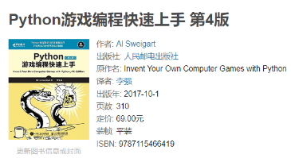

书籍的内容：大部分内容都是关于命令行有些的，只有最后的几个章节是关于PyGame的GUI游戏搭建。

书籍的评价：⭐⭐⭐/⭐⭐⭐⭐⭐

具体的评价：

部分游戏中文社区其实不会了解，比如说hangman_game，当然这并不是作者的问题。

内容的结构存在着一些问题，应该按照介绍游戏，给出具体的游戏的演示流程，基于流程一步一步写出来代码，然后给出完整的代码，这样的一个步骤来书写，而不是先给出完整的代码，然后一个代码块一个代码块的讲一下这个代码块是怎么回事，这从流程上来讲应该是错误的。

代码不是非常的Pythonic，缺少了OOP相关的内容，代码从工程上来讲应该需要重构来符合规范，比如说将游戏的部分弄到另一个py文件中，然后再main文件中导入这个文件和执行内容，现在都现在同一个文件中，也没有main()函数。

如果是Python语言的新手的话，在学习完语法之后可以通过这本书来提升一下自己对语法的熟练程度，但是缺乏的OOP相关的内容需要其他的书籍来再次训练。

**R的两门Udemy课程**

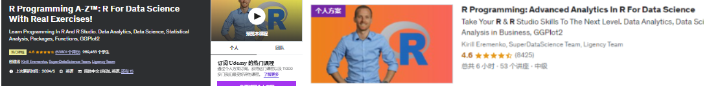

评价为：⭐⭐⭐/⭐⭐⭐⭐⭐

感觉R要么从系统性的数据入手，要么从一些项目入手来实践一下，这样会更好一些。

这两门课还可以，但是单纯的学习这个而不是，效率其实感觉没有那么大，而且R是专门用来搞统计的，所以也没法像是学习Python一样做一些不涉及到数据科学/统计而是单纯的使用语言的训练。

还是使用R数据科学之类的会更好一些。

## 人工智能

**AI for Everyone**

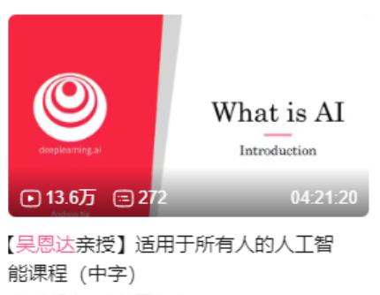

就是一个非常简单的科普视频，而且这里的人工智能也不是宽泛的人工智能，更多的就是机器学习之类的东西，类似于自然模拟相关的算法之类的，基本上也没有提及。

**速成科：人工智能**

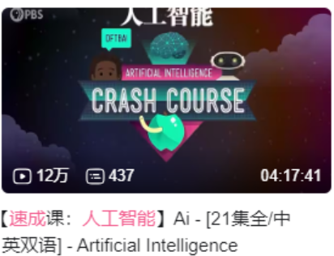

还可以，涉及到的知识面比上面的课程要稍广泛一些，用来进行科普不错。

## 数据科学

**Python数据科学实战**

Github地址：https://github.com/YeJiu97/python-for-data-science-a-hands-on-introduction

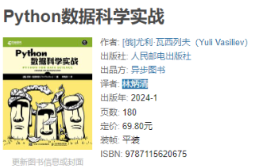

首先这本书比较薄，定价为70RMB，内容虽然涉及到了不少数据科学的东西，但是基本上都是点到即止的讲了一下，无论是从“学习”还是从“实战”的角度来讲，都是不够系统或者不够实践的，也对不起这个价格，如果能够打折在35~40RMB左右入手，只能够说还行，高于了这个价格入手就不是非常好了。

接着是书中的内存存在着一些问题，最典型的就是代码问题，代码使用的不是pandas 2.0或者以后的版本，这个版本之后append()函数被从pandas中移除了，但是书中的代码还是使用了append()函数来为dataframe添加新的列，如果这本书出版的较早，那么这些问题是可以理解的，但是作为一本在2024年一月左右出版的书籍，我认为存在着这样的问题是很有问题的，因为出版方没有能够核对一遍代码是否能够运行，书中在使用到numpy和pandas的时候也没有指定版本，而是单纯的给出了一个安装代码pip install numpy和pip install pandas，也没有要求使用anaconda或者miniconda之类的来管理包的版本。

最后，我没有找到原作者的ipynb代码或者github的仓库，另外第九章使用到了googlmaps和telegram bot，这些在国内（大陆地区）都没有办法使用，所以这个章节也无法实现，虽然这不是出版方和作者的问题就是了。

**Kaggle Master with Heart Attack Prediction Kaggle Project**

Udemy上面的一个课程：

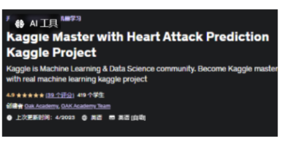

只能够说是一个非常基础的教程，教了一下怎么使用Kaggle和Version切换或者别的一些东西，不是非常推荐购买，因为汇率的问题，但是如果能够找人20人民币帮忙下载之类的，就可以看看。

## 机器学习

**机器学习项目实战**

Github地址：https://github.com/YeJiu97/machine-learning-bookcamp-build-a-portfolio-of-real-life-projects

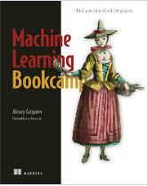

书籍的评价：⭐⭐⭐⭐/⭐⭐⭐⭐⭐

从内容的角度来看，其实是一本比较好的机器学习的入门书籍，并且不是单纯的将理论，而是从某一个具体的数据集和对应的项目来阐述了对应的算法，仅少量的数学，大量的图表和说明，这一点相对于其他的中文机器学习的教程书籍来的好很多。但是这本书籍缺少了关于无监督学习相关的内容，如果仅讨论有的监督学习，书籍也缺乏了关于SVM和朴素贝叶斯算法等内容。

另外，这本书中有着三个章节是关于服务器部署等相关的内容的，虽然这可以视作是“实战”，但是对于冲着机器学习项目实战而来的人，更好的选择是将这些讲解替换成SVM和朴素贝叶斯，然后再最后的章节给出如何导出模型，载入模型，部署模型和服务器上使用模型的内容。而且不是所有的读者都会使用亚马逊服务器或者某一个特定的服务器的，不如去除掉在某一个具体的服务器上部署的想法，而是更加具体的而讲一下如何使用本地的Flask来进行模型使用，虽然现在也有Flask相关的内容，但是内容太短了。

不是关于模型的章节部分我大部分都是自己看过去和简单的对着敲了一下代码，这个库中的对应章节的内容主要还是来自作者自己的代码。注意：作者的jupyter中只有代码，基本没有注释，很少有讲解，这个相对于Python数据科学项目实战来的查了太多，那本书的jupyter源代码基本上就是书籍的内容，有着完整的讲解和代码实现和对代码的结果的解释，可以说就是书籍的内容的jupyterlab排版。

如果是我的话，我应该会给出这样的内容结构：

- 第一章：机器学习简介和环境搭建
- 第二章：回归分析，线性回归和非线性回归
- 第三章：分类问题，二元分类和评估
- 第四章：分类问题，多元分类和评估
- 第五章：贝叶斯分类
- 第六章：决策树与随机森林
- 第七章：SVM
- 第八章：深度学习：实现一下MNIST的识别
- 第九章：模型导入，导出，如何应用到新的数据集和如何使用Flask进行部署
- 附录：Python基础语法，numpy基础语法，pandas基础语法，一些推荐的Kaggle项目

这本书的标价是129，只比另一本书的139便宜了10块钱，但是薄了许多，内容的硬核程度和随书源代码也都差了很多，拼多多的价格为55上下，性价比还行。

补充：书中的代码存在着一些问题，一些代码的缩进和符号存在着错误或者确实；另外主要是第7章，也就是深度学习的部分，如果对着书走，敲的代码的运行结果和书籍给出来的运行结果是对不上的，因为书中的代码和作者的源代码存在着出入。

# 数据科学

## 机器学习

**Python机器学习项目实战**

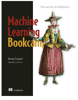

每个章节的标题，内容和我的代码实现。

| 编 号 | 章节                 | 内容                                                         | 我的实现                                                     | 完成情况 |
| ----- | -------------------- | ------------------------------------------------------------ | ------------------------------------------------------------ | -------- |
| 1     | 机器学习简介         | 理解机器学习及其可解决的问题                                 | [机器学习简介](https://github.com/YeJiu97/machine-learning-bookcamp-build-a-portfolio-of-real-life-projects/tree/main/scr/chapter%2301：机器学习简介) | 完成     |
| 2     | 回归问题的机器学习   | 使用线性回归模型创建汽车价格预测项目                         | [用于回归的机器学习](https://github.com/YeJiu97/machine-learning-bookcamp-build-a-portfolio-of-real-life-projects/tree/main/scr/chapter%2302：用于回归的机器学习) | 完成     |
| 3     | 分类问题的机器学习   | 使用逻辑回归预测客户是否流失                                 | [用于分类的机器学习](https://github.com/YeJiu97/machine-learning-bookcamp-build-a-portfolio-of-real-life-projects/tree/main/scr) | 完成     |
| 4     | 分类问题的评估指标   | 使用准确率、混淆矩阵、精确率、召回率、ROC、AUC等评估分类模型 | [分类的评估标准](https://github.com/YeJiu97/machine-learning-bookcamp-build-a-portfolio-of-real-life-projects/tree/main/scr/chapter%2304：分类的评估指标) | 完成     |
| 5     | 机器学习模型的部署   | 使用Pickle保存模型、Flask部署模型、Pipenv管理依赖、Docker打包服务、AWS Elastic Beanstalk部署到云端 | [机器学习的模型的部署](https://github.com/YeJiu97/machine-learning-bookcamp-build-a-portfolio-of-real-life-projects/tree/main/scr/chapter%2305：机器学习模型部署) | 基本完成 |
| 6     | 决策树与集成学习     | 使用树模型预测违约风险，包括决策树、随机森林、梯度提升树等   | [决策树与集成学习](https://github.com/YeJiu97/machine-learning-bookcamp-build-a-portfolio-of-real-life-projects/tree/main/scr/chapter%2306：决策树与集成学习) | 完成     |
| 7     | 神经网络与深度学习   | 使用卷积神经网络进行图像分类，介绍TensorFlow和Keras，迁移学习、数据增强等 | [神经网络学习](https://github.com/YeJiu97/machine-learning-bookcamp-build-a-portfolio-of-real-life-projects/tree/main/scr/chapter%2307：神经网络与深度学习) | 完成     |
| 8     | 无服务器深度学习     | 使用TensorFlow-Lite提供轻量级环境，使用AWS Lambda部署深度学习模型，通过API Gateway提供网络服务 | [无服务器深度学习](https://github.com/YeJiu97/machine-learning-bookcamp-build-a-portfolio-of-real-life-projects/tree/main/scr/chapter%2308：无服务器深度学习) | 完成     |
| 9     | Kubernetes与Kubeflow | 使用Kubernetes部署和服务模型，使用Kubeflow简化部署流程       | [Kubeflow](https://github.com/YeJiu97/machine-learning-bookcamp-build-a-portfolio-of-real-life-projects/tree/main/scr/chapter%2309：kubeflow)，[kubernetes](https://github.com/YeJiu97/machine-learning-bookcamp-build-a-portfolio-of-real-life-projects/tree/main/scr/chapter%2309：kubernetes) | 完成     |
| 10    | 附录                 | Python，NumPy和Pandas                                        | [附录](https://github.com/YeJiu97/machine-learning-bookcamp-build-a-portfolio-of-real-life-projects/tree/main/scr/chapter%2310：附录) | 完成     |

从内容的角度来看，其实是一本比较好的机器学习的入门书籍，并且不是单纯的将理论，而是从某一个具体的数据集和对应的项目来阐述了对应的算法，仅少量的数学，大量的图表和说明，这一点相对于其他的中文机器学习的教程书籍来的好很多。但是这本书籍缺少了关于无监督学习相关的内容，如果仅讨论有的监督学习，书籍也缺乏了关于SVM和朴素贝叶斯算法等内容。

另外，这本书中有着三个章节是关于服务器部署等相关的内容的，虽然这可以视作是“实战”，但是对于冲着机器学习项目实战而来的人，更好的选择是将这些讲解替换成SVM和朴素贝叶斯，然后再最后的章节给出如何导出模型，载入模型，部署模型和服务器上使用模型的内容。而且不是所有的读者都会使用亚马逊服务器或者某一个特定的服务器的，不如去除掉在某一个具体的服务器上部署的想法，而是更加具体的而讲一下如何使用本地的Flask来进行模型使用，虽然现在也有Flask相关的内容，但是内容太短了。

不是关于模型的章节部分我大部分都是自己看过去和简单的对着敲了一下代码，这个库中的对应章节的内容主要还是来自作者自己的代码。注意：作者的jupyter中只有代码，基本没有注释，很少有讲解，这个相对于Python数据科学项目实战来的查了太多，那本书的jupyter源代码基本上就是书籍的内容，有着完整的讲解和代码实现和对代码的结果的解释，可以说就是书籍的内容的jupyterlab排版。

如果是我的话，我应该会给出这样的内容结构：

- 第一章：机器学习简介和环境搭建
- 第二章：回归分析，线性回归和非线性回归
- 第三章：分类问题，二元分类和评估
- 第四章：分类问题，多元分类和评估
- 第五章：贝叶斯分类
- 第六章：决策树与随机森林
- 第七章：SVM
- 第八章：深度学习：实现一下MNIST的识别
- 第九章：模型导入，导出，如何应用到新的数据集和如何使用Flask进行部署
- 附录：Python基础语法，numpy基础语法，pandas基础语法，一些推荐的Kaggle项目

这本书的标价是129，只比另一本书的139便宜了10块钱，但是薄了许多，内容的硬核程度和随书源代码也都差了很多，拼多多的价格为55上下，性价比还行。

补充：书中的代码存在着一些问题，一些代码的缩进和符号存在着错误或者确实；另外主要是第7章，也就是深度学习的部分，如果对着书走，敲的代码的运行结果和书籍给出来的运行结果是对不上的，因为书中的代码和作者的源代码存在着出入。

书籍的评价：⭐⭐⭐⭐/⭐⭐⭐⭐⭐

# 数学

## 编程与数学

**Python数学编程**

Github的地址：https://github.com/YeJiu97/doing-math-with-python

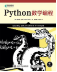

书籍的定位很明确：应用Python解决高中和大学低年级的数学问题，涉及到几何，概率论，统计学以及微积分等知识。

需要注意的地方在于：这本书并不会具体的教你这些知识，只是简单的介绍一下一些基础的概念，然后便使用Python语言来进行实践，所以如果想要一边学习数学，一遍学习如何使用Python来对数学解答进行表达和求解，这本书并不能够做到这一点。

这本书需要提升的地方：每一个主题都需要更加多的知识点来更加系统性的学习如何使用Python来进行求解，比如说第5张关于集合和概率的内容，只讲了并集和交集两个概念，然后通过投掷骰子和硬币为例子进行了简单的实践，很明显这太过于浅显了，概率论不说复杂的高级概率统计相关的知识点，就算是入门的简单的知识点，也不应该只有这些；另外这本书使用的库有些奇怪，虽然使用到了matplotlib，但是基本上没有使用numpy和pandas，这两个都是现在数据科学绕不开的两个库，或者作者干脆自己使用math来实现一些需要的数学功能，并且作为独立的模块以供之后导入使用，但是作者也没有这么做。

这本书的标价为59人民币，但是网络上购买可以打折在30人民币入手，但是考虑内容还是有些略贵。

总体评分：⭐⭐⭐/⭐⭐⭐⭐⭐。

**数据科学的数学基础**

Github仓库：https://github.com/YeJiu97/essential-math-for-data-science

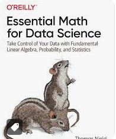

书籍评价：⭐⭐⭐⭐/⭐⭐⭐⭐⭐。

感觉排版不够紧凑，但是也没有能够想出有什么更好的排版，或许可以参考一下Manning出版的那些书籍，这个Oreilly的书籍基本上都是这样的。

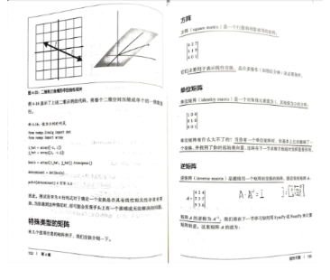

另外书籍里面有一些错误的排版，比如说某一行的缩进是错误的，这样的错误很低级（注：注意到是直接从英文的pdf上复制黏贴产生的结果）。

内容总体上来的是偏向于入门的，但是感觉讲解的不够详细，我认为应该可以结合更多的例子进行详解的讲解定理的使用，每个章节之后的习题，在涉及到概率统计的章节和线性回归的章节，最好也是给出一个具体的例子，然后让读者从这些例子去做这一章学习到的内容，而不是单纯的让读者去计算或者用代码计算。

关于公式的推到很多时候是不存在的，比如说第五章的线性回归的封闭矩阵是怎么回事，QR分解如何推到，也是不存在的，如果是这样，在使用的时候先生成一个例子进行可视化或者公式展开进行讲解，会是一个更好的选择。

总体上来讲一般，但是更多的是起到了对数据科学所需的数学只是的总览的作用，如果想要非常坚实的打下基础，那么需要的是找对应章节的知识点的教材来进行更加的系统性的学习。

标价118，入手肯定是有问题的，拼多多上面买了将近80，不划算，入手在60的话还可以，不然还是算了。

# 电视剧&电影

## 电视剧

**南海归墟**

评价：⭐⭐/⭐⭐⭐⭐⭐

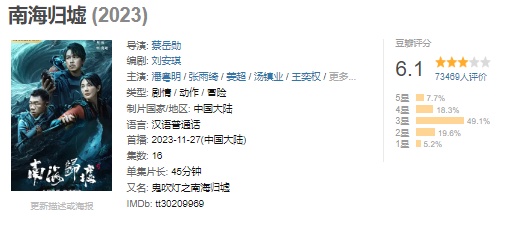

这个东西拍的非常糟糕，也可能是这一部涉及到出海和海下考古的剧情，所以不好拍，但是如果和别的一些也涉及到海洋的电视剧进行比较，特效道具和演员的演技都是比较差的。

## 动漫电影

**刀剑神域进击篇：无星之夜 劇場版**

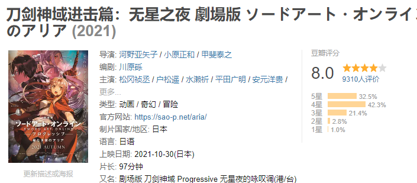

相当于对第一季的PartI进行了补充，让人物更加的立体，没有什么冲突的地方，评价为：⭐⭐⭐⭐/⭐⭐⭐⭐⭐，没有把米特写死属于没有落入俗套，而且对于这个人物的塑造也很不错，既不是桐人的性转镜像，也不是什么没有变化的游戏狂热玩家，是一个具有复杂性的普通人。

**刀剑神域进击篇：暮色黄昏 劇場版**

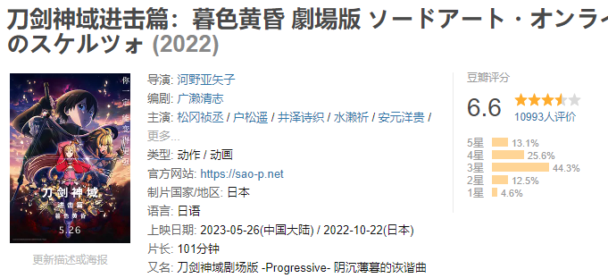

豆瓣上面这个剧场版的评分比上一个来的低，我的评价也是：⭐⭐⭐/⭐⭐⭐⭐⭐，主要原因在于人物的塑造问题，首先是对牙王的塑造和动漫里面的有些不吻合，对于米特的塑造倒是不错，可是作为女主的亚斯娜的塑造就不太行了，亚斯娜可以表现出抑郁悲伤之类的情绪，但是不应该是一个哭哭啼啼的人，如果100分钟里面哭个五六次，那么对于原先的人物的塑造就太打击了。

# 动漫

## 日本动画

**打工吧，魔王大人II**

我的评价：⭐⭐⭐/⭐⭐⭐⭐⭐

过了好久才出来的第二季。

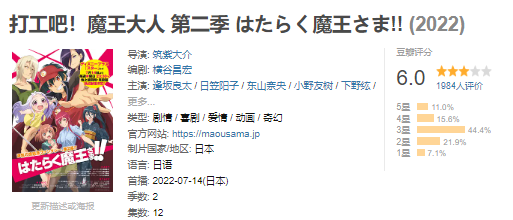

画风不如第一季，不过和小说的更加贴近，这一季感觉不是很懂，另外小说最后一些烂了，魔王不和勇者呆在一起然后回去，反倒是把小千和魔王组成了CP，按照网络上的说法是作者在打工的时候遇到过这样的一位很好的同事，但是因此在小说中这样写，实在是太糟糕了。

**鬼灭之刃**

最终决战之前的训练了：

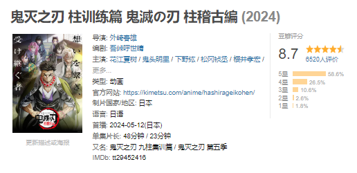

最后死了一堆人，不过最后的结局处理的不是非常好，上一和上三都是近似死亡逻辑，观感不是非常的好，对于上一，最好是各种配合最终杀死，至于无惨，让阳关消灭就好了，鬼化的炭治郎的恢复太王道了，观感觉也不是非常的好，而且可以因为鬼化过，让其可以超过25岁这个开了斑纹导致的寿命极限。

我的评价：⭐⭐⭐/⭐⭐⭐⭐⭐。

**狼与香辛料**

这个竟然重制了：

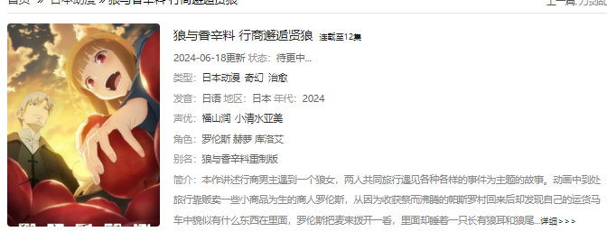

画风也是更加的贴近了小说的插画，不过我还是比较喜欢老板的画风，而且我比较期待的其实是第二季之后的内容，而不是单纯的重制，就像是诛仙我也期待碧瑶挡剑之后的内容，而不是挡剑之前的内容反复的观看。

另外的一个改动让我不是非常的理解，在新版的剧情里面：

这里是男性，但是老版的里面是女性，剧情上老版本的和男主之间存在着一些单相思的关联，对赫萝的行为也有对男主的报复的成分，二这里则是男性，和男主也只是最开始愿意来做交易的感激，这个改动的理由是什么？感觉不如原先刻画出来一个更加细腻复杂的人物。

总体评价：⭐⭐⭐⭐⭐/⭐⭐⭐⭐⭐。

**死狂**

这个词语的来源是：“所谓武士道者，不外乎死亡。（武士道は死に狂いである。）

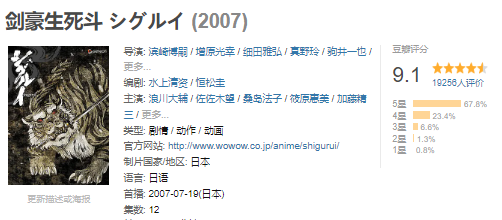

> 独臂的武士因为无法支撑长刀的重量而将刀抛至空中，盲眼的剑士因为没有抓准距离和时机便随意挥刀……

这部作品是对武士刀的一个讽刺，两个武士的背后的爱恨情仇和比武时候的决斗，最终变成了这样轻飘飘甚至有些可笑的记录。

评价：⭐⭐⭐⭐⭐/⭐⭐⭐⭐⭐。

**拳愿v.s刃牙**

评价：⭐⭐/⭐⭐⭐⭐⭐。

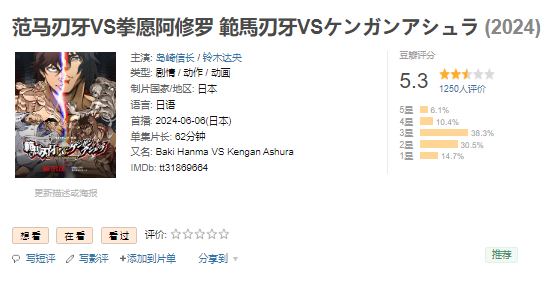

拳愿的流畅度还是可以的，而且也比较写实，联动之后和搞笑动漫一起变成了便宜动漫。

**终末的女武神**

我的评价：

- 第一季：⭐⭐/⭐⭐⭐⭐⭐
- 第二季：⭐⭐⭐/⭐⭐⭐⭐⭐
- 第三季：⭐⭐/⭐⭐⭐⭐⭐

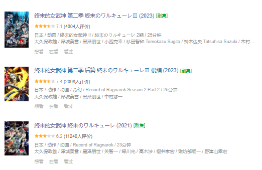

除了第二季的智斗可以看一下，别的都非常地糟糕。如果吕布输了是因为凡人之躯，那么亚当至少应该是平局，而佐佐木小次郎是个什么东西。莫名其妙的讲解和观众的加油呐喊太尴尬了，无聊的回忆也没有对人物有什么深刻的塑造，最重要的是，战斗番的战斗不好看，你的横扫的威力很大和你应该什么时候出脚是两件事情，根本没有展示战斗智商和博弈有什么好看的。

**刀剑神域系列**

第一季：

第一季的评价为⭐⭐⭐⭐/⭐⭐⭐⭐⭐。

第一季的PartI的评价可以有：⭐⭐⭐⭐⭐/⭐⭐⭐⭐⭐。基本上可以认为是这个动漫带起来的轻小说热度，现在回过头来看一遍，很多当年的感觉都还在，PartII的评价为：⭐⭐⭐/⭐⭐⭐⭐⭐，总体上观感不如PartI的部分来的好。

第二季：

还可以：⭐⭐⭐⭐/⭐⭐⭐⭐⭐，故事的剧情和深度会比第一季的PartII来得好一些。

第三季：

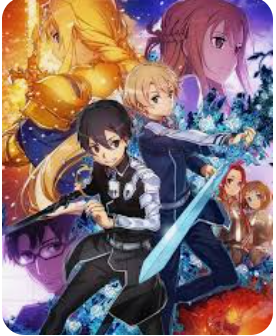

故事内容和角色深度上比之前来的要好，引入了全新的设定和人物，例如Eugeo和Alice，为系列增添了新的活力。在视觉效果上有所提升，战斗场景和角色表现都得到了好评。但是剧集可以缩短道原先的3/4左右，让节奏更加的紧凑，而且对于几位女性角色的塑造不够，最后都是让男主来处理，这点不是非常的好。

评价为：⭐⭐⭐⭐/⭐⭐⭐⭐⭐。

## 中国动画

**诛仙II**

终于出来了十年后的内容了。

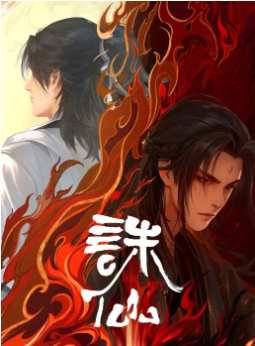

从建模来看：

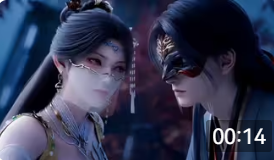

这个金瓶儿怎么比陆雪琪还要清纯的感觉啊，而且和鬼厉的CP感非常的强，陆雪琪虽然也奶奶的：

微表情做的非常的不错。

另外，小白怎么这么漂亮：

调戏小凡的画面：

而且怎么还有一个专属的MV？

https://www.bilibili.com/video/BV1aBvEepEWx/?spm_id_from=333.337.search-card.all.click&vd_source=70cc82c6f851aaa826e5c863112d2113。

有点夸张，主角和陆雪琪和碧瑶都没有这个待遇。

评价：⭐⭐⭐⭐⭐/⭐⭐⭐⭐⭐。

# 游戏

## 动作类

**SiFu**

我的评价：⭐⭐⭐⭐/⭐⭐⭐⭐⭐。

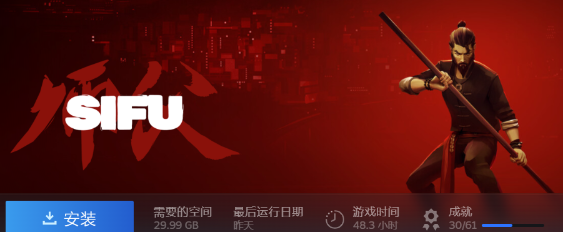

这个游戏非常的不错，重点是打折也不是很贵。黑木还是不是很会打，大师难度的也还需要多练，竞技场的话最高成就有一些有些困难了。多练其实也还可以，但是人老了。

背后的故事也非常有趣：

1. https://www.bilibili.com/video/BV1hT4y1X74Y/?spm_id_from=333.337.search-card.all.click
2. https://www.bilibili.com/video/BV1tm4y1Z7rm/?spm_id_from=333.337.search-card.all.click&vd_source=70cc82c6f851aaa826e5c863112d2113

没想到中国的传统武术在年轻人的圈子里是这样出圈的，而且是靠着一个老外来传播的。不过这也令我想到了一代宗师里面的一句话：南拳又何止北传，能够传承下去，何止于南北，何止于华人。

## 魂类

**记忆边境**

我的评价：⭐⭐/⭐⭐⭐⭐⭐。

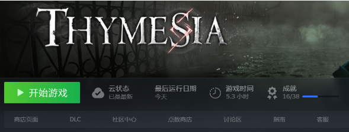

通过白色血条和绿色架势条来避免砍几刀就跑的消耗式打法，并且强制切换使用两种攻击方式，但是缺乏了相关的机制，只是单纯的对同一个怪打了两遍而已，应该给怪一些变化，比如说白色血条和绿色架势条差距较大的情况之下，小怪会进行防守或者进行更多的闪避，甚至进行逃跑。

地图设计上来见，引导性不是非常的好，不是非常理由一些门或者说捷径设置在这里到底是用来干嘛的，而且打开了一个门之后，或者完成了某一个道路上的怪的清理之后，也不知道接下来要去哪里，地图也不存在着某一个地图最终会通向原点的情况，各个地图之间也没有通道，而是直接在基地选项传送到这一张图，设计的不是非常的好。

感觉有些偏向于魂like游戏，而不是类银河战士恶魔城，但是角色的机动性太强了，而且第一个Boss的机动性也非常的强，玩家打到这里的时候的角色属性偏弱了，但是也不会有特意去刷经验升级的欲望，因为对地图的探索欲望本身也非常弱，而且升级的难度在等级高了之后，需要的经验点太多了。怪物的设计上，缺乏了差异性，很多怪物就是换皮。

音效不是非常的好，打击感一般，打击感是非常需要提升的地方，毕竟快速战斗是游戏的核心和特色，第一Boss不应该有第二管血，或者降低血量避免这么坦。

原价入手肯定不值得，但是打折50上下入手还行，不过最好给出来一些竞技场/Boss Rush的功能，来让一些人能够精进自己和反复游玩。

## Rogue类

**雨中冒险：回归**

我的评价：⭐⭐⭐/⭐⭐⭐⭐⭐。

游戏缺失是高清重制了，但是感觉难度还是太高了一些，建议降低一些难度，另外Boss复活或者忽然间伤害高的把我秒了，这是不是不太合适？

另外这个游戏玩的人太少了一些：

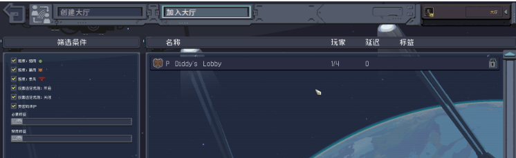

除非你有一群也喜欢玩这个游戏的朋友或者网友，否则的话，基本上就会变成单机游戏了，但是单人通关的难度太高了，而且很快就会觉得很无聊。

买的时候价格在50左右，不记得是不是打折入手的，但是感觉可以更加的便宜一些。

**死亡细胞**

我的评价：⭐⭐⭐⭐⭐/⭐⭐⭐⭐⭐。

这个游戏是真的好玩和耐玩。

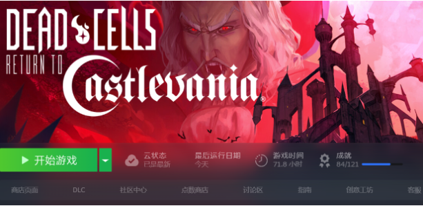

5个DLC全部都入手了：

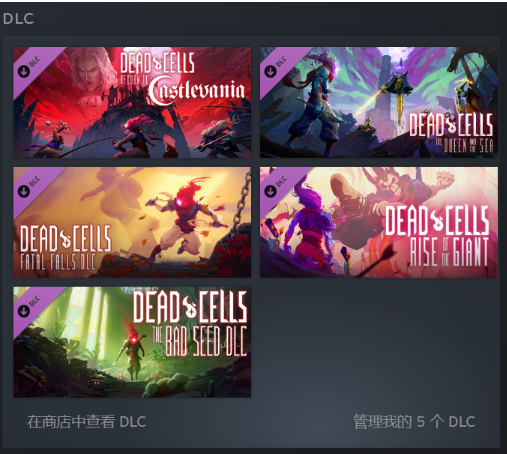

DLC的地图：

| DLC        | 地图                                         |
| ---------- | -------------------------------------------- |
| 巨人的崛起 | 山洞、守护者的居所、观星实验所、观星台       |
| 坏种       | 荒废植物园、被弃者沼泽、巢穴                 |
| 致命坠落   | 崩坏神庙、不死海滩、阴森墓园                 |
| 王后与海   | 感染船骸、灯塔、塔顶                         |
| 重返恶魔城 | 城堡边陲、恶魔城、被污染的大墓地、城主的据点 |

来自网友的路线图，2024年的：

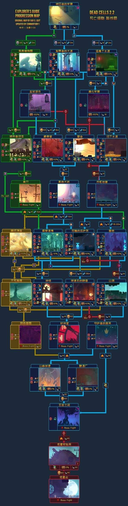

0细胞的时候需要拿到的一些符文：

- 被囚者牢房→有罪者大道，拿到藤蔓符文
- 被囚者牢房→猛毒下水道，拿到传送符文
- 被囚者牢房→有罪者大道→藏骨堂，拿到牧羊符文
- 被囚者牢房→猛毒下水道→旧下水道→作呕地窖→沉睡的庇护所，拿到蜘蛛符文

前往DLC守护者居所方法

- 首先需要通关0细胞，然后在牢房之前出现的洞口进去，站在平台的边缘丢脑袋（丢出脑袋后一直按着往右即可），解锁2道门，然后跳到对岸拿到前往山洞的钥匙
- 然后走被囚者牢房→猛毒下水道→旧下水道→作呕地窖→墓地的路线，从墓地用钥匙开门前往山洞（门前有一个祭坛状的东西，钥匙要镶嵌上去，会有按键提示），之后就可以从山洞去守护者居所打巨人Boss。
- 在第一次完成这个路线之后，就可以在被遗忘的陵墓的尽头，前往时钟室的旁边看到一个2细胞之后能进的门，这个门可以直接去守护者的居所，然后解锁成就“炽热与冰冷”。

恶魔城的方法

- 我们要从被囚者的牢笼走到城堡边陲，最后到达恶魔城
- 更新完成dlc后在如图所示位置出门会看到一群蝙蝠
- 我们打开地图看一下会发现被囚者的牢房中出现了一个城堡边陲入口
- 一路前往那里进入城堡边陲，进入后触发剧情
- 之后我们需要去被污染的大墓地，将死神boss击败
- 从被囚者的牢房前往钟楼，再将时钟室的敌人杀完出来就可以去了，解锁第一种后我们就可以在出生点看到阿鲁卡，前往时钟室将守卫杀光后出来又可以看到阿鲁卡，与其对话就可以解锁恶魔城了

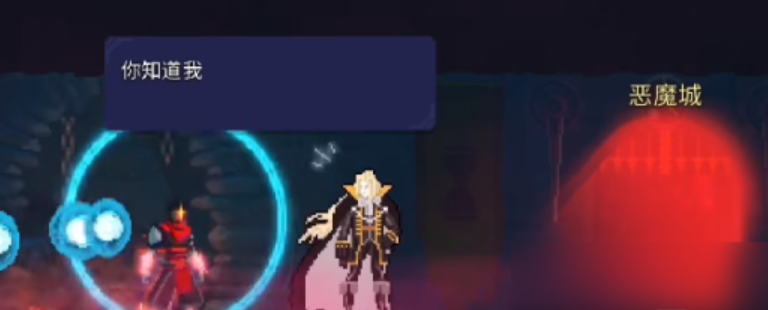

五细胞解锁方法

在通关4细胞的时候，第二个BOSS要去守护者的居所打巨人，这样才能拿到第5个起源细胞，开启5细胞难度，也就是最后一个起源细胞不在王手的手里。

如果你走时钟室BOSS去打王手，打败王手之后是拿不到第5个起源细胞的，打完还是4细胞难度，非常难过。

**小骨：英雄杀手**

我的评价：⭐⭐⭐/⭐⭐⭐⭐⭐。

这个游戏比死亡细胞其实差了不少。

感觉不如死亡细胞，死亡细胞的一周目的难度没有那么高，而且可以通过每过一个地图来进行补给，武器的多样性也丰富不少，而且高周目新的怪，解锁新的符文等等，都会有让人继续下去的动力。而且死亡细胞有DLC不断出来，小骨如果能够通关一遍的话，接下去接着玩地动力就没有那么高了。

果断时间开个修改器把东西刷一下，然后再玩一下做一下成就。

## 模拟经营

**潜水员戴夫**

这个游戏原本不在计划里面：

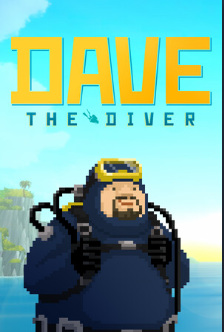

我开着修改器玩了大概40个小时，这个游戏做的确实不错，我的评价为：⭐⭐⭐⭐⭐/⭐⭐⭐⭐⭐。

游戏中包含多种多样的海洋生物和探险区域，游戏内容也随着时间不断更新和扩展，这点上可以增加玩家的长期兴趣。美术风格非常的不错，而且鱼类非常的丰富，为每种鱼给出绘图和制作模型，工程量应该很大，而且做的都非常地不错。游戏的玩法也非常的多元，抓鱼，运行寿司店，探索海洋和人鱼村，还有各种任务和事件，长期可玩性很高。

而且这个游戏是一个流程全成就游戏，只要按照顺序来玩，将事件和任务和剧情都过了，基本上就是全成就了，非常的友善（渎神I就要和全图的所有尸体对话，太折磨了）。