# 人生七年

## 为什么是七年

七年这个概念有三个来源。

第一个来源是数字7本身的神奇，一周有7天，世界有7大洲，人眼所能够分辨的色彩有7种，人的工作记忆所能够记载的对象的数量为7，等等。

第二个来源是 @李笑来 的书籍《新生：七年就是一辈子》，李笑来老师的话要听，李笑来老师推荐的产品不要购买，书籍阅读地址为：[新生大学：七年就是一辈子](https://b.xinshengdaxue.com/)，一个短视频演讲可以在B站上观看：[七年就是一辈子](https://www.bilibili.com/video/BV19V411r7LF/?spm_id_from=333.337.search-card.all.click)。

第三个来源则是ITV的一个系列纪录片：人生七年。

通过观看这一系列的纪录片，能够起到“以人为镜可以明得失”的效果。

至于生活方法，目标等，采用的理念是极简主义的理念：

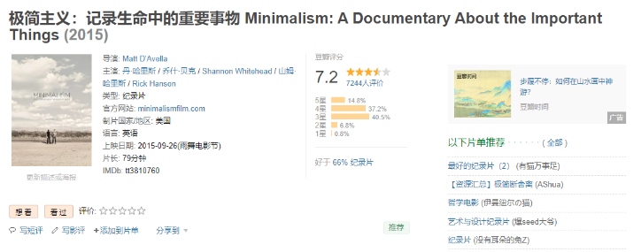

## 需要达成的目标

这七年的核心目标为：成为一位数据科学家。为了成为一位数据科学家需要掌握Python，R和SQL；接着掌握微积分，线性代数和概率统计等数学知识；最后需要掌握机器学习，深度学习和因果推断等知识。

这七年的次要目标为：成为以为插画家，目标为Krenz或者阮佳。

此外还需要做的事情有：掌握英语并且在时间足够的情况之下掌握日语；掌握网络开发的技巧并且使用Django开发一个自己的网站；此外就是提升自己的思维能力，让自己的心智水平得以上升。

# 心智

## 学习效率

首先一定要看的是李笑来的《新生：七年就是一辈子》。

此外还有两个能够协助自己提高自己认知能力的教程。一个是Yjango的学习观：

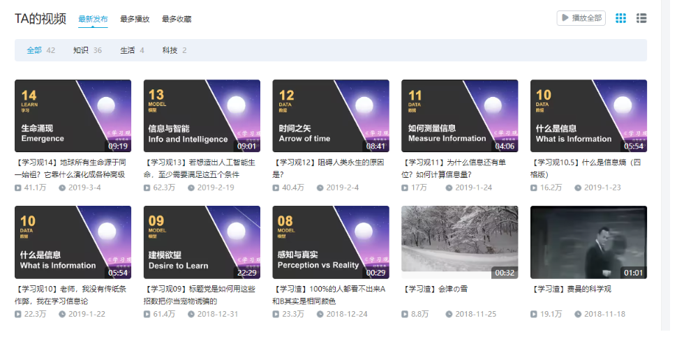

另一个则是Yjango的断墨寻径：

## 社会实践

推荐达-瑞欧的《原则》：

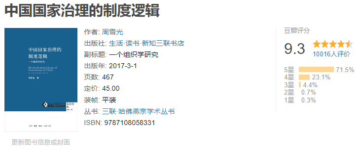

## 脑科学

脑科学可以通过在B站上已经购买的两个课程来进行学习：

两本脑科学书籍：

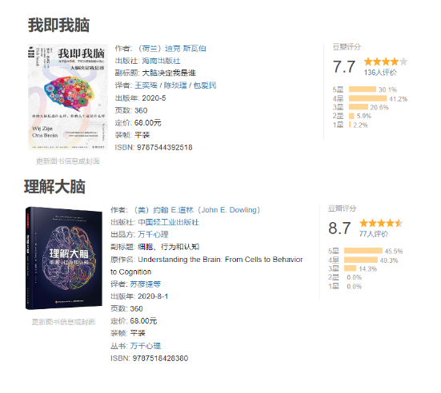

## 如何进行研究

书籍：

Udemy课程：

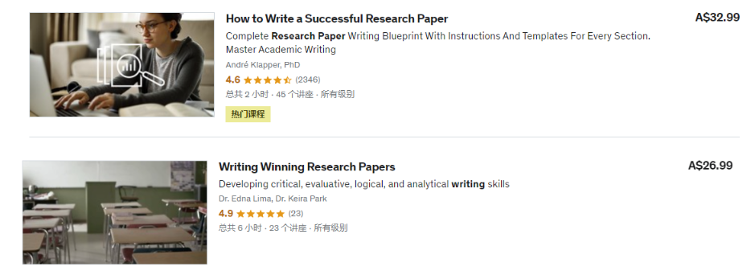

## 健康

增重采用的视频为：

正念则采用：

# 成为一位数据科学家

## 什么是数据科学

数据科学可以参考这张图：

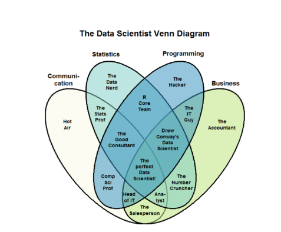

从上图不难看出，如果想要成为一位数据科学家，需要掌握的技能有：

1. 统计学和概率论（数学基础）
2. 编程（工具使用）
3. 商业（业务了解）
4. 交流（信息传播）

在如何成为一位数据科学家的安排上，主要会以这些技能作为核心脉络来进行学习。

## 数学基础

### 数学思维

在学习具体的数学之前，要对数学本身有着一个概览。

第一本需要看的书籍是，《[什么是数学 : 对思想和方法的基本研究](https://book.douban.com/subject/27061912/)》

这是关于这本书的简介：

> 《什么是数学》是世界著名的数学科普读物，它搜集了许多经典的数学珍品，对整个数学领域中的基本概念与方法，做了精深而生动的阐述。无论是数学专业人士，或是愿意作数学思考者都可以阅读本书。特别对中学数学教师、大学生和高中生，本书都是一本极好的参考书。

第二本需要看的书籍是，《[优美的数学思维（原书第2版） : 问题求解与证明](https://book.douban.com/subject/35197539/)》

这是关于书籍的简介：

> 本书以大量生动有趣的问题求解实例为背景，使用通俗易懂的语言，深入浅出地介绍优美的数学思维和严谨的证明方法，所涉及的数学内容不仅包含函数与集合、数学归纳法理论、组合计算与组合证明、整数理论、数理逻辑、图论等离散数学，而且包含微积分与实数理论等连续数学，覆盖了多个不同的数学领域。本书内容在逻辑上层层展开、环环相扣，形成一套相对完备的知识体系。本书的内容可以有效地激发学生的学习兴趣，唤醒学生的数学潜能和数学思维。

### 微积分

高等数学是进一步的学习统计学和概率论的基础知识。

采用的是Udemy上面的一个系列课程：

并且将会完成该课程的配套的训练。

此外有一个比较重要的课程，那就是**3Blue1Brown**的[【官方双语/合集】*微积分的本质* - 系列合集](https://www.bilibili.com/video/BV1qW411N7FU/?spm_id_from=333.337.search-card.all.click)，在学习开始，中途和结尾都可以反复观看这个视频来加深对于微积分的了解。

这里还有一本：微积分入门。

### 线性代数

线性代数入门采用的视频教程为麻省理工公开课的线性代数教程：

1. [麻省理工学院 - MIT - *线性代数*（我愿称之为*线性代数*教程天花板）](https://www.bilibili.com/video/BV16Z4y1U7oU/)
2. [麻省理工学院 - MIT - *线性代数*/中英文版，助教：陈莉楠（我愿称为最详](https://www.bilibili.com/video/BV1VZ4y1a76K/)

配套的书籍为：《[线性代数（第5版）](https://book.douban.com/subject/34820335/)》

Udemy的这位教微积分的老师也有一门线性代数的课程：

**3Blue1Brown**也有相关的视频：[【官方双语/合集】线性代数的本质 - 系列合集](https://www.bilibili.com/video/BV1ys411472E/)，需要进行反复的观看。

最后看的书籍为：[线性代数应该这样学 : 第3版](https://book.douban.com/subject/26886299/)，习题的答案在：http://linearalgebras.com/

另外这里还有一个本书：

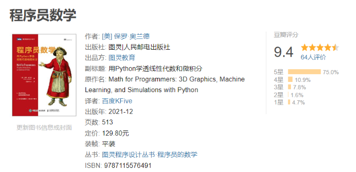

使用这本书可以进行Python语言来实现线性代数和微积分。

### 概率论与统计学

入门采用的视频教程为Udemy的这位老师的课程：

Udemy的这位老师还是一本与他人合作的课程：

这两门课都可以用来进行快速的入门学习。

统计学的深入学习基于这两本教程：

1. [统计学（第4版） : 基于R](https://book.douban.com/subject/35377356/)
2. [统计学（第五版） : 从数据到结论](https://book.douban.com/subject/35694162/)

这两本书分别使用到了R语言和Python语言，对于使用R语言和Python语言来搞数据科学是一个很好的训练。

此外还有手头的两本书：

1. [统计学核心方法及其应用](https://book.douban.com/subject/30384807/)
2. [多元统计分析——基于R(第2版)（基于R应用的统计学丛书）](https://book.douban.com/subject/35052008/)

概率论的深入学习则采用这三本书：

1. [概率导论（第2版·修订版）](https://book.douban.com/subject/26694188/)
2. [概率论基础教程（原书第10版）](https://book.douban.com/subject/35868257/)
3. [概率论及其应用（卷1•第3版）](https://book.douban.com/subject/25794324/)

最后也可以看一下**3Blue1Brown**的关于概率论的视频：

另外还有一本科普书籍：

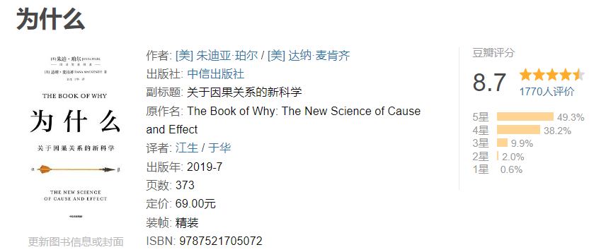

补充：

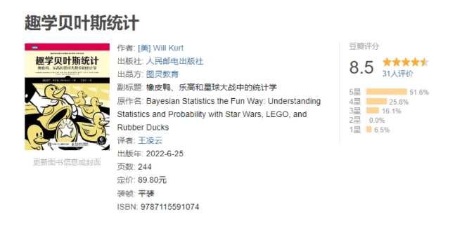

## 编程

### Python语言

Python语言在先前已经学习了《Python编程：从入门到实践》，这里可以再使用Udemy的课程来快速的回顾一下Python语言：

复习Python语言之后需要进行大量的项目来进行实践，这里采用的是Angela Yu的课程：

然后就是Ardit Sulce的两个Python工程课程：

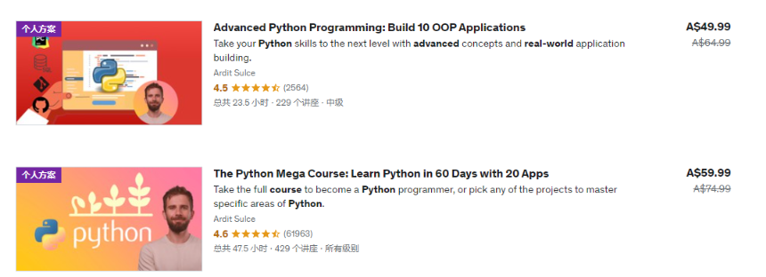

此外还有就是对Python语言的习题练习。

LintCode的Python习题：

牛客网的Python语言习题：

其他的一些Python课程：

使用Python实现设计模式：

使用Python语言的技巧：

### R语言

R语言的两门Udemy的教程为：

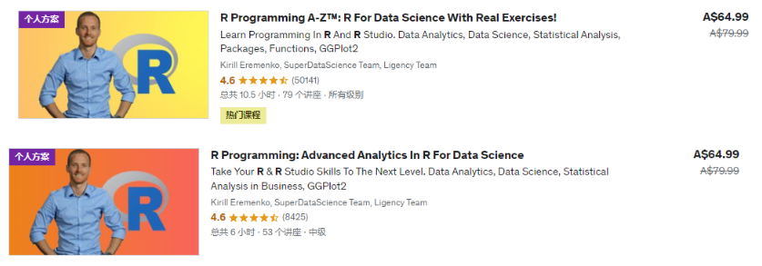

使用的书籍为：

### SQL

SQL所使用的两本书籍是：

使用的视频教程是：

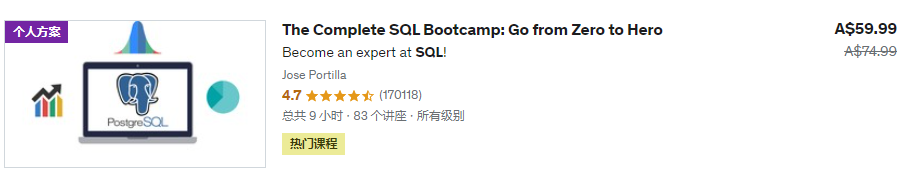

然后使用LIntCode和牛客网的习题来进行巩固：

还有LeetCode的习题：

还有的习题为：

1. https://sqlzoo.net/wiki/SQL_Tutorial/zh
2. http://xuesql.cn/

关于SQL的面试：

### 数据结构与算法

数据结构与算法并不是数据科学所需的知识，但是是计算机相关的必备的知识，在这里作为支线进行学习。

Python语言之前已经学了：

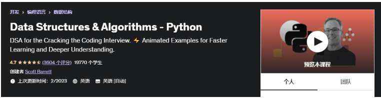

现在可以进一步的学习：

以及进行Python原因的LeetCode的练习：

在进行求职面试之前，需要刷一些习题，可以使用：

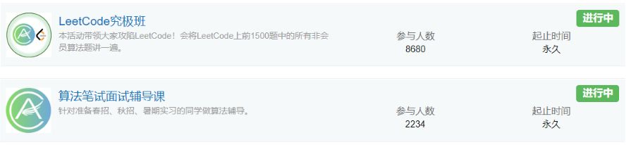

还有就是将LeetCode的经典的问题做一遍：

这里还有一门已经购买了的C++的算法基础课：

还有就是：

1. 编程珠玑
2. 编程珠玑-续

另外还有一本非常好的书籍：

如果还有余力，将《算法导论》：

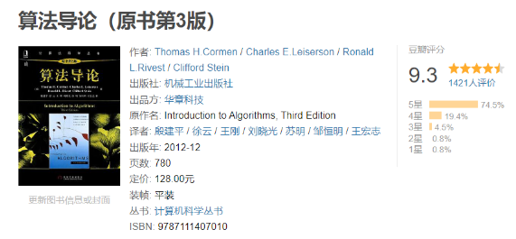

公开课：

实战：参加50次LeetCode的周赛，并且至少获得Top 500，Top 200的记录。

## 数据分析

如何处理数据：

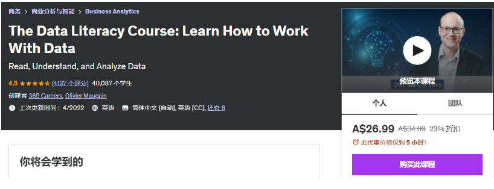

数据分析首先可以看的书籍是：

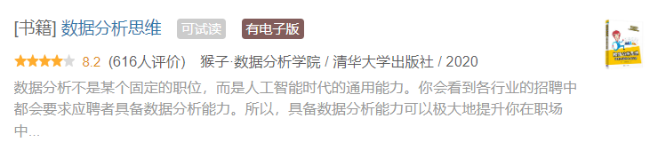

通过这本书可以对数据分析有着一个较为笼统的概括性的认知。

接着是学习B站上已经购买了的课程：

着是这本书：

接着是牛客网提供的数据分析相关的习题：

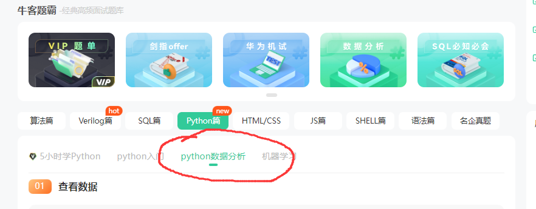

完整的数据分析训练课程：

另外还有一个快速过一遍的简单的视频：

## 数据可视化

可视化的一个概览：

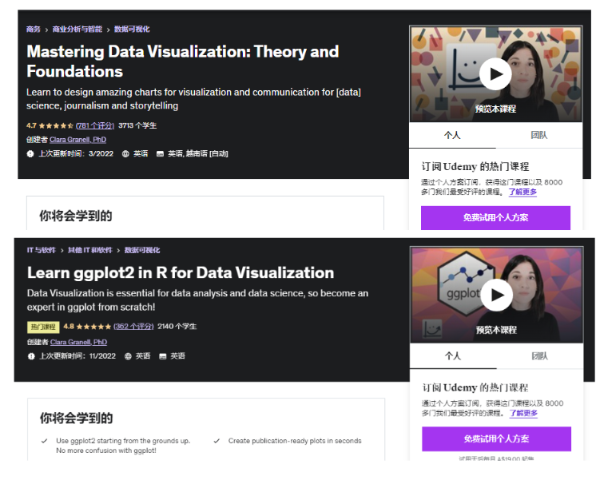

可视化书籍：

Python的可视化则采用这个Udemy教程：

## 人工智能

### 通用人工智能

一个简单的介绍视频为：

人工智能采取的教程为：

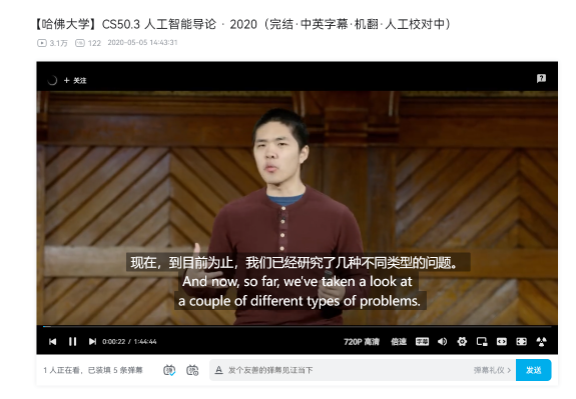

以及：

课件为：https://inst.eecs.berkeley.edu/~cs188/fa19/

Bilibili的AI的竞赛：

### 数据科学

一个比较概括的课程：

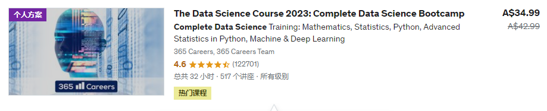

以及加州伯克利分校的数据科学课程：

链接为：https://space.bilibili.com/446570117/video?tid=0&pn=2&keyword=&order=pubdate 和 http://www.data8.org/

R语言在Udemy上面关于数据科学的教程：

接着是Udemy的几门关于Python数据科学的书籍：

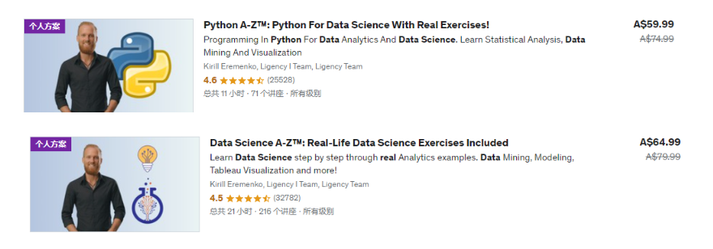

### 数据挖掘

数据挖掘采用的书籍为： [数据挖掘导论](https://www.douban.com/link2/?url=https://book.douban.com/subject/5377669/&query=数据挖掘导论&cat_id=1001&type=search&pos=0)

Udemy的课程为：

Bilibili的课程为：

### 机器学习

机器学习课程则为：

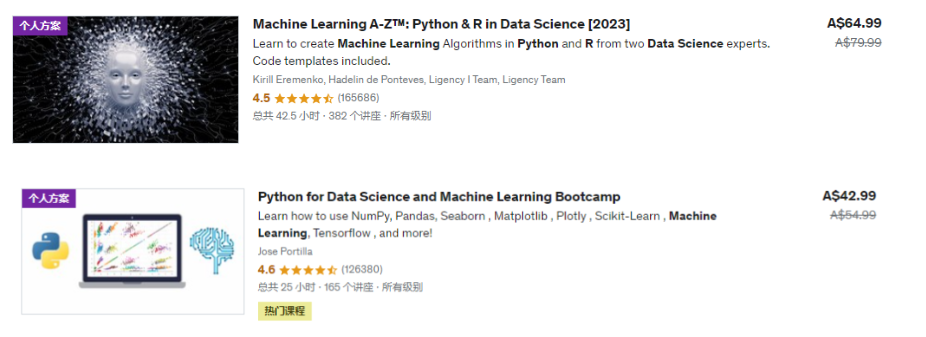

此外还有李沐和吴恩达的课程：

R语言的机器学习：

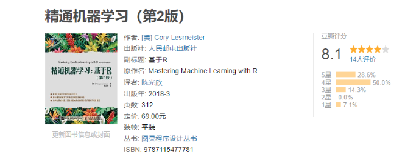

动手机器学习：

统计学习书籍：

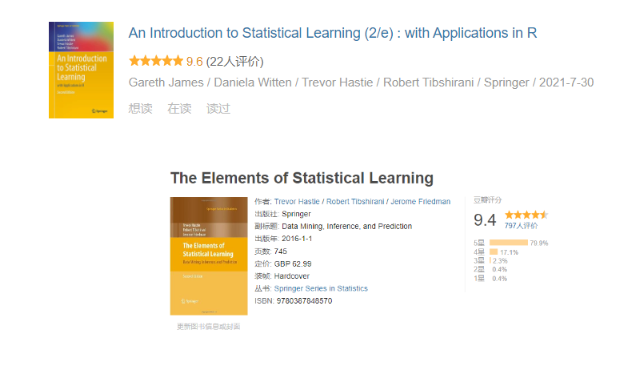

### 深度学习

深度学习的入门书籍采用：

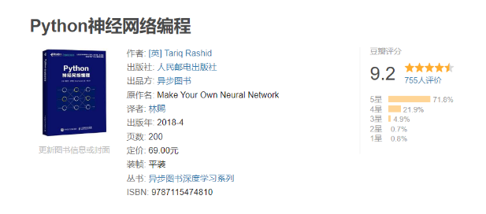

快速的了解一下深度学习：

从入门到进阶：

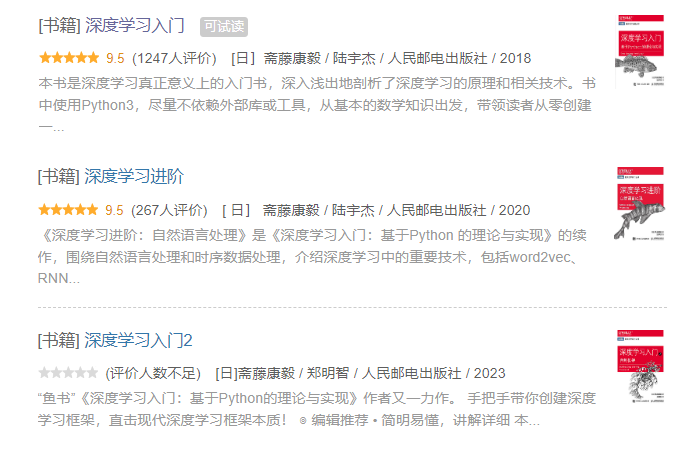

一本高分课程：

最后采用的是李沐大佬的书籍：

动手深度学习配合李沐大佬在Bilibili上面的课程。

### 项目实战

学完之后一定要自己动手在项目上进行实践，首先是 a collection of data science take home challenges：

然后是:

以及：

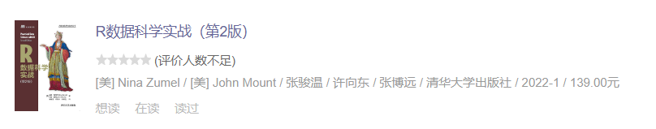

机器学习项目项目实战：

机器学习项目交付实战：

一个Kaggle的项目：

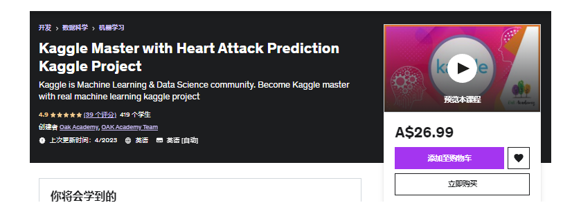

还有就是Kaggle的三十天训练营：

其他：至少参加5次Kaggle的比赛，并且获得银牌以及以上的成绩。

### 强化学习

强化学习入门：

强化学习实战：

### 时间序列

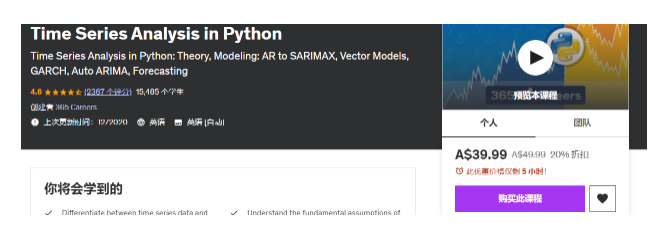

另外还有一个生存分析的课程：

### 因果推断

首先是这个课程：

链接：https://www.bradyneal.com/causal-inference-course

Judea Pearl的统计因果推理入门：

还有就是因果推断书籍：

## 大数据

### Linux系统

大数据首先需要会使用Linux系统。

Linux指令相关采用的教程是：

学完之后采用LintCode提供的Linux习题：

Linux工程课则是使用AcWing的Linux课程：

系统性的学习则采用Udemy的课程：

### 大数据处理

接着需要学习的是Spark使用的教程为：

LintCode提供了大数据相关的习题：

不过只有7道题目，只能够说聊胜于无。

使用VIM进行编辑：Vim Masterclass。

## 商业与经济

### 经济学

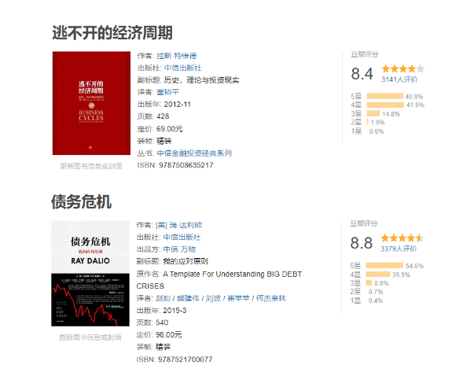

### 商业

# 成为一位插画家

## 艺术史

以及现代艺术：

中国艺术史：

## 艺术理论

在B站上购买的：

关于电影：

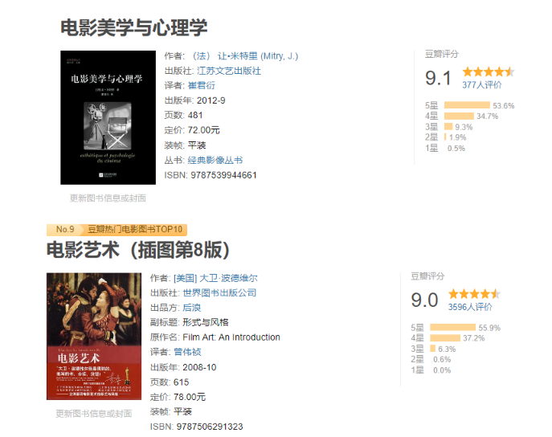

## 基础课

首先需要使用的一个较为系统性的课程是：

还有就是顾佳艺的文艺复星球：色彩造型基础班。

另外就是Krenz的课程：透视，构成，色彩。

## 进阶课

准备使用柯一正的IE-Art来进行进阶：

接着是阮佳的课程：

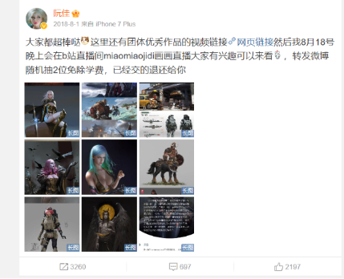

还有就是Victor-Cloux的课程：

# 英文

## 单词

单词使用的单词书有两本：

配合使用的Udemy的课程是：

## 语法

除了单词之外，还需要理解英语的语法。

语法使用的是B站上的一个英语语法课程：

配合使用的Udemy的语法课程为：

## 听力与口语

口语课程首先可以使用的是B站的口语课程：

口音纠正则使用：

还有就是：

## 写作

写作采用这些课程：

1. Score High Ielts Writing (General Training Module)
2. Score band 7 + in Academic IELTS Writing Task 1
3. Mastering IELTS Writing Task 2 (Achieve Band 7+ in 7 Hours)
4. Mastering IELTS Writing - Task 2 (Band 9 Model Answers)

以及：

## 雅思备考

首先使用的是Udemy的课程：

接着需要使用的是雅思官方的习题集：

写作会采用顾家北的书籍：

和慎小嶷的书籍：

# Web 开发

**如果数据科学和插画的学习没有问题的话**

## HTMl/CSS

HTML+CSS的课程看这一门课就完事了：

另外需要使用LintCode的习题：

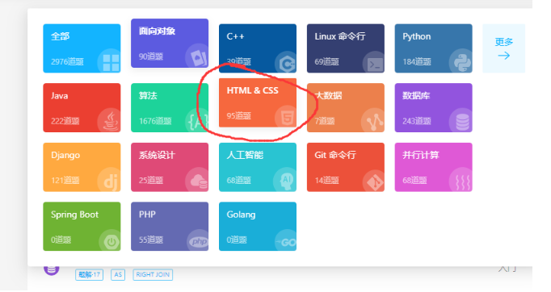

和牛客网的习题：

来完成知识点的巩固。

## JavaScript 和 Vue

JavaScript则采用Udemy的课程：

同样的，还有做习题：

接着是学习一下Vue这个框架：

## Django

Django首先使用的是AcWing的课程：

还有就是Udemy的课程：

Mosh的：The Ultimate Django Series。

## Web课程

使用的项目Udemy的课程为：

还有就是：

补充一个2023 哈弗大学CS50 Python & JavaScript Web开发课程：

# 程语言补充学习

可以对其他的语言有一定程度的了解。

## C++语言

C++语言语法基础：

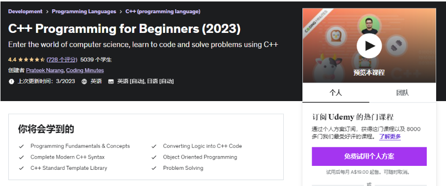

代码练习：

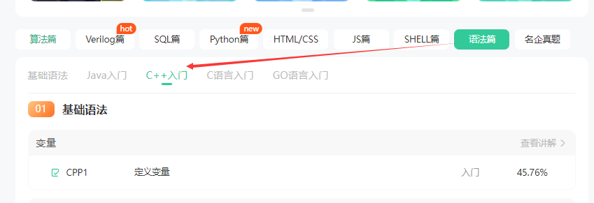

## Java语言

AcWing的Java语言：

代码练习：

# 思维能力

## 思想史/哲学史

思想史：

哲学史：

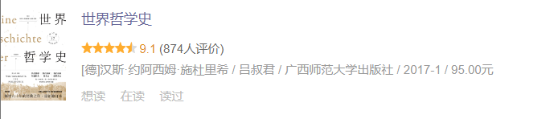

中国哲学史：

哲学导论：

作为生活方式的哲学：

## 政治学

通识：

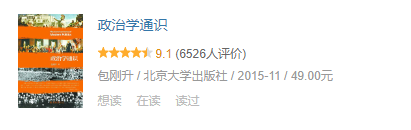

独裁者：

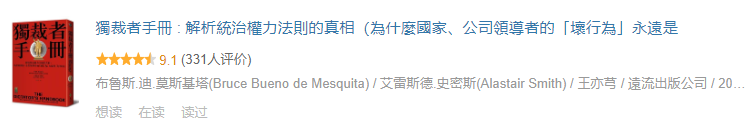

权力与特权：

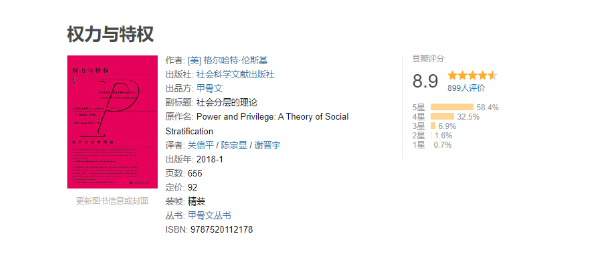

坏世界研究：

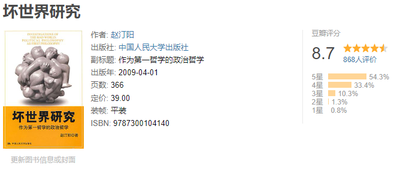

## 伦理学/道德哲学

伦理学与生活：

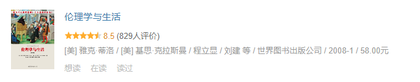

道德哲学：

当代元伦理导论：

论可能性的生活：

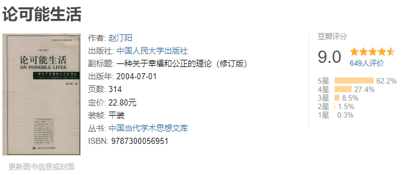

## 政治哲学

## 科学哲学

## 灵哲学

## 存在主义与虚无主义

存在主义：

虚无主义：

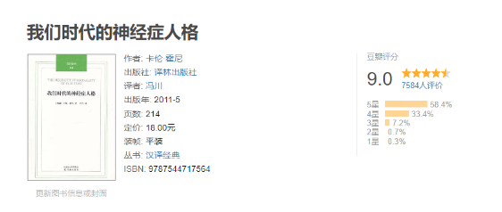

## 侯世达全集

## 康德三大批判

邓晓芒的三大批判合集：

《纯粹理性批判》句读：

## 人类社会

进化心理学：

裸猿：

贾雷德·戴蒙德：

猿猴：

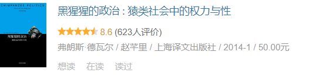

群居的艺术：

组织：

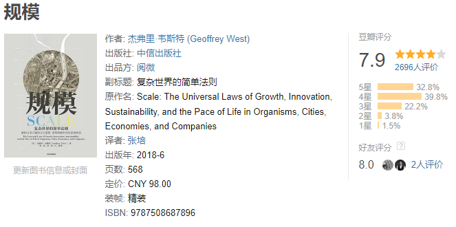

## 历史

全球史：

海洋：

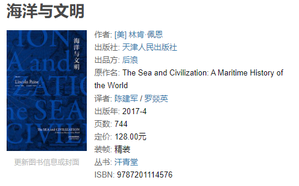

丝绸之路：

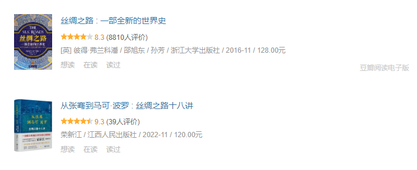

欧洲历史：

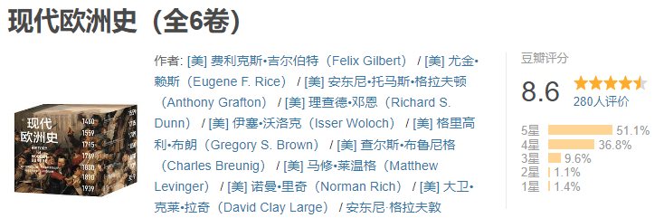

美国史：

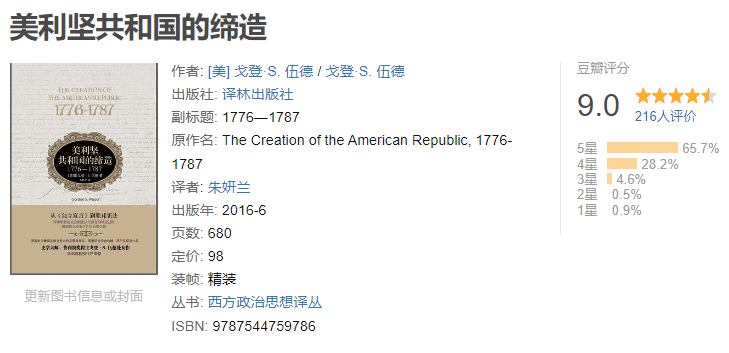

中国史：

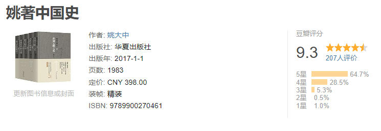

中国近现代史：

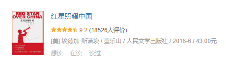

一些别的中国历史作品：

## 信息社会

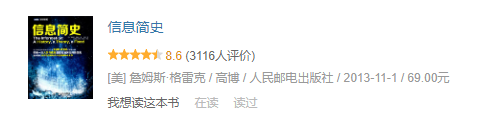

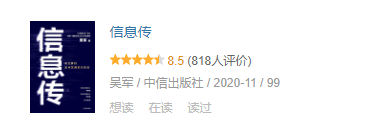

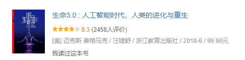

## 心理学

**科普**

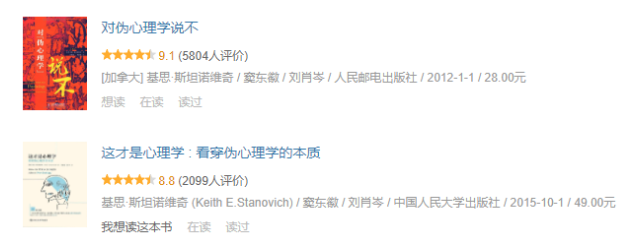

**认知心理学**

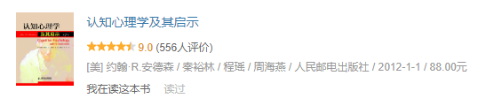

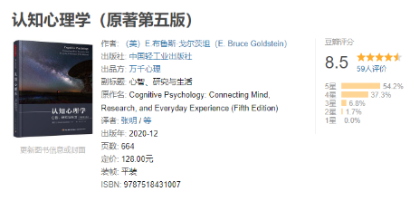

## 生命

**生命的起源**

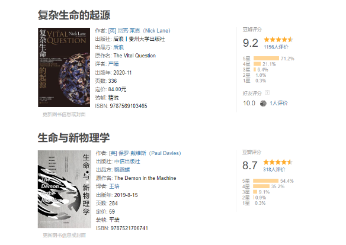

**进化论**

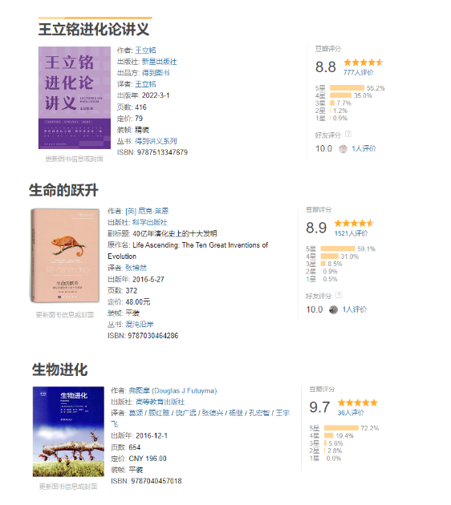

## 人物传记

**科学家的人物传记**

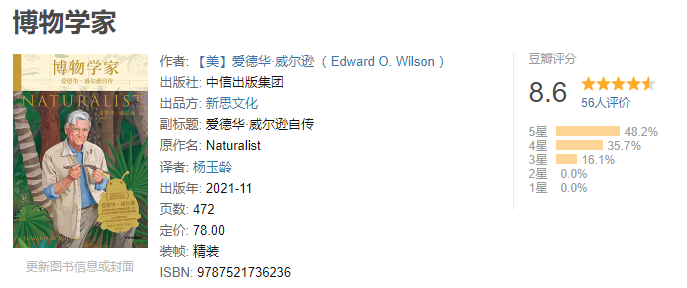

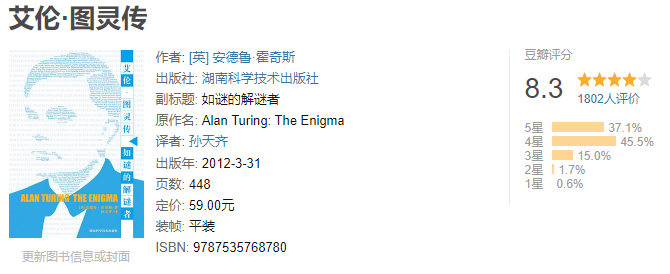

**哲学家人物传记**

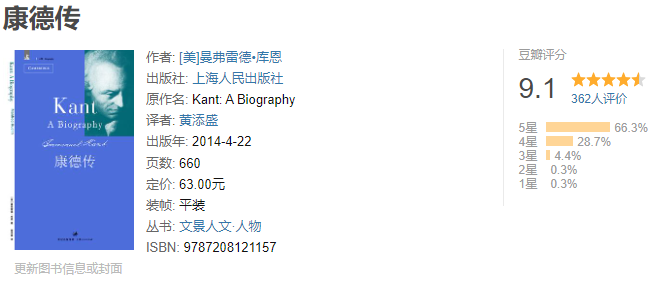

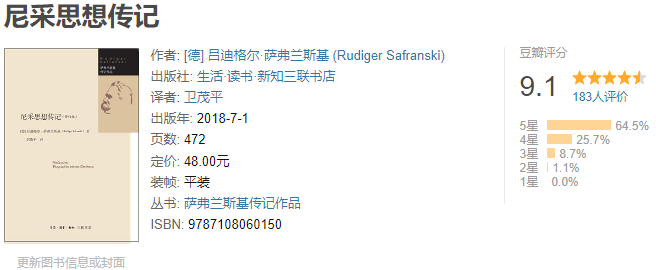

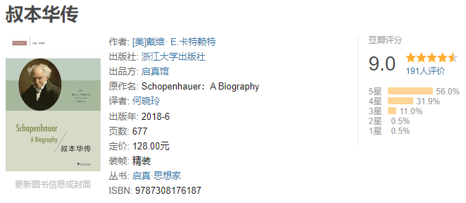

**艺术家人物传记**

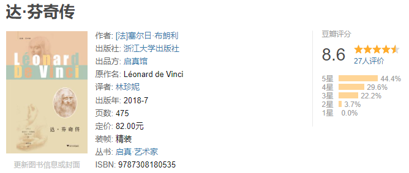

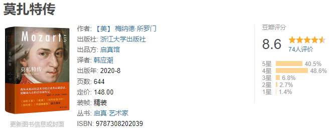

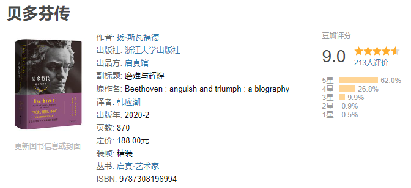

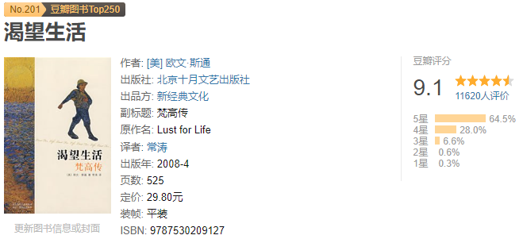

**工程师/全才人物传记**

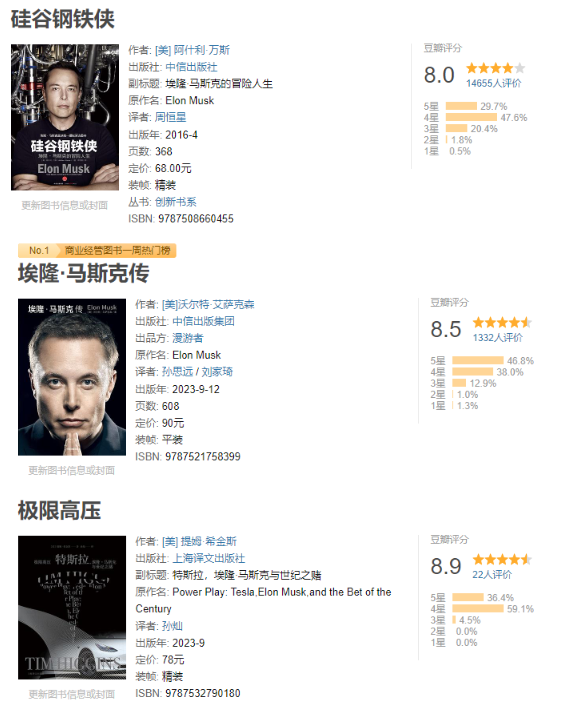

# 娱乐

## 纪录片

纪录片首先必看的是 人生七年系列：

此外，可以看一下这个集合中的纪录片的内容：

另外看大量的TED的演讲，虽然不是纪录片，但是也能够学习很多的内容。

## 电影

电影可以看一下豆瓣TOP 250中的感兴趣的电影，另外可以看一下每年推荐的电影。

豆瓣Top250：https://movie.douban.com/top250

## 动漫

动漫也可以看一下每年热点动漫，但是也需要看一下一些经典的动漫。

必看的系列：

1. Jojo的奇妙冒险
2. 进击的巨人 漫画 + 动画 全部
3. 剑风传奇 漫画 + 动画 全部
4. 藤本树全集
5. 守望者，鼠族
6. 伊藤潤二 全集
7. 沙村廣明
8. 全民審判，万物，非平面
9. 富堅義博全集

其他的还有一些老的经典的动漫。

## 小说

首先要阅读的推理小说是：

接着是阅读“京极堂”系列：

仙侠必读的是诛仙：

科幻必读的是三体系列（复习）：

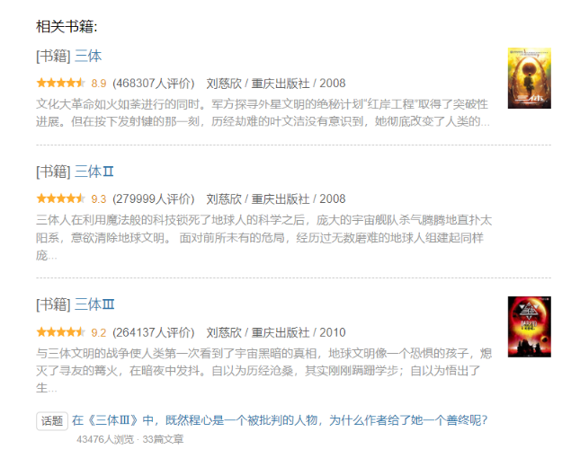

和来自新世界：

轻小说必读的书籍为狼與辛香料系列：

另外看一些经典的或者知名的网络小说。

另外就是一些比较经典的小说：古龙全集，金庸全集，还珠楼主全集等等。

经典文学的小说则主要为：世界名著，日本的小说（川端康成，三岛由纪夫等等）。

## 游戏

- 魂系列游戏：黑暗之魂1，黑暗之魂3，艾尔登法环，上古之魂，雨世界，Dark Maus，斩妖行，恶魔之魂：重制版，血缘：诅咒，Grime，Lies of P，堕落之主。
- Rogue类：Risk of Rain，Risk of Rain Return，死亡细胞，Noita，Hades，Transistor，Hades II
- 银河战士恶魔城：神之亵渎，神之亵渎 II，奥日与黑暗森林，奥日与精灵意志，空洞骑士，空洞骑士：丝绸之歌，赤痕·：夜之仪式，信使，20 minutes，Caveblazers，The Last Faith，Crowsworn
- 精准平台：茶杯头，蔚蓝，细胞迷途，Mark of the Ninja: Remastered，
- 像素游戏：不思议的皇冠，山海旅人，烟火，Broforce，GotoRoboto，Gris，传说法师，UnderTale
- 回合战略&策略：圣女战旗，A=B，Hack Run，Hack Run Zero，Hack Time，Hacknet，Paper Please，星之海，八方旅人，八方旅人II，三角战略
- 角色扮演：女神异闻录：皇家版，FireWatch，Journey，To the moon，火炬之光II，魔女之屋
- 开放世界：塞尔达：旷野之息，塞尔达：王国之泪，荒野大镖客II
- 动作类游戏：黑神话：悟空，鬼泣5
