# 人生七年

## 为什么是七年

七年这个概念有三个来源。

第一个来源是数字7本身的神奇，一周有7天，世界有7大洲，人眼所能够分辨的色彩有7种，人的工作记忆所能够记载的对象的数量为7，等等。

第二个来源是 @李笑来 的书籍《新生：七年就是一辈子》，李笑来老师的话要听，李笑来老师推荐的产品不要购买，书籍阅读地址为：[新生大学：七年就是一辈子](https://b.xinshengdaxue.com/)，一个短视频演讲可以在B站上观看：[七年就是一辈子](https://www.bilibili.com/video/BV19V411r7LF/?spm_id_from=333.337.search-card.all.click)。

第三个来源则是ITV的一个系列纪录片：人生七年。

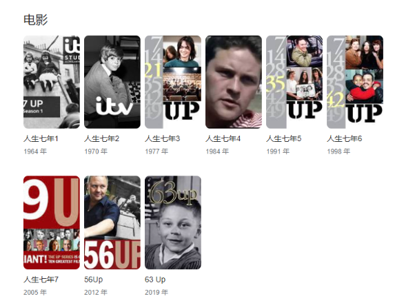

通过观看这一系列的纪录片，能够起到“以人为镜可以明得失”的效果。

至于生活方法，目标等，采用的理念是极简主义的理念：

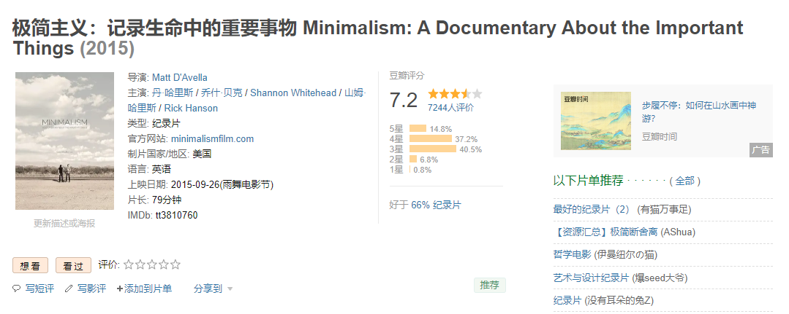

## 第一个七年需要达成的目标

第一个七年需要达成的核心目标其实只有一个：成为一位数据科学家。

第一个七年需要达成的次要目标是：掌握良好的绘画技能。但是由于AI绘画能力的更新，所以成为插画家这一个把目标的权重大幅度的降低。

除此之外，需要学习英文，提升自己的语言表达能力，逻辑思辩能力和完成对自己的基础的通识教育。

# 心智

工欲善其事，必先利其器

## 学习效率

首先一定要看的是李笑来的《新生：七年就是一辈子》。

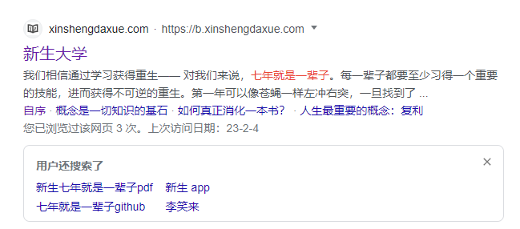

此外还有两个能够协助自己提高自己认知能力的教程。一个是Yjango的学习观：

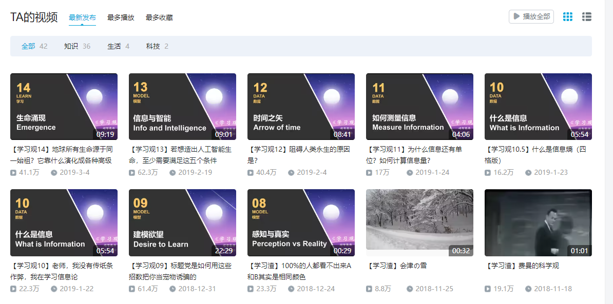

另一个则是Yjango的断墨寻径：

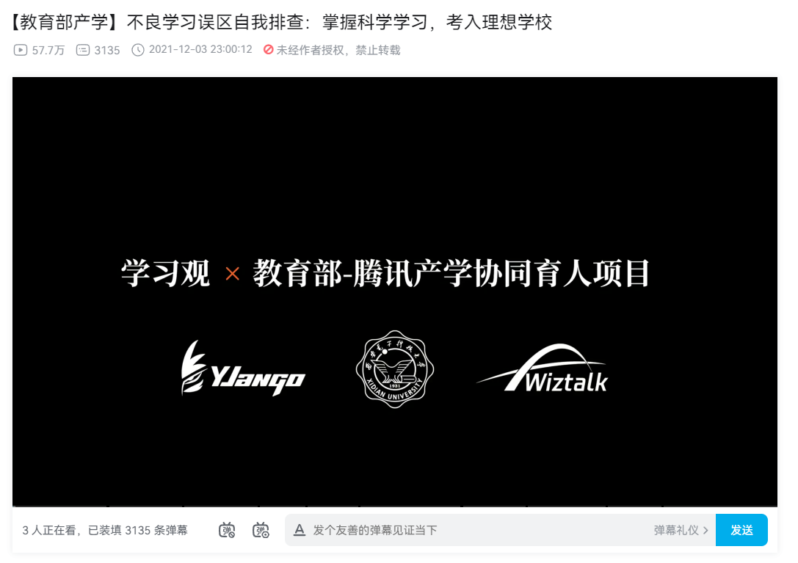

还有就是一些书籍：

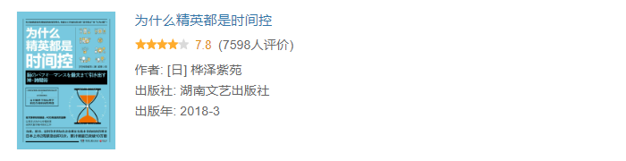

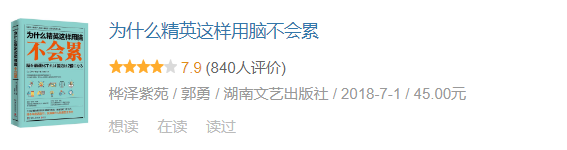

推荐达-瑞欧的《原则》：

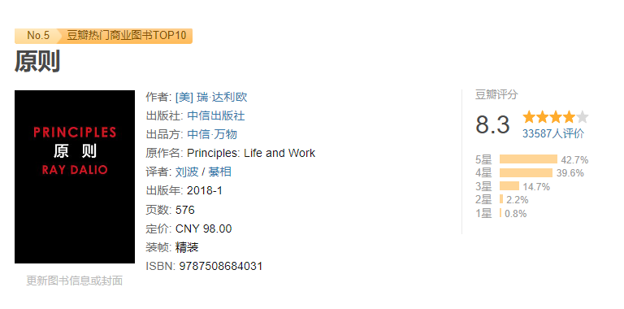

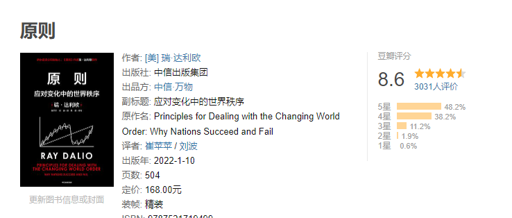

以及另外的两本市面上认为比较好的心智相关的书籍：

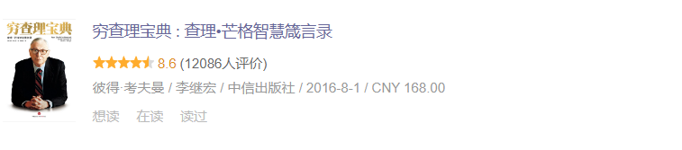

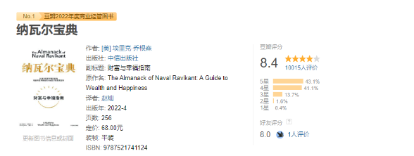

脑科学可以通过在B站上已经购买的两个课程来进行学习：

## 如何做研究

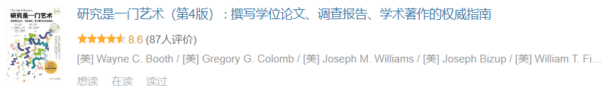

## 健康

增重采用的视频为：

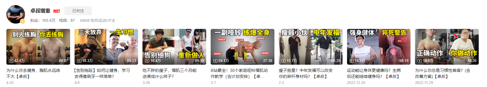

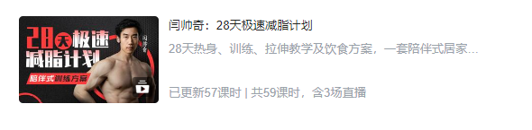

正念则采用：

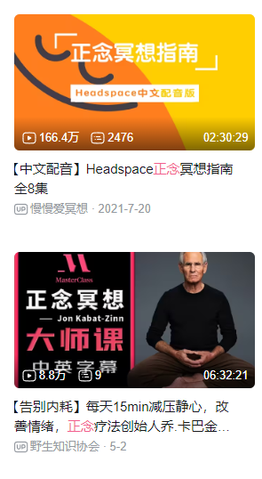

# 成为一位数据科学家

## 什么是数据科学

数据科学可以参考这张图：

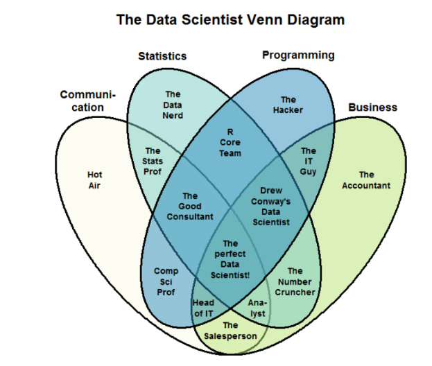

从上图不难看出，如果想要成为一位数据科学家，需要掌握的技能有：

1. 统计学和概率论（数学基础）
2. 编程（工具使用）
3. 商业（业务了解）
4. 交流（信息传播）

在如何成为一位数据科学家的安排上，主要会以这些技能作为核心脉络来进行学习。

## 数学基础

### 数学思维

在学习具体的数学之前，要对数学本身有着一个概览。

第一本需要看的书籍是，《[什么是数学 : 对思想和方法的基本研究](https://book.douban.com/subject/27061912/)》

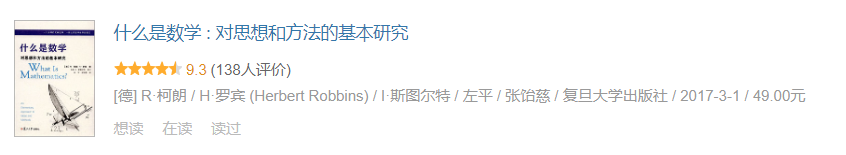

这是关于这本书的简介：

> 《什么是数学》是世界著名的数学科普读物，它搜集了许多经典的数学珍品，对整个数学领域中的基本概念与方法，做了精深而生动的阐述。无论是数学专业人士，或是愿意作数学思考者都可以阅读本书。特别对中学数学教师、大学生和高中生，本书都是一本极好的参考书。

第二本需要看的书籍是，《[优美的数学思维（原书第2版） : 问题求解与证明](https://book.douban.com/subject/35197539/)》

这是关于书籍的简介：

> 本书以大量生动有趣的问题求解实例为背景，使用通俗易懂的语言，深入浅出地介绍优美的数学思维和严谨的证明方法，所涉及的数学内容不仅包含函数与集合、数学归纳法理论、组合计算与组合证明、整数理论、数理逻辑、图论等离散数学，而且包含微积分与实数理论等连续数学，覆盖了多个不同的数学领域。本书内容在逻辑上层层展开、环环相扣，形成一套相对完备的知识体系。本书的内容可以有效地激发学生的学习兴趣，唤醒学生的数学潜能和数学思维。

### 微积分

高等数学是进一步的学习统计学和概率论的基础知识。

一本贴近于科普的书籍为：《[度量 : 一首献给数学的情歌](https://book.douban.com/subject/26420533/)》

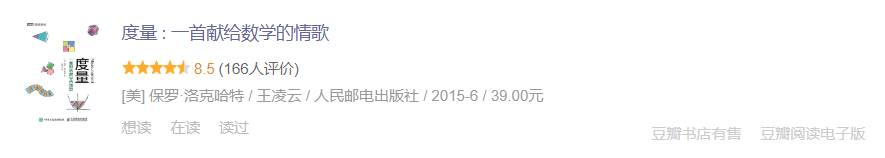

这本书是一本相关的科普书籍，通俗易懂。

微积分的入门采用的是一本入门书：《[简单微积分 : 学校未教过的超简易入门技巧](https://book.douban.com/subject/30271424/)》

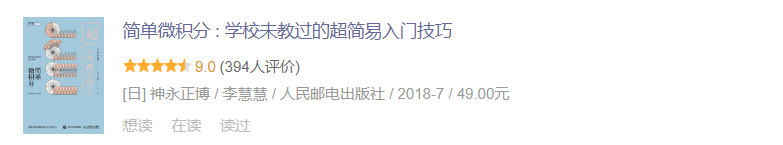

关于该书籍：

> 本书是微积分入门科普读物，以微积分的“思考方法”为核心，以生活例子通俗讲解了微积分的基本原理、公式推导以及实际应用意义，解答了微积分初学者遭遇的常见困惑。本书讲解循序渐进、生动亲切，没有烦琐计算、干涩理论，是一本只需“轻松阅读”便可以理解微积分原理的入门书。

关于进一步的学习，我将采用的是Udemy上面的一个系列课程：

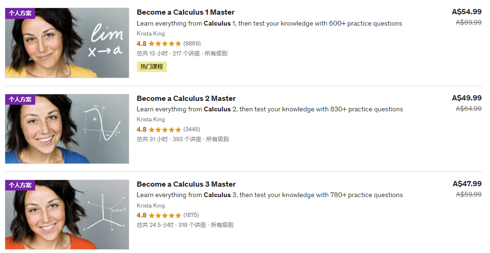

并且将会完成该课程的配套的训练。

此外有一个比较重要的课程，那就是**3Blue1Brown**的[【官方双语/合集】*微积分的本质* - 系列合集](https://www.bilibili.com/video/BV1qW411N7FU/?spm_id_from=333.337.search-card.all.click)，在学习开始，中途和结尾都可以反复观看这个视频来加深对于微积分的了解。

### 线性代数

线性代数入门采用的视频教程为麻省理工公开课的线性代数教程：

1. [麻省理工学院 - MIT - *线性代数*（我愿称之为*线性代数*教程天花板）](https://www.bilibili.com/video/BV16Z4y1U7oU/)
2. [麻省理工学院 - MIT - *线性代数*/中英文版，助教：陈莉楠（我愿称为最详](https://www.bilibili.com/video/BV1VZ4y1a76K/)

配套的书籍为：《[线性代数（第5版）](https://book.douban.com/subject/34820335/)》

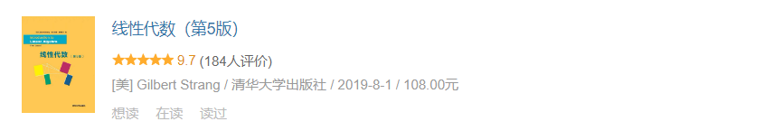

Udemy的这位教微积分的老师也有一门线性代数的课程：

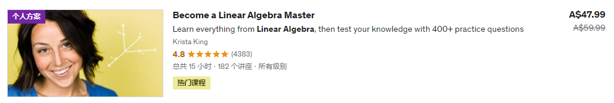

**3Blue1Brown**也有相关的视频：[【官方双语/合集】线性代数的本质 - 系列合集](https://www.bilibili.com/video/BV1ys411472E/)，需要进行反复的观看。

最后看的书籍为：[线性代数应该这样学 : 第3版](https://book.douban.com/subject/26886299/)，习题的答案在：http://linearalgebras.com/

### 概率论与统计学

入门采用的视频教程为Udemy的这位老师的课程：

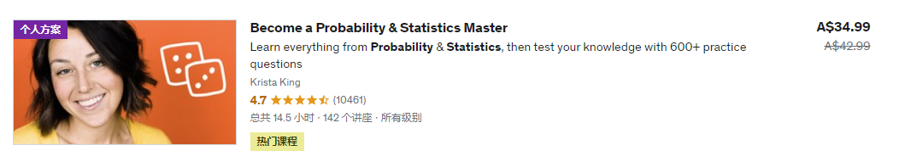

Udemy的这位老师还是一本与他人合作的课程：

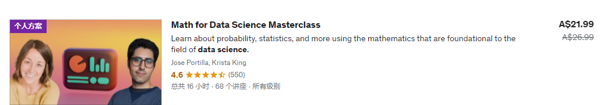

这两门课都可以用来进行快速的入门学习。

统计学的深入学习基于这两本教程：

1. [统计学（第4版） : 基于R](https://book.douban.com/subject/35377356/)
2. [统计学（第五版） : 从数据到结论](https://book.douban.com/subject/35694162/)

这两本书分别使用到了R语言和Python语言，对于使用R语言和Python语言来搞数据科学是一个很好的训练。

此外还有手头的两本书：

1. [统计学核心方法及其应用](https://book.douban.com/subject/30384807/)
2. [多元统计分析——基于R(第2版)（基于R应用的统计学丛书）](https://book.douban.com/subject/35052008/)

概率论的深入学习则采用这三本书：

1. [概率导论（第2版·修订版）](https://book.douban.com/subject/26694188/)
2. [概率论基础教程（原书第10版）](https://book.douban.com/subject/35868257/)
3. [概率论及其应用（卷1•第3版）](https://book.douban.com/subject/25794324/)

最后也可以看一下**3Blue1Brown**的关于概率论的视频：

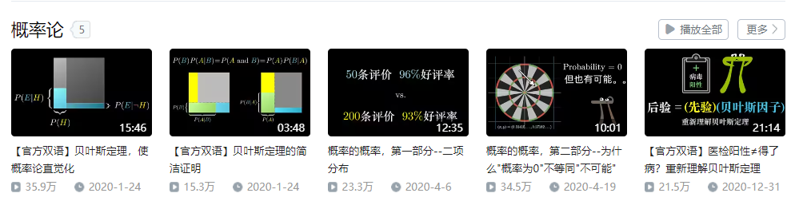

## 编程

### Python语言

Python语言在先前已经学习了《Python编程：从入门到实践》，这里可以再使用Udemy的课程来快速的回顾一下Python语言：

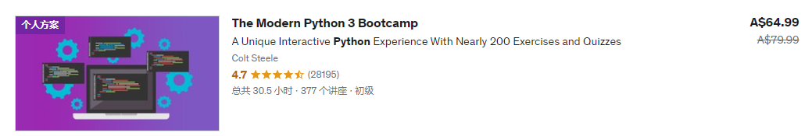

复习Python语言之后需要进行大量的项目来进行实践，这里采用的是Angela Yu的课程：

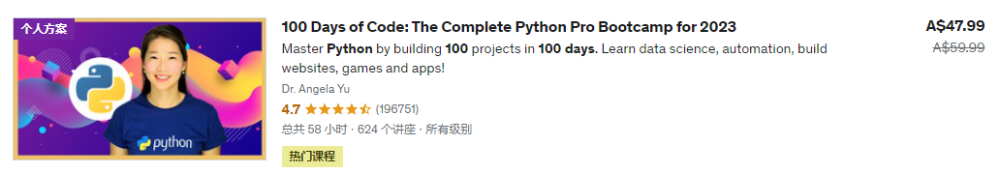

然后就是Ardit Sulce的两个Python工程课程：

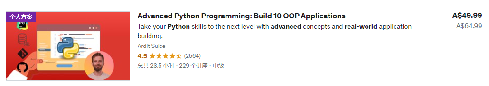

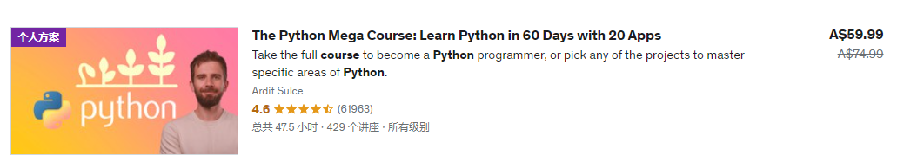

此外还有就是对Python语言的习题练习。

LintCode的Python习题：

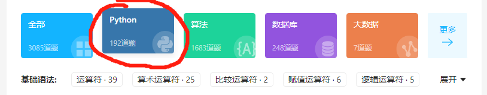

牛客网的Python语言习题：

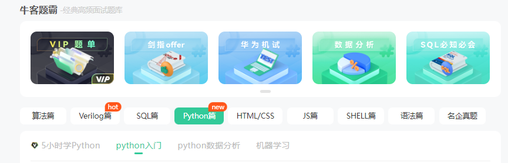

### R语言

R语言的两门Udemy的教程为：

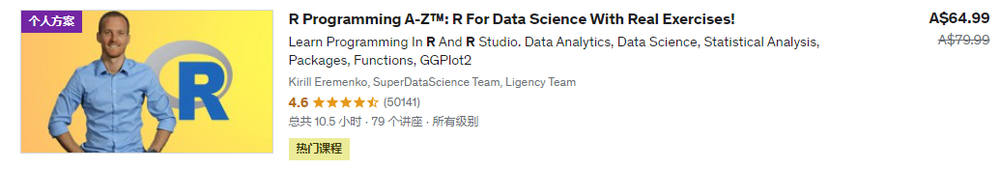

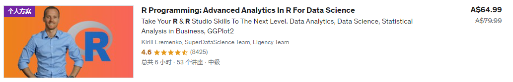

使用的书籍为：

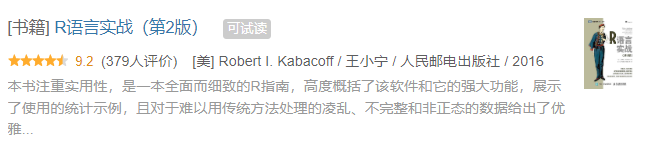

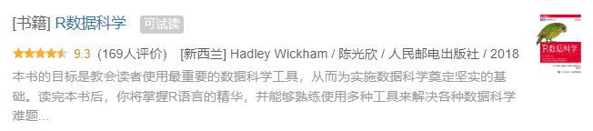

### SQL

SQL所使用的两本书籍是：

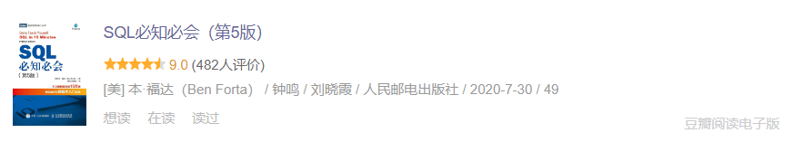

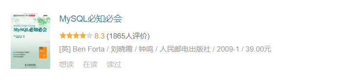

使用的视频教程是：

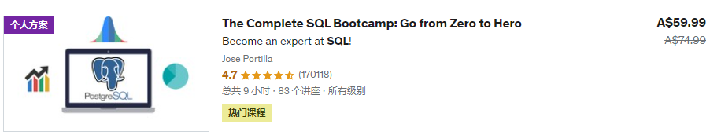

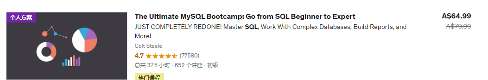

SQLite也需要学习一下。

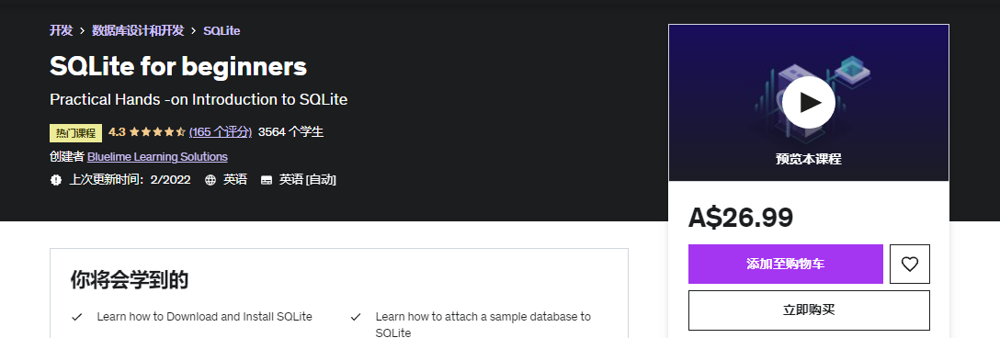

然后使用LIntCode和牛客网的习题来进行巩固：

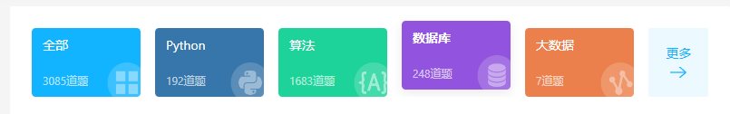

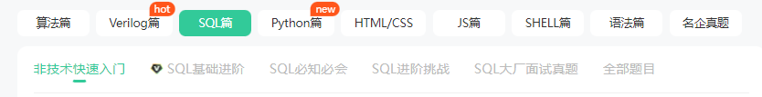

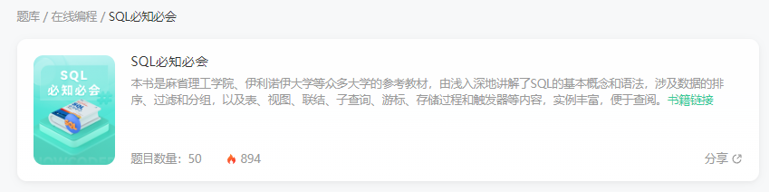

还有LeetCode的习题：

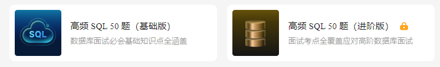

还有的习题为：

1. https://sqlzoo.net/wiki/SQL_Tutorial/zh
2. http://xuesql.cn/

### 数据结构与算法

数据结构与算法并不是数据科学所需的知识，但是是计算机相关的必备的知识，在这里作为支线进行学习。

Python语言之前已经学了：

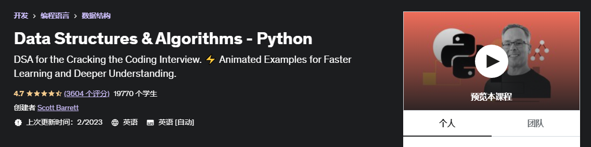

现在可以进一步的学习：

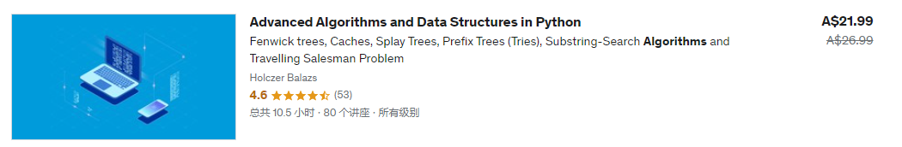

以及进行Python原因的LeetCode的练习：

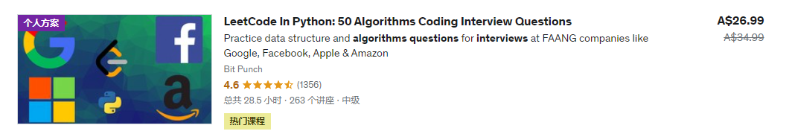

在进行求职面试之前，需要刷一些习题，可以使用：

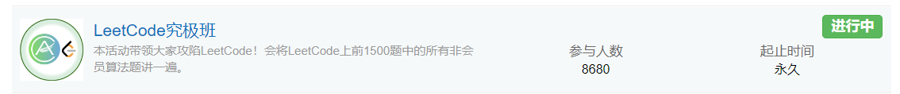

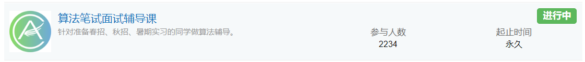

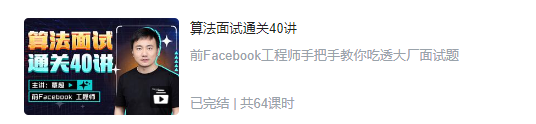

还有就是将LeetCode的经典的问题做一遍：


这里还有一门已经购买了的C++的算法基础课：

另外还有一本非常好的书籍：


## 数据科学方向

### 人工智能

一个简单的介绍视频为：


人工智能采取的书籍为：


Udemy的课程为：


### 数据分析

数据分析首先可以看的书籍是：


通过这本书可以对数据分析有着一个较为笼统的概括性的认知。

接着是学习B站上已经购买了的课程：

着是这本书：


接着是牛客网提供的数据分析相关的习题：


另外还有一个生存分析的课程：


以及时间序列的课程：


### 数据可视化

可视化的一个概览：


R语言的数据可视化使用这本书：


Tableau则是使用如下所示的两个教程：


除此之外，还需要学习一下D3.js进行数据可视化的技能：


### 数据科学

一个比较概括的课程：


R语言在Udemy上面关于数据科学的教程：


接着是Udemy的几门关于Python数据科学的书籍：


还有就是他人放在B站上的课程：


数据挖掘采用的书籍为： [数据挖掘导论](https://www.douban.com/link2/?url=https%3A%2F%2Fbook.douban.com%2Fsubject%2F5377669%2F&query=数据挖掘导论&cat_id=1001&type=search&pos=0)


Udemy的课程为：


Bilibili的可称为：


机器学习课程则为：


此外还有李沐和吴恩达的课程：


### 数据科学实战

学完之后一定要自己动手在项目上进行实践，首先是 a collection of data science take home challenges：


然后是:


以及：


一个Kaggle的项目：


Udemy的数据科学的项目：


另外还有十个经典的数据集：

1. Titanic: Machine Learning from Disaster 数据集链接：https://www.kaggle.com/c/titanic/data 教程链接：https://www.kaggle.com/alexisbcook/titanic-tutorial
2. House Prices: Advanced Regression Techniques 数据集链接：https://www.kaggle.com/c/house-prices-advanced-regression-techniques/data 教程链接：https://www.kaggle.com/pmarcelino/comprehensive-data-exploration-with-python
3. Credit Card Fraud Detection 数据集链接：https://www.kaggle.com/mlg-ulb/creditcardfraud 教程链接：https://www.kaggle.com/janiobachmann/credit-fraud-dealing-with-imbalanced-datasets
4. Iris Species 数据集链接：https://www.kaggle.com/uciml/iris 教程链接：https://www.kaggle.com/jchen2186/machine-learning-with-iris-dataset
5. Airbnb New User Bookings 数据集链接：https://www.kaggle.com/c/airbnb-recruiting-new-user-bookings/data 教程链接：https://www.kaggle.com/egemenzeytinci/airbnb-data-exploration-and-analysis
6. NYC Property Sales 数据集链接：https://www.kaggle.com/new-york-city/nyc-property-sales 教程链接：https://www.kaggle.com/vikramgarg/new-york-city-property-sales-analysis
7. Amazon Top 50 Bestselling Books 2009-2019 数据集链接：https://www.kaggle.com/sootersaalu/amazon-top-50-bestselling-books-2009-2019 教程链接：https://www.kaggle.com/mjain98/amazon-bestselling-books-exploratory-data-analysis
8. Pokemon with Stats 数据集链接：https://www.kaggle.com/abcsds/pokemon 教程链接：https://www.kaggle.com/kanncaa1/data-sciencetutorial-for-beginners
9. Yelp Dataset 数据集链接：https://www.kaggle.com/yelp-dataset/yelp-dataset 教程链接：https://www.kaggle.com/khushinetwork/yelp-data-analysis-tutorial
10. Heart Disease UCI 数据集链接：https://www.kaggle.com/ronitf/heart-disease-uci 教程链接：https://www.kaggle.com/samuelbosch/heart-disease-eda-classification-visualization

### 大数据

大数据首先需要会使用Linux系统：

Linux指令相关采用的教程是：


学完之后采用LintCode提供的Linux习题：


Linux工程课则是使用AcWing的Linux课程：


系统性的学习则采用Udemy的课程：


接着需要学习的是Spark使用的教程为：


LintCode提供了大数据相关的习题：


不过只有7道题目，只能够说聊胜于无。

## 商业与经济

### 经济学


### 商业


## 交流

### 谈话


### 写作


### 职场


# 成为一位插画家

由于AI的发展和潜力，大幅度的降低在这个目标上的投入。

## 艺术理论

首先是艺术史书籍：


以及现代艺术：


接着是在B站上购买的：


## 基础课

首先需要使用的一个较为系统性的课程是：


还有就是顾佳艺的文艺复星球：色彩造型基础班。

## 进阶

准备使用柯一正的IE-Art来进行进阶：


进阶的书籍则是：


## 终极

应该会选择阮佳的课程：


也有可能是Victor-Cloux的课程。

# 英文

## 单词

单词使用的单词书有两本：


配合使用的Udemy的课程是：


## 语法

除了单词之外，还需要理解英语的语法。

语法使用的是B站上的一个英语语法课程：


配合使用的Udemy的语法课程为：


## 听力与口语

口语课程首先可以使用的是B站的口语课程：

口音纠正则使用：


还有就是：


## 写作

写作采用这些课程：

1. Score High Ielts Writing (General Training Module)
2. Score band 7 + in Academic IELTS Writing Task 1
3. Mastering IELTS Writing Task 2 (Achieve Band 7+ in 7 Hours)
4. Mastering IELTS Writing - Task 2 (Band 9 Model Answers)

以及：


## 雅思备考

首先使用的是Udemy的课程：


接着需要使用的是雅思官方的习题集：


写作会采用顾家北的书籍：


和慎小嶷的书籍：


还有就是使用一些软件来辅助自己学习：


## 学术写作


# Web 开发

**如果数据科学和插画的学习没有问题的话**

## HTMl/CSS

HTML+CSS的课程看这一门课就完事了：


另外需要使用LintCode的习题：


和牛客网的习题：


来完成知识点的巩固。

## JavaScript 和 Vue

JavaScript则采用Udemy的课程：


同样的，还有做习题：


接着是学习一下Vue这个框架：


## Django

Django首先使用的是AcWing的课程：


还有就是Udemy的课程：


## Web课程

首先使用的是AcWing的Web工程课程：


使用的项目Udemy的课程为：


还有就是：


和：


补充一个2023 哈弗大学CS50 Python & JavaScript Web开发课程：


# 通识教育

## 什么是通识教育

通识教育的定义为：

> 通识教育是一种旨在培养学生全面知识与技能的教育体系。它不仅包括学科知识，还包括跨学科的知识，如人文学科、社会科学、自然科学和工程技术等领域的知识。通识教育的目标是培养学生的批判思维、创新能力和领导才能，以适应不断变化的全球化社会和职场的需求。通识教育还注重培养学生的社会责任感和公民意识，使他们成为积极的社会成员和生活中的领袖。

由此我们可以总结出几个要点：

1. 需要跨学科的知识：自然科学，人文科学，社会科学等科学，一些通用的入门的知识
2. 思维方法的改变：批判性思维，创新能力和领导才能
3. 自我定位：现代社会的责任，自我定位，社会形式等等

## 跨学科的知识

### 自然科学

自然科学可以将其分为两个主要的部分：物理学，生命科学。

物理学通识需要阅读的书籍为：

1. [七堂极简物理课](https://book.douban.com/subject/26772731/)
2. [现实不似你所见 : 量子引力之旅](https://book.douban.com/subject/27156306/)
3. [时间的秩序](https://book.douban.com/subject/33424487/)
4. [时间的形状](https://book.douban.com/subject/26992254/)
5. [极简宇宙史](https://book.douban.com/subject/26697350/)

生命科学则可以分为这样的几个部分：生命的起源与本质，生命演化的逻辑，一些关于人类学的研究。

生命的起源：

1. [复杂生命的起源](https://book.douban.com/subject/35221093/)
2. [祖先的故事 : 生命起源的朝圣之旅](https://book.douban.com/subject/30349090/)
3. [大图景 : 论生命的起源、意义和宇宙本身](https://book.douban.com/subject/34908495/)
4. [生命是什么](https://book.douban.com/subject/30376075/) 

进化论：

1. [王立铭进化论讲义](https://book.douban.com/subject/35780513/)
2. [基因传 ](https://www.douban.com/link2/?url=https%3A%2F%2Fbook.douban.com%2Fsubject%2F27168433%2F&query=基因&cat_id=1001&type=search&pos=0)
3. [生命的跃升 : 40亿年演化史上的十大发明](https://book.douban.com/subject/26679862/)

### 人文社科

人文社科是一个非常大的领域，所以这里就挑一些基础的方面：人类学，社会科学。

人类学研究：

1. 两性：[进化心理学(第4版) : 心理的新科学](https://book.douban.com/subject/26683297/)，[欲望的演化（最新修订版） : 人类的择偶策略](https://book.douban.com/subject/35153840/)
2. 裸猿系列：[裸猿 : 《裸猿》三部曲之一和之后的系列](https://book.douban.com/subject/4312810/)，[崩溃 : 社会如何选择成败兴亡](https://book.douban.com/subject/35684427/)，[昨日之前的世界 : 我们能从传统社会学到什么?](https://book.douban.com/subject/35684426/)，[第三种黑猩猩 : 人类的身世与未来](https://book.douban.com/subject/35932683/)，[枪炮、病菌与钢铁 : 人类社会的命运](https://book.douban.com/subject/35714810/)
3. 一些经典的人类学书籍：[文化人类学（第13版）](https://book.douban.com/subject/35694032/)，[人类学的邀请（第4版） : 认识自我和他者](https://book.douban.com/subject/33440209/)，[天真的人类学家 : 小泥屋笔记&重返多瓦悠兰](https://book.douban.com/subject/6712255/)，[如何像人类学家一样思考](https://book.douban.com/subject/35556888/)，[金枝- 图书- 豆瓣](https://m.douban.com/book/subject/2101774/)

社会科学：

1. 社会心理学：[社会性动物（第12版）](https://book.douban.com/subject/34970886/)，[社会心理学（第11版，平装版）](https://book.douban.com/subject/26701760/)
2. 一些具体的东西：[私人生活的变革 : 一个中国村庄里的爱情、家庭与亲密关系（1949—1999）](https://book.douban.com/subject/26952345/)，[礼物的流动 : 一个中国村庄中的互惠原则与社会网络](https://book.douban.com/subject/26951502/)，[性之变 : 21世纪中国人的性生活](https://book.douban.com/subject/24845741/)，[中国社会的个体化](https://book.douban.com/subject/10048862/)

## 思维方法的改变

**哲学启蒙**

思想史与哲学史：

1. 思想史：[思想史 : 从火到弗洛伊德](https://book.douban.com/subject/27136549/)，[20世纪思想史 : 从弗洛伊德到互联网](https://book.douban.com/subject/34449288/)，[西方现代思想史](https://book.douban.com/subject/10491609/)
2. 哲学史：[世界哲学史](https://book.douban.com/subject/26832583/)，[西方哲学史 : 从古希腊到当下](https://book.douban.com/subject/26438558/)

**批判性思维**

批判性思维：

1. 提问：[学会提问（原书第12版）](https://book.douban.com/subject/35513147/)
2. 批判性：[批判性思维（原书第5版）](https://book.douban.com/subject/33405075/)
3. 思考工具：[直觉泵和其他思考工具](https://book.douban.com/subject/30340107/)，[超越智商 : 为什么聪明人也会做蠢事](https://book.douban.com/subject/26605978/)，[思考，快与慢](https://book.douban.com/subject/10785583/)

**创新与领导力**

1. 创造力：创造力 : 心流与创新心理学，列奥纳多·达·芬奇传 : 从凡人到天才的创造力密码
2. 领导力：Bilibili课程：权利，硬球 : 政治是这样玩的，权谋 : 如何赢得权力

## 现代社会

道德哲学与政治哲学：

1. [政治学通识](https://book.douban.com/subject/26658395/)
2. [政治思考 : 一些永久性的问题](https://book.douban.com/subject/4857097/)
3. [当代元伦理学导论](https://book.douban.com/subject/30443294/)
4. [伦理学与生活](https://book.douban.com/subject/3222065/)
5. [当代政治哲学](https://book.douban.com/subject/26389495/)

社会形式：

1. 经济：[置身事内 : 中国政府与经济发展](https://book.douban.com/subject/35546622/)
2. 组织形式：[中国国家治理的制度逻辑](https://book.douban.com/subject/26901114/)，[现代政治的思想与行动](https://book.douban.com/subject/27661640/)

# 娱乐

## 纪录片

纪录片首先必看的是 人生七年系列：


此外，可以看一下这个集合中的纪录片的内容：


## 电影

电影可以看一下豆瓣TOP 250中的感兴趣的电影，另外可以看一下每年推荐的电影。

豆瓣Top250：https://movie.douban.com/top250


## 动漫

动漫也可以看一下每年热点动漫，但是也需要看一下一些经典的动漫。

必看的系列：

1. Jojo的奇妙冒险
2. 进击的巨人 漫画 + 动画 全部
3. 剑风传奇 漫画 + 动画 全部

其他的还有一些老的经典的动漫。

## 小说

首先要阅读的推理小说是：


接着是阅读“京极堂”系列：


仙侠必读的是诛仙：


科幻必读的是三体系列（复习）：


和来自新世界：


轻小说必读的书籍为狼與辛香料系列：


另外看一些经典的或者知名的网络小说。

## 游戏

**魂系列游戏：**艾尔登法环，上古之魂，Rain World，神之亵渎，神之亵渎II，Dark Maus，恶魔之魂，血缘：诅咒，仁王，遗迹:灰烬重生

**平台跳跃：**蔚蓝，空洞骑士，空洞骑士：丝绸之歌，奥日与黑暗森林，奥日与萤火意志，细胞迷途

**编程/解谜：**Hack net，Hack Run，Hack Time，Hack Zero，The Witch’s House，To the moon，Fire Watch

**动作类：**SiFu，鬼泣5，黑神话：悟空

**RPG：**塞尔达：荒野之息，塞尔达：王国之泪，Journey，女神异闻录5皇家版，

**类银河战士恶魔城：**血污：夜之仪式，Lost Ruins，Caveblazers，The last faith，Crowsworn

**Galgame：**ef，eden，三色绘恋，君与彼女与彼女之恋，白色相簿II

**回合制战略：**圣女战旗，八方旅人，八方旅人II，三角战略

