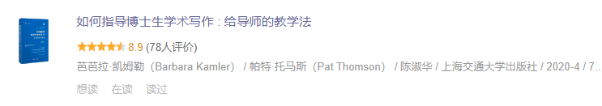
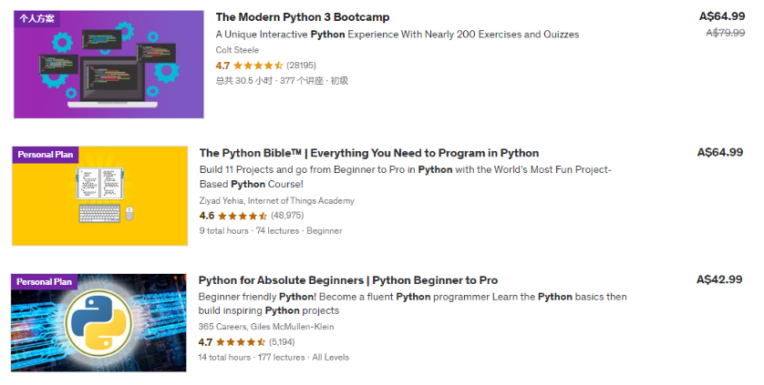
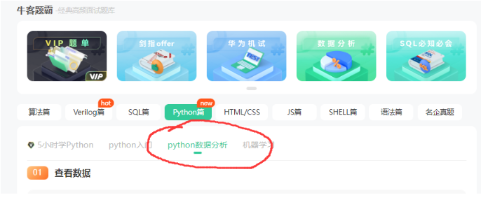
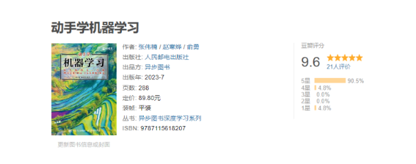
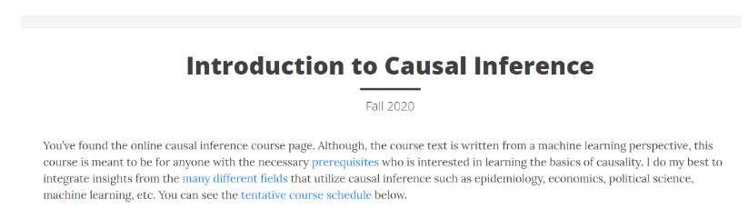
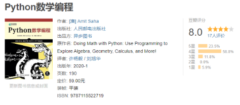
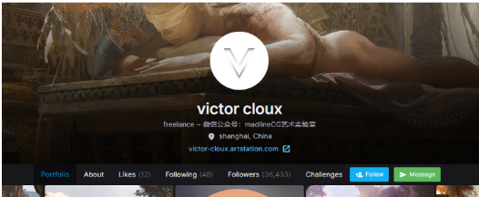
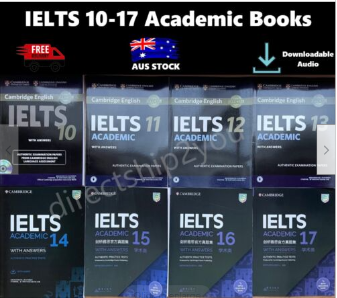
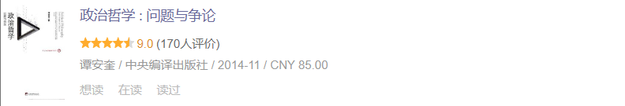
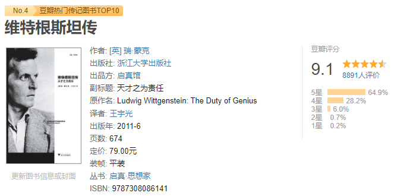

# 第一个人生七年计划

## 为什么是七年

7被认为是一个非常独特的数字，很多东西都和7有关。比如说在基督教中，圣经中提到了许多与7有关的事件，如上帝在第七天休息，七个圣灵的七个品质，七个教会，等等；而在历史方面，古代文化中的许多传统和仪式都与7有关，比如七星，七宝，七合一的神秘。

当然，我们也可以让每一个数字都变得非常独特和神奇，选择7而不是6或者10的核心原因，其实来自于BBC的纪录片：

这是对这个系列的简单的概括：

> "人生七年"（"Up Series"）是一部英国纪录片系列，由导演迈克尔·阿普莱德（Michael Apted）创作。该系列始于1964年，迄今已经拍摄了多部纪录片，每七年发布一部。该系列跟踪了一群英国人，他们从7岁开始，每七年回顾他们的生活，探讨他们的人生、家庭、职业、价值观和梦想的演变。这部系列纪录片的目标是探讨社会阶层、家庭背景、机会和生活选择对个体命运的影响。

除此之外，7年这个概念还来自于李笑来的一本书《新生：七年就是一辈子》：

这本书不知道为什么豆瓣上面搜索不到，但是这本书可以在李笑来自己的一个网页上面找到：https://b.xinshengdaxue.com/Preface.html

此外，还有李笑来的演讲：https://www.bilibili.com/video/BV19V411r7LF/?spm_id_from=333.337.search-card.all.click

## 第一个七年目标

七年的时间为：从公历2024年1月1日开始计算7年，结束日期将是2030年12月31日。

第一个七年的核心目标为：成为一位数据科学家（这个目标可能包含了需要获得数据科学/机器学习相关方向的博士学位的条件）。

第一个七年的兴趣目标为：掌握较高水准的插画能力。

第一个七年的其他任务则是：通过大量的阅读来完成对自己的通识教育，以及在还玩的动游戏的时候将一些游戏完了。

此外，英语作为当今社会必备的工具也需要被好好的掌握；至于第二门外语，暂时考虑为日语，但是具体要不要学则视其他的任务是否很好的完成而定。

# 提升自己的心智能力

工欲善其事，必先利其器。提升自己的心智能力是非常有必要的。

## 学习技巧

首先需要观看的是Coursera上面的一门非常好的学习相关的课程：Learning how to learn。

接着是李笑来的几本书籍：

还有就是YJango在Bilibili上面的两门公开课程：学习观和断墨寻径。

## 心智认知

首先需要阅读的是桥水基金的创始人瑞·达利欧的几本书籍：

接着是控制论书籍：

然后是穷查理宝典：

## 如何进行研究

首先是书籍：

进行博士生学术写作：

进行论文写作：

## 冥想

冥想首先采用的是HeadSpace的冥想课程：

接着是大师课：

## 健身

首先看一下卓叔增重的视频：

接着是已经购买了的课程：

# 数据科学家——编程

数据科学家需要编程的原因在于编程提供了强大的工具来处理、分析和建模大规模数据。编程使数据科学家能够自动化数据处理过程、开发定制的分析工具，以及实施复杂的机器学习算法。此外，编程还赋予数据科学家探索数据、进行实验和解决实际问题的能力。通过编程，他们可以更灵活地应对各种数据挑战，从而更好地理解数据并为业务决策提供有力支持。因此，编程成为数据科学家的不可或缺的技能之一。

## Python语言

Python是一种高级编程语言，以其易读性和丰富的生态系统而闻名。数据科学家喜欢使用Python，因为它提供了强大的数据分析和机器学习库（如NumPy、Pandas、Scikit-Learn），而且具有广泛的社区支持。这使得Python成为数据科学家的首选语言，能够更轻松地进行数据处理、可视化和建模，以加速数据科学项目的开发和部署。

在之前我已经学过了Python语言，一个是《Python编程：从入门到实践》，另外就是Udemy的课程：

不过Python语言增加了一些新的特性，而且因为可以使用ChatGPT来完成程序，所以对于Python语言有一些生疏了。

这里做大量的Python项目来回顾和练习Python语言。

首先是Udemy上面的Python的项目课程：

然后是一些关于Python实践的书籍：

然后可以使用网络上的一些Python习题：

其他的一些Python课程：

使用Python实现设计模式：

使用Python语言的技巧：

## R语言编程

为什么使用R语言

> R语言是一种用于数据分析和统计建模的编程语言和环境。它具有丰富的统计和数据可视化包，以及强大的数据操作和处理能力。数据科学家需要学习R语言，因为它是数据科学的重要工具之一，特别适用于统计分析、数据可视化和数据挖掘。R提供了专门用于数据科学的包，如ggplot2、dplyr和caret，使得数据分析和建模更加高效。此外，R拥有庞大的社区支持，有大量的开源资源和文档，使学习和解决数据科学问题更加便捷。学习R语言可以增加数据科学家的工具箱，帮助他们更好地理解数据、制定预测模型和进行深入的统计分析。

R语言的两门Udemy的教程为：

使用的书籍为：

国内有一位推崇R语言的，有一本出版的书籍为：

## SQL语言

SQL所使用的两本书籍是：

使用的视频教程是：

然后使用LIntCode和牛客网的习题来进行巩固：

还有LeetCode的习题：

还有的习题为：

1. https://sqlzoo.net/wiki/SQL_Tutorial/zh
2. http://xuesql.cn/

## 补充学习——C++语言

C++语言不一定是数据科学家所需的，但是可以学习一下。

C++语言语法基础：

代码练习：

## 补充学习——Java语言

一个是Bilibili上之前购买了的课程：

还有一个就是AcWing的课程：

接着在LintCode和牛客网上面使用习题训练一下就好了。

## 补充学习——数据结构与算法

程序员必备，可以学习一下。

Python语言之前已经学了：

现在可以学习一下：

接着是练习：

这里还有一门已经购买了的C++的算法基础课：

还有就是：

1. 编程珠玑
2. 编程珠玑-续

C++的一个印度老哥的视频非常的不错：

另外还有一本非常好的书籍：

进行求职面试之前，需要刷一些习题，可以使用：

还有就是将LeetCode的经典的问题做一遍：

# 数据科学家——数据分析

## 数据分析

数据分析最开始可以看的书籍是：

通过这本书可以对数据分析有着一个较为笼统的概括性的认知。

接着是学习B站上已经购买了的课程：

着是这本书：

Pandas进一步的学习：

接着是牛客网提供的数据分析相关的习题：

## 数据可视化

可视化的一个概览：

可视化书籍：

# 数据科学家——数据科学

## 通用人工智能

一个简单的介绍视频为：

人工智能采取的教程为：

Bilibili的AI的竞赛：

## 数据科学概览

一个比较概括的课程：

接着是Udemy的几门关于Python数据科学的书籍：

## 数据挖掘

数据挖掘采用的书籍为： [数据挖掘导论](https://www.douban.com/link2/?url=https://book.douban.com/subject/5377669/&query=数据挖掘导论&cat_id=1001&type=search&pos=0)

Udemy的课程为：

Bilibili的课程为：

## 机器学习

最开始入门可以看一下吴恩达和李沐在Bilibili上面的机器学习的课程。

还有就是特征选择：

机器学习课程则为：

动手机器学习：

如果上面的内容都已经学完了，则可以尝试下面的内容。

两本统计学习经典书籍：

还有就是NYU的Data Science项目的王牌课程 DS1003 Machine Learning。

课程的主页在这：

[https://davidrosenberg.github.io/ml2019/#homedavidrosenberg.github.io/ml2019/#home](https://link.zhihu.com/?target=https%3A//davidrosenberg.github.io/ml2019/%23home)

课程核心内容：

1. 课程视频(Youtube): [https://youtu.be/U6M0m9c9_Js](https://link.zhihu.com/?target=https%3A//youtu.be/U6M0m9c9_Js)
2. 课程Slides和参考资料: [https://davidrosenberg.github.io/ml2019/#lectures](https://link.zhihu.com/?target=https%3A//davidrosenberg.github.io/ml2019/%23lectures)
3. 作业: [https://davidrosenberg.github.io/ml2019/#assignments](https://link.zhihu.com/?target=https%3A//davidrosenberg.github.io/ml2019/%23assignments)

> This course covers a wide variety of topics in machine learning and statistical modeling. While mathematical methods and theoretical aspects will be covered, the primary goal is to provide students with the tools and principles needed to solve the data science problems found in practice. This course also serves as a foundation on which more specialized courses and further independent study can build.

## 深度学习

深度学习的入门书籍采用：

入门到进阶：

一本高分课程：

最后采用的是李沐大佬的书籍：

动手深度学习配合李沐大佬在Bilibili上面的课程。

## 强化学习

强化学习入门：

强化学习实战：

## 时间序列

Python时间序列：

R语言时间序列：

## 因果推断

首先是这个课程：

链接：https://www.bradyneal.com/causal-inference-course

Judea Pearl的统计因果推理入门：

还有就是因果推断书籍：

## 各种项目进行实战

学完之后一定要自己动手在项目上进行实践，首先是 a collection of data science take home challenges：

然后是:

以及：

机器学习项目项目实战：

机器学习项目交付实战：

一个Kaggle的项目：

还有就是Kaggle的三十天训练营：

## 补充学习——Linux系统

数据首先需要会使用Linux系统。

Linux指令相关采用的教程是：

学完之后采用LintCode提供的Linux习题：

Linux工程课则是使用AcWing的Linux课程：

# 数据科学家——数学

数学的重要性不需要进行额外的强调了。

## 入门通识

在学习具体的数学之前，要对数学本身有着一个概览。

第一本需要看的书籍是，《[什么是数学 : 对思想和方法的基本研究](https://book.douban.com/subject/27061912/)》

这是关于这本书的简介：

> 《什么是数学》是世界著名的数学科普读物，它搜集了许多经典的数学珍品，对整个数学领域中的基本概念与方法，做了精深而生动的阐述。无论是数学专业人士，或是愿意作数学思考者都可以阅读本书。特别对中学数学教师、大学生和高中生，本书都是一本极好的参考书。

第二本需要看的书籍是，《[优美的数学思维（原书第2版） : 问题求解与证明](https://book.douban.com/subject/35197539/)》

这是关于书籍的简介：

> 本书以大量生动有趣的问题求解实例为背景，使用通俗易懂的语言，深入浅出地介绍优美的数学思维和严谨的证明方法，所涉及的数学内容不仅包含函数与集合、数学归纳法理论、组合计算与组合证明、整数理论、数理逻辑、图论等离散数学，而且包含微积分与实数理论等连续数学，覆盖了多个不同的数学领域。本书内容在逻辑上层层展开、环环相扣，形成一套相对完备的知识体系。本书的内容可以有效地激发学生的学习兴趣，唤醒学生的数学潜能和数学思维。

## 微积分与线性代数

高等数学是进一步的学习统计学和概率论的基础知识。

采用的是Udemy上面的一个系列课程：

并且将会完成该课程的配套的训练。

此外有一个比较重要的课程，那就是**3Blue1Brown**的[【官方双语/合集】*微积分的本质* - 系列合集](https://www.bilibili.com/video/BV1qW411N7FU/?spm_id_from=333.337.search-card.all.click)，在学习开始，中途和结尾都可以反复观看这个视频来加深对于微积分的了解。

线性代数入门采用的视频教程为麻省理工公开课的线性代数教程：

1. [麻省理工学院 - MIT - *线性代数*（我愿称之为*线性代数*教程天花板）](https://www.bilibili.com/video/BV16Z4y1U7oU/)
2. [麻省理工学院 - MIT - *线性代数*/中英文版，助教：陈莉楠（我愿称为最详](https://www.bilibili.com/video/BV1VZ4y1a76K/)

配套的书籍为：《[线性代数（第5版）](https://book.douban.com/subject/34820335/)》

Udemy的这位教微积分的老师也有一门线性代数的课程：

**3Blue1Brown**也有相关的视频：[【官方双语/合集】线性代数的本质 - 系列合集](https://www.bilibili.com/video/BV1ys411472E/)，需要进行反复的观看。

最后看的书籍为：[线性代数应该这样学 : 第3版](https://book.douban.com/subject/26886299/)，习题的答案在：http://linearalgebras.com/

## 概率论与统计学

入门采用的视频教程为Udemy的这位老师的课程：

Udemy的这位老师还是一本与他人合作的课程：

这两门课都可以用来进行快速的入门学习。

统计学的深入学习基于这两本教程：

1. [统计学（第4版） : 基于R](https://book.douban.com/subject/35377356/)
2. [统计学（第五版） : 从数据到结论](https://book.douban.com/subject/35694162/)

这两本书分别使用到了R语言和Python语言，对于使用R语言和Python语言来搞数据科学是一个很好的训练。

此外还有手头的两本书：

1. [统计学核心方法及其应用](https://book.douban.com/subject/30384807/)
2. [多元统计分析——基于R(第2版)（基于R应用的统计学丛书）](https://book.douban.com/subject/35052008/)

概率论的深入学习则采用这三本书：

1. [概率导论（第2版·修订版）](https://book.douban.com/subject/26694188/)
2. [概率论基础教程（原书第10版）](https://book.douban.com/subject/35868257/)
3. [概率论及其应用（卷1•第3版）](https://book.douban.com/subject/25794324/)

最后也可以看一下**3Blue1Brown**的关于概率论的视频：

另外还有一本科普书籍：

补充：

## 动手实践数学

这里还有一个本书：

使用这本书可以进行Python语言来实现线性代数和微积分。

使用Python实现统计学：

还有一本书：

# 成为一位插画家

## 艺术理史

世界艺术史：

以及现代艺术：

中国艺术史：

## 艺术理论

在B站上购买的：

关于电影：

## 绘画基础

首先需要使用的一个较为系统性的课程是：

还有就是顾佳艺的文艺复星球：色彩造型基础班。

另外就是Krenz的课程：

## 进阶课程

准备使用柯一正的IE-Art来进行进阶：

接着是阮佳的课程：

还有就是Victor-Cloux的课程：

# 英语学习

## 单词

单词使用的单词书有两本：

配合使用的Udemy的课程是：

## 语法

除了单词之外，还需要理解英语的语法。

## 听力与口语

口语课程首先可以使用的是B站的口语课程：

口音纠正则使用：

还有就是：

## 写作

写作采用这些课程：

1. Score High Ielts Writing (General Training Module)
2. Score band 7 + in Academic IELTS Writing Task 1
3. Mastering IELTS Writing Task 2 (Achieve Band 7+ in 7 Hours)
4. Mastering IELTS Writing - Task 2 (Band 9 Model Answers)

以及：

## 雅思备考

首先使用的是Udemy的课程：

接着需要使用的是雅思官方的习题集：

写作会采用顾家北的书籍：

和慎小嶷的书籍：

# Web 开发

**如果数据科学和插画的学习没有问题的话**

## HTMl/CSS

HTML+CSS的课程看这一门课就完事了：

另外需要使用LintCode的习题：

和牛客网的习题：

来完成知识点的巩固。

## JavaScript 和 Vue

做习题：

## Django

Django首先使用的是AcWing的课程：

还有就是Udemy的课程：

Mosh的：The Ultimate Django Series。

## Web课程

使用的项目Udemy的课程为：

补充一个2023 哈弗大学CS50 Python & JavaScript Web开发课程：

# 通识教育——哲学思辩

## 哲学史/思想史

思想史：

哲学史：

中国哲学史：

## 政治学

通识：

独裁者：

权力与特权：

坏世界研究：

## 伦理学/道德哲学

伦理学与生活：

道德哲学：

当代元伦理导论：

论可能性的生活：

国内的几本书：

## 政治哲学

**政治哲学通识书籍**

**自由主义**

**功利主义**

## 心灵哲学

## 存在主义与虚无主义

存在主义：

虚无主义：

## 侯世达全集

## 分析哲学历史

牛津的史书：

二十世纪分析哲学史：

分析哲学故事：

# 通识教育——科学科普

## 物理科普

## 量子力学

## 时间

## 生命与起源

什么是生命：

结合物理学：

起源：

微观与宏观：

## 进化论

思维方式：

具体的理论：

教科书：

## 心理学

**科普**

**认知心理学**

## 脑科学

脑科学可以通过在B站上已经购买的两个课程来进行学习：

两本脑科学书籍：

神经：

## 信息社会

# 通识教育——人文社科

## 人类社会

进化心理学：

裸猿：

贾雷德·戴蒙德：

猿猴：

群居的艺术：

组织：

## 经济金融

经济学思维：

经济学原理：

经济状况：

经济周期：

中国经济：

中国组织形式：

投资理财。

小狗钱钱：

财富自由之路：

一些其他理财书：

**行为经济学**

## 历史

全球史：

海洋：

丝绸之路：

欧洲历史：

美国史：

日本近代史：

中国史：

中国近现代史：

一些别的中国历史作品：

以色列：

阿富汗：

## 地理

当年天涯大神的作品：

另外一本航海相关的：

## 人物传记

**科学家的人物传记**

**哲学家人物传记**

**艺术家人物传记**

**工程师/全才人物传记**

# 娱乐

## 纪录片

纪录片首先必看的是 人生七年系列：

此外，可以看一下这个集合中的纪录片的内容：

另外看大量的TED的演讲，虽然不是纪录片，但是也能够学习很多的内容。

## 电影

电影可以看一下豆瓣TOP 250中的感兴趣的电影，另外可以看一下每年推荐的电影。

豆瓣Top250：https://movie.douban.com/top250

## 动漫

动漫也可以看一下每年热点动漫，但是也需要看一下一些经典的动漫。

必看的系列：

1. Jojo的奇妙冒险
2. 进击的巨人 漫画 + 动画 全部
3. 剑风传奇 漫画 + 动画 全部
4. 藤本树全集
5. 守望者，鼠族
6. 伊藤潤二 全集
7. 沙村廣明
8. 全民審判，万物，非平面
9. 富堅義博全集

其他的还有一些老的经典的动漫。

## 小说

首先要阅读的推理小说是：

接着是阅读“京极堂”系列：

仙侠必读的是诛仙：

科幻必读的是三体系列（复习）：

和来自新世界：

轻小说必读的书籍为狼與辛香料系列：

另外看一些经典的或者知名的网络小说。

另外就是一些比较经典的小说：古龙全集，金庸全集，还珠楼主全集等等。

经典文学的小说则主要为：世界名著，日本的小说（川端康成，三岛由纪夫等等）。

## 游戏

**宫崎老贼的魂系列游戏：**

分别是：黑暗之魂1高清重置，黑暗之魂3，艾尔登法环，血缘：诅咒，恶魔之魂高清重制。

**接着是一些魂Like游戏：**

**类银河战士恶魔城游戏：**

**Rogue类游戏：**

**精准平台：**

**角色扮演：**

**像素游戏：**

**编程游戏：**

**战棋游戏：**

分别为：圣女战旗，星之海，八方旅人I，八方旅人II，三角战略。

**模拟经营/沙盒等**

**JRPG类**

分别是：P5R，塞尔达野炊和王国之泪。

**其他没有还没有上架或者打折的游戏**

雨中冒险的高清复刻版：

几款类银河战士恶魔城游戏：

还有丝之歌：

最后看看黑神话悟空的情况。

补充：还有SiFu。