# 人生七年计划总览

**为什么是七年**

七年这个概念来自于BBC的一个系列纪录片：

《人生七年》系列纪录片对人生的重大影响主要在于它深入地展示了时间对个人成长和社会变迁的影响。这部纪录片从1964年开始，每隔七年跟踪拍摄同一组人的生活，从他们七岁开始，展示了他们的成长、挑战以及如何面对生活的转变。

除此之外，7年这个概念还来自于李笑来的一本书《新生：七年就是一辈子》，这本书可以在李笑来自己的一个网页上面找到：[李笑来-人生七年](https://b.xinshengdaxue.com/Preface.html)。此外，还有李笑来的演讲：[李笑来-人生七年演讲](https://www.bilibili.com/video/BV19V411r7LF/?spm_id_from=333.337.search-card.all.click)。

**第一个七年目标**

目标涉及到的几个领域：提升自己的心智认知能力，掌握数据科学家所需的知识和技能，成为一位插画家，以及，完成对自己的通识教育。

心智认知：

> 工欲善其事，必先利其器。七年是一个很长的时间，人生也不仅仅是这一个七年。无论是想要在这一个七年中取得成功，还是在之后的多个七年中取得成功，需要的都是提升自己的心智能力。我首先需要做的了解自己的认知模式是如何运行的，接着需要做的是掌握各种学习方法和技巧，另外我还需要掌握正念的方法来提升自己的专注力，最后需要做的是了解这个外部的世界和从前人那里学习进行社会实践的方法。

事业目标：

> 在这七年里,我的主要目标是获得数据科学或相关专业(如统计学、计算机科学等)的硕士或者博士学位。作为一名数据科学家,我将学习大数据分析、机器学习、数据挖掘、数据可视化等技能。我将全身心投入课程学习、参与科研项目,掌握处理和分析大规模数据的能力,为未来在企业、政府机构、科研机构等单位从事数据分析和建模工作做好准备。获得学位后,我计划寻求数据科学家的工作机会,可能在科技公司、咨询公司、金融机构等单位就职。作为数据科学家,我将负责收集、处理、分析海量数据,发现数据中的模式和规律,并将分析结果可视化呈现,为企业的决策提供数据支持。

兴趣目标：

> 在这七年里，我的次要目标是获得成为插画家的技术培训。作为一位插画家，我将掌握绘画所需的基础技能，此外我还会了解美学，设计和艺术史相关的内容，从而提高自己的审美和修养。我会把自己的作品发布在网络平台上，来获得超过30万的总关注人数，并且通过将自己的作品放置在类似于爱发电或者货摊网之类的平台上，来获得一些睡后收入。此外，我需要被人越高来肯定自己的能力得到了市场的认可，越高的费用不低于3000人民币每张插图。

个人素养：

> 通识教育对我来说至关重要,因为它能拓宽视野、培养批判性思维,为我未来的艺术创作提供丰富素材和审美修养,提升综合素质促进全面发展,同时让我在职业生涯和个人兴趣之间寻求平衡,实现多元价值的体现。阅读人文社科经典著作不仅是知识的积累,更将引导我对人生价值观的反思,塑造高尚的品性操守,成为一个富有人文关怀的全面发展的人。

# 心智认知

## 认知效率

**认知心理学**

基于心智认知的具体技巧：

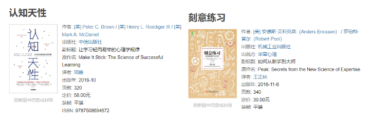

认知心理学：

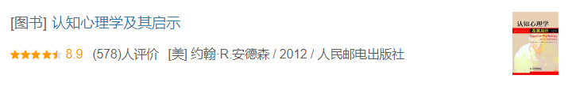

**脑科学**

脑科学书籍：

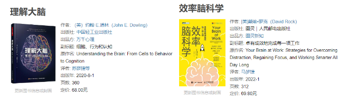

Bilibili已经购买了的脑科学课程：

还有就是要警惕自己上瘾：

**学习技巧**

是Coursera上面的一门非常好的学习相关的课程：Learning how to learn。

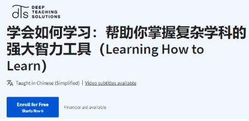

还有就是YJango在Bilibili上面的两门公开课程：学习观和断墨寻径。

另外YJango在Bilibili上开了一个付费课程，可以报名一下感谢这些视频提供的帮助。

## 冥想与幸福

冥想采用的是HeadSpace的冥想课程和大师课：

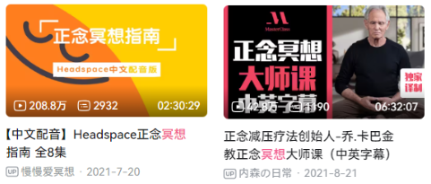

接着进行正念相关的训练：

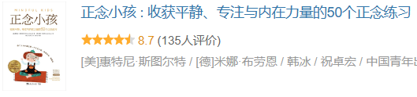

幸福课程则首先采用哈佛大学的幸福课：

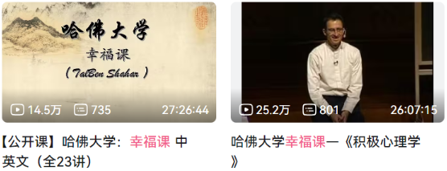

接着是动机在杭州的几本书籍：

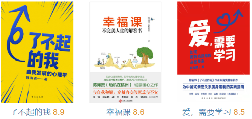

## 社会实践

首先需要阅读的是桥水基金的创始人瑞·达利欧的几本书籍：

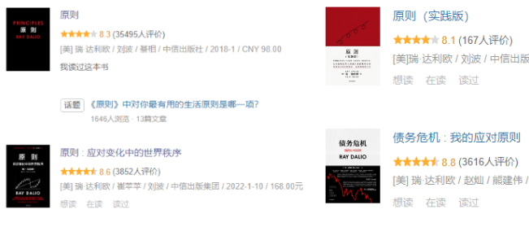

接着是控制论书籍：

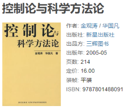

然后是穷查理宝典：

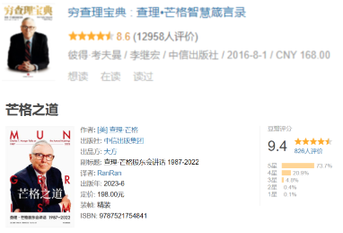

## 身体健康

**健身**

已经购买的一个Bilibili上面的视频：

然后是两本书籍：

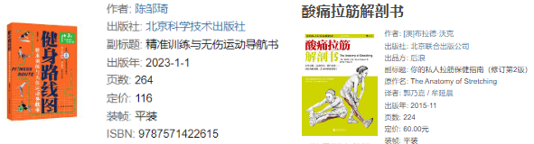

**健康**

人都是会衰老的，重点在于如何面对衰老：

# 成为数据科学家

## 编程语言

**Python语言**

Python语言在之前已经学过了《Python编程：从入门到实践》这本书。

现在需要做的是通过大量的练习来巩固一下和掌握一些更高的特性：

然后可以使用网络上的一些Python习题：

1. [Python Practice: 93 Unique Online Coding Exercises](https://www.dataquest.io/blog/python-practice/#core-practice)
2. https://www.lintcode.com/problem/?typeId=8
3. https://pynative.com/python-exercises-with-solutions/
4. [https://www.nowcoder.com/exam/oj?page=1&tab=Python%E7%AF%87&topicId=344](https://www.nowcoder.com/exam/oj?page=1&tab=Python篇&topicId=344)

**R语言编程**

为什么使用R语言

> R语言是一种用于数据分析和统计建模的编程语言和环境。它具有丰富的统计和数据可视化包，以及强大的数据操作和处理能力。数据科学家需要学习R语言，因为它是数据科学的重要工具之一，特别适用于统计分析、数据可视化和数据挖掘。R提供了专门用于数据科学的包，如ggplot2、dplyr和caret，使得数据分析和建模更加高效。此外，R拥有庞大的社区支持，有大量的开源资源和文档，使学习和解决数据科学问题更加便捷。学习R语言可以增加数据科学家的工具箱，帮助他们更好地理解数据、制定预测模型和进行深入的统计分析。

R语言的两门Udemy的教程为：

使用的书籍为：

**SQL语言**

SQL的两本书籍：

然后是大量的习题：

1. https://www.lintcode.com/problem/?typeId=3
2. https://sqlzoo.net/wiki/SQL_Tutorial/zh
3. http://xuesql.cn/
4. [https://www.nowcoder.com/exam/oj?page=1&tab=SQL%E7%AF%87&topicId=199](https://www.nowcoder.com/exam/oj?page=1&tab=SQL篇&topicId=199)
5. https://leetcode.cn/problemset/database/

## 数据分析

数据分析入门采用的书籍为：

观看和学习在Bilibili上面购买的两门课程：

然后是两本大部头书籍：

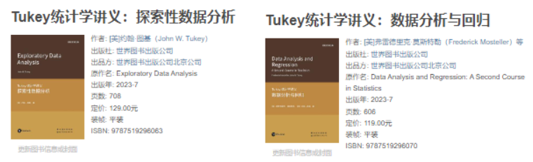

这是两本书的作者的简历：

> 约翰·图基是一位杰出的数学家和统计学家,被誉为”数据科学之父”。他提出了探索性数据分析,创造了”比特”和”软件”一词,发明了快速傅里叶变换等广为人知的理论和算法。他获得了诸多荣誉,包括国家科学奖章和IEEE最高荣誉奖章。
>
> 弗雷德里克·莫斯特勒是20世纪最杰出的统计学家之一,师从约翰·图基,后成为哈佛大学统计系创系者和首任系主任。他曾担任多个统计学会会长,并获选为美国国家科学院、美国国家医学院等院士。

最后是贝叶斯数据分析的书籍：

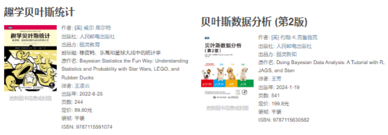

一些在线的练习：

1. [https://www.nowcoder.com/exam/oj?page=1&tab=Python%E7%AF%87&topicId=326](https://www.nowcoder.com/exam/oj?page=1&tab=Python篇&topicId=326)
2. https://leetcode.cn/studyplan/30-days-of-pandas/

另外补充一本高性能Python和数据分析的书籍：

## 数据可视化

可视化的理论和练习：

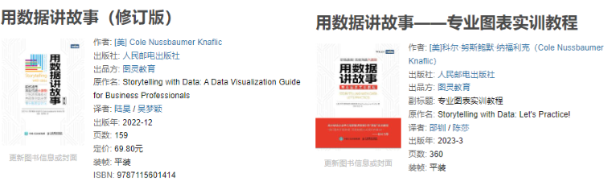

## 人工智能

人工智能的两门通识课程：

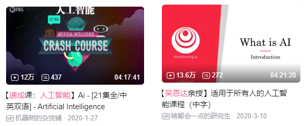

接着是较为系统的课程：

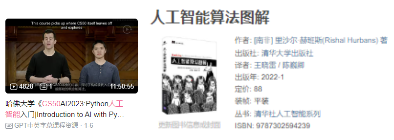

另外是bilibili上面购买了的课程：

## 数据科学

**数据科学实战**

进行数据科学实战来提升自己的能力：

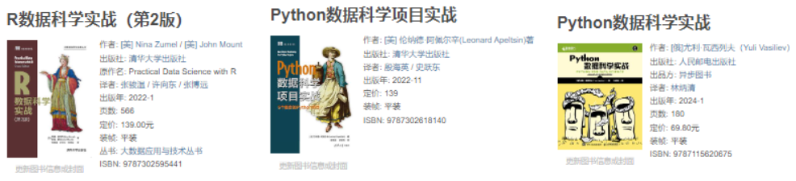

另外是一些Kaggle的实战课程：

A collection of data science take home challenges：

这本书可以最后用来进行训练。

大数据相关的两本书籍：

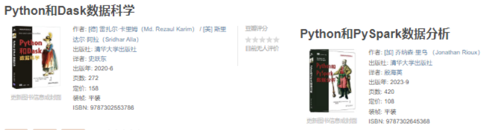

## 无监督学习

首先是最经典的书籍：

然后是Bilibili的课程：

## 机器学习

**机器学习入门**

机器学习的入门资料为：

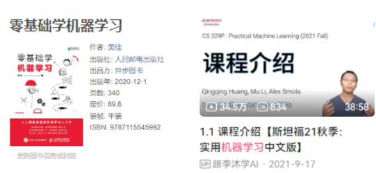

接着是这两本书籍：

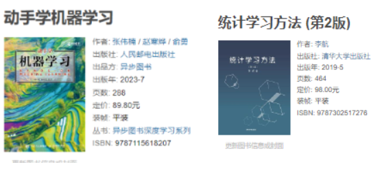

两本最为经典的教程书籍为：

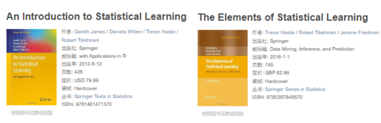

**机器学习实战**

首先量Manning出版社的两本书：

这里有一位老哥，这位老哥有一个简短的书籍：

图机器学习：

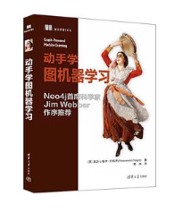

## 深度学习

最简单的入门书籍：

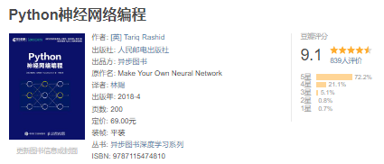

非常好的三本书籍：

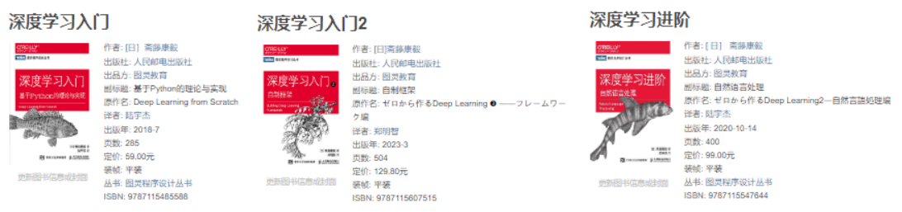

然后是两本大佬的书籍：

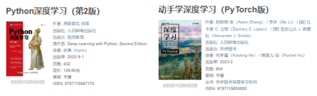

然后是李沐大佬的深度学习视频：

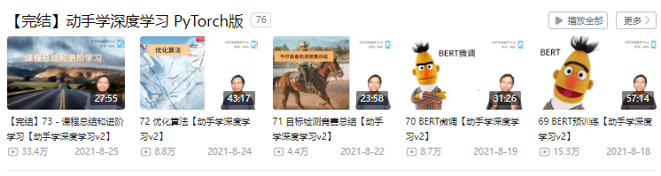

## 强化学习

强化学习的入门书籍采用的是：

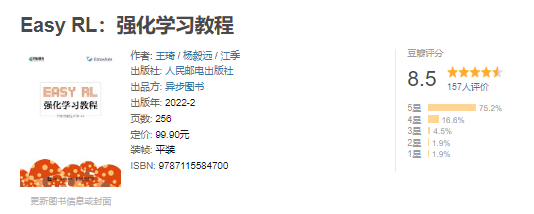

系统性书籍采用的是：

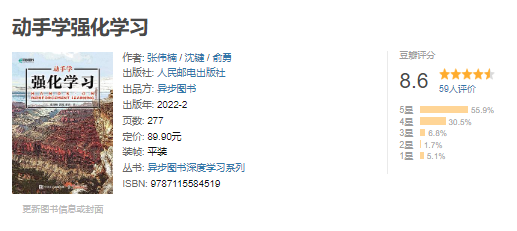

另外需要等这本日文书的中文译本翻译出来：

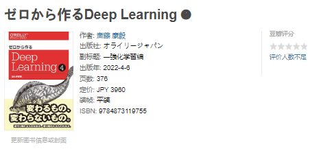

## 因果推断

因果推推断是一种统计方法，主要用于估计一个变量对另一个变量的影响或效果。它试图回答的核心问题是：“一个事物的变化会如何影响另一个事物？” 这与描述性统计或关联分析不同，因为因果推断不仅仅是描述数据之间的关系，而是尝试确定一个因素是否直接导致了另一个因素的改变。

因果推断的入门书籍为：

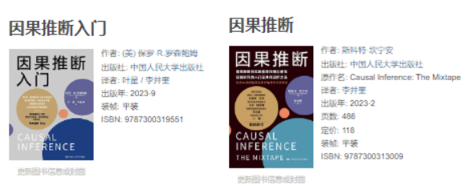

接着是Pearl的书籍：

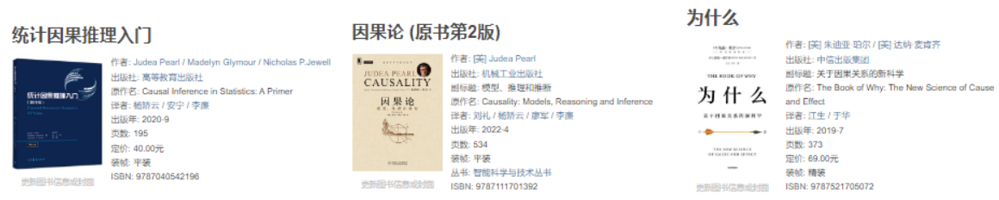

## 自然语言处理

自然语言处理推荐使用的书籍是：

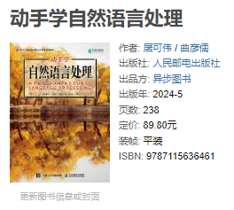

自然语言处理实战：

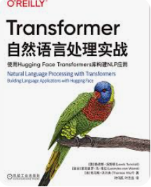

关于生成式人工智能的介绍：

一门系统的课程：

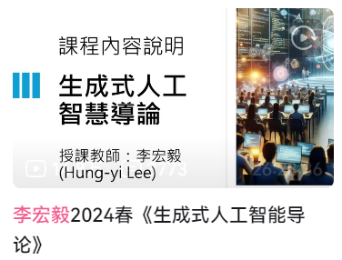

## 时间序列

Python语言的时间序列书籍：

时间序列的实战：

## 鸢尾花书籍系列

这是生姜DrGinger的系统性书籍：

## 程序员的补充学习

**C++语言**

C++语言采用AcWing购买的一个课程：

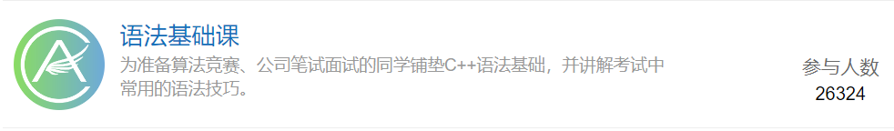

和Udemy上面的两门课程：

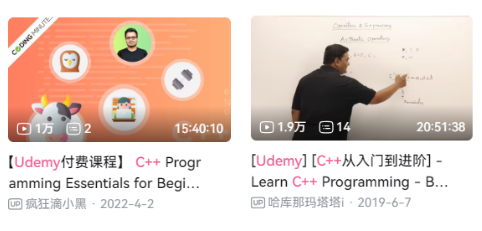

**数据结构与算法**

数据结构与算法的入门课程采用：

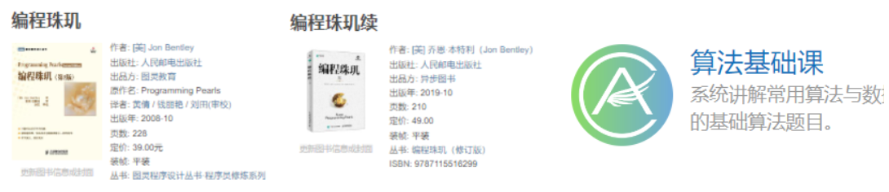

进阶课程则采用：

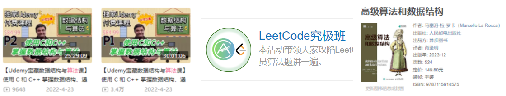

然后是大量的练习和面试习题：

**Linux使用**

Linux的使用只需要简单的学习一下关于命令行之类的东西就可以了：

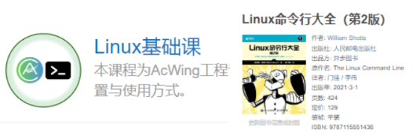

**Git和Github的使用**

Git与Github的使用：

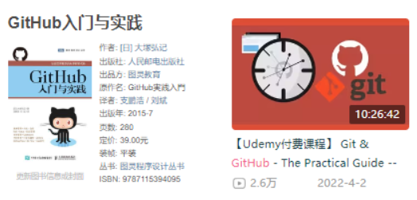

# 数学基础

## 通识与科普

关于数学思维的科普书籍阅读：

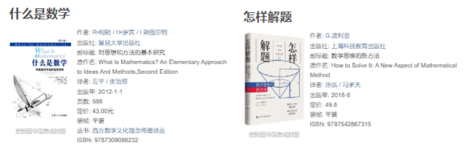

## 程序员的数学

这两本书是快速的入门：

然后使用专门的数据科学/机器学习/深度学习相关的数学书籍来进行学习：

系统性的回顾微积分，则需要观看：

> 1. 麻省理工公开课：单变量微积分
> 2. 麻省理工公开课：单变量微积分 习题课
> 3. 麻省理工公开课：多变量微积分
> 4. 麻省理工公开课：多变量微积分 习题课

微积分的知识可以使用**3Blue1Brown**的[【官方双语/合集】*微积分的本质* - 系列合集](https://www.bilibili.com/video/BV1qW411N7FU/?spm_id_from=333.337.search-card.all.click)来进行进一步的了解，同样的线性代数也是：[【官方双语/合集】线性代数的本质 - 系列合集](https://www.bilibili.com/video/BV1ys411472E/)，需要进行反复的观看。

**线性代数**

线性代数的进一步学习采用麻省理工公开课的线性代数教程：

1. [麻省理工学院 - MIT - *线性代数*（我愿称之为*线性代数*教程天花板）](https://www.bilibili.com/video/BV16Z4y1U7oU/)
2. [麻省理工学院 - MIT - *线性代数*/中英文版，助教：陈莉楠（我愿称为最详](https://www.bilibili.com/video/BV1VZ4y1a76K/)

配套的书籍为：《[线性代数（第5版）](https://book.douban.com/subject/34820335/)》。

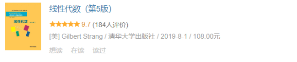

> 最后看的书籍为：[线性代数应该这样学 : 第3版](https://book.douban.com/subject/26886299/)，习题的答案在：http://linearalgebras.com/ 。

同样的线性代数也是：[【官方双语/合集】线性代数的本质 - 系列合集](https://www.bilibili.com/video/BV1ys411472E/)，需要进行反复的观看。

## 概率论与数理统计

统计思维或者历史：

统计学的入门教程：

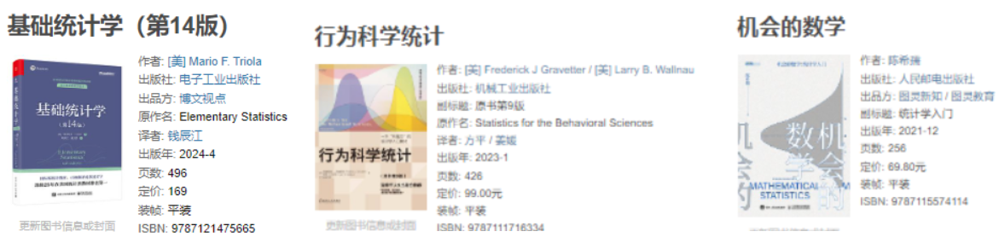

概率论基础课程：

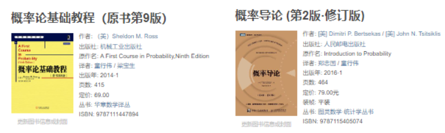

接着是基于测度论的教程：

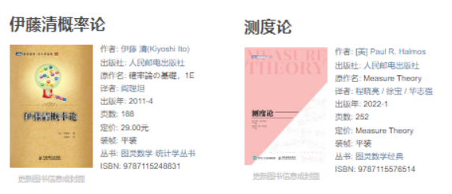

# 成为一位插画家

## 艺术史与美学

首先是艺术史相关的书籍：

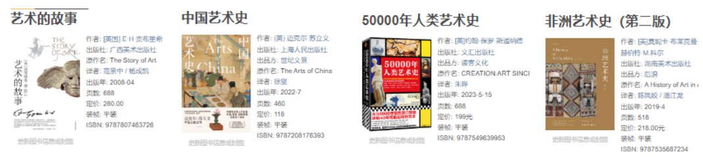

然后是关于美学的知识：

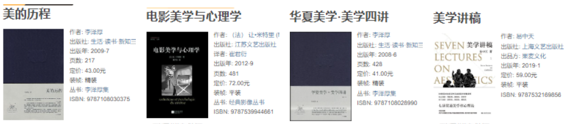

## 绘画基础课程

基础入门书籍：

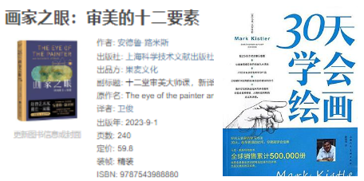

入门的公开视频教程：

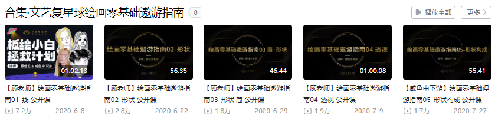

基础课程：

分别为：Krenz的三门课和顾佳艺的造型与色彩基础班。

## 绘画进阶课程

进阶课程首先采用柯一正的自然学徒会：

然后从这两位大佬的课程中选择一门课程进行系统性学习：

# 通识教育

通识教育在这里主要分为三个部分：

1. 文史哲部分
2. 经济学
3. 生命与生活

## 经济学

推荐的一个书籍为：

经济学是现代人必须要掌握的知识，入门的书籍为：[经济学原理(第7版) : 微观经济学分册+宏观经济学分册](https://book.douban.com/subject/26435630/)。

在这之后需要从经济学的视角来了解一下中国的情况：

1. [置身事内 : 中国政府与经济发展](https://book.douban.com/subject/35546622/)
2. [解读中国经济 : 聚焦新时代的关键问题](https://book.douban.com/subject/30329810/)
3. [结构性改革 : 中国经济的问题与对策](https://book.douban.com/subject/35147504/)
4. [中国经济改革进程 (第2版)](https://book.douban.com/subject/36198856/)
5. [以利为利 : 财政关系与地方政府行为](https://book.douban.com/subject/10587755/)

了解亚洲和全球的经济情况：

1. [亚洲大趋势](https://book.douban.com/subject/25893995/)
2. [逃不开的经济周期 : 历史，理论与投资现实](https://book.douban.com/subject/20272113/)
3. [经济状况，世界状况](https://book.douban.com/subject/36493902/)

还有就是达瑞欧的书籍和视频：

1. [债务危机 : 我的应对原则](https://book.douban.com/subject/30486499/)
2. [经济机器是如何运行的 （全集）](https://www.douban.com/link2/?url=https://www.bilibili.com/video/BV1zJ411L76N/&link2key=9beaaaff9e)

具体的一些操作可以看一些关于财富管理或者投资理财的书籍：

1. [小狗钱钱](https://book.douban.com/subject/35295592/)
2. [财富自由之路](https://book.douban.com/subject/27094706/)
3. [聪明的投资者（第4版注疏点评版）](https://book.douban.com/subject/26752026/)
4. [手把手教你读财报 (新准则升级版) : 财报是用来排除企业的](https://book.douban.com/subject/35299355/)
5. [手把手教你读财报2 : 18节课看透银行业](https://book.douban.com/subject/26965847/)

## 文学

**如何阅读**

如何阅读系列：

**文学史书籍**

世界和中国文学史：

**小说写作**

从写作的角度去看小说：

**小说阅读**

武侠小说：

**推理小说**

主要的作者和代表作：

| 作者             | 代表作                                                       |
| ---------------- | ------------------------------------------------------------ |
| 阿瑟·柯南·道尔   | 《福尔摩斯探案全集》： 《巴斯克维尔的猎犬》、《四签名》、《血字的研究》 |
| 阿加莎·克里斯蒂  | 《阿加莎·克里斯蒂推理小说全集》： 《东方快车谋杀案》、《无人生还》、《尼罗河上的惨案》 |
| 艾勒里·奎因      | 《艾勒里·奎因探案集》： 《希腊棺材之谜》、《罗马帽子之谜》、《X的悲剧》 |
| 江户川乱步       | 《江户川乱步推理小说集》： 《阴兽》、《怪人二十面相》、《人间椅子》 |
| 弗朗茨·卡夫卡    | 《卡夫卡的城堡》                                             |
| 卡尔·海森        | 《卡尔·海森推理小说集》： 《剃刀的边缘》、《绝对的声音》、《自然死亡》 |
| 约翰·狄克森·卡尔 | 《约翰·狄克森·卡尔推理小说集》： 《三口棺材》、《爱德华夫人的冒险》、《绞首台岛》 |
| 乔治·西默农      | 《梅格雷探案集》： 《梅格雷和他的死人》、《梅格雷的愤怒》、《梅格雷与玩具村》 |
| 松本清张         | 《松本清张推理小说集》： 《点与线》、《砂器》、《零的焦点》  |
| 岛田庄司         | 《岛田庄司推理小说集》： 《占星术杀人魔法》、《斜屋犯罪》、《御手洗洁的冒险》 |
| 东野圭吾         | 《白夜行》、《嫌疑人X的献身》、《恶意》、《秘密》、《幻夜》  |
| 今村昌弘         | 《尸人庄谜案》、《马戏团之夜》、《狱门岛》                   |
| 雷蒙德·钱德勒    | 《漫长的告别》、《大眠》、《湖底女人》                       |
| 达希尔·哈米特    | 《马耳他之鹰》、《红色收割》、《玻璃钥匙》                   |
| 莫里斯·勒布朗    | 《亚森·罗平》系列： 《亚森·罗平绅士大盗》、《空心针》、《金三角》 |
| 鲁斯·伦德尔      | 《威克福德》系列、《斯坦霍普》系列                           |
| P.D.詹姆斯       | 《亚当·达尔格里什》系列： 《覆灭的荆棘》、《黑塔》、《无罪的谋杀》 |
| 迈克尔·康奈利    | 《哈里·博施》系列： 《黑冰》、《黑色回声》、《迷失之光》     |
| 罗伯特·范·古利克 | 《狄仁杰》系列： 《狄公断案》、《铜钟案》、《铁钉案》        |
| 宫部美雪         | 《火车》、《模仿犯》、《无名之毒》                           |
| 斯蒂格·拉森      | 《千禧年三部曲》： 《龙文身的女孩》、《玩火的女孩》、《捅马蜂窝的女孩》 |

**科幻小说**

这是主要的作品：

| 作者                 | 代表作                                                     |
| -------------------- | ---------------------------------------------------------- |
| 艾萨克·阿西莫夫      | 《基地》系列、《机器人》系列、《神们自己》                 |
| 阿瑟·克拉克          | 《2001太空漫游》、《与拉玛相会》、《天堂的喷泉》           |
| 菲利普·K·迪克        | 《仿生人会梦见电子羊吗？》、《高堡奇人》、《尤比克》       |
| 弗兰克·赫伯特        | 《沙丘》系列                                               |
| 雷·布拉德伯里        | 《华氏451度》、《火星编年史》、《蒲公英酒》                |
| 威廉·吉布森          | 《神经漫游者》、《模式识别》、《全息玫瑰碎片》             |
| 奥森·斯科特·卡德     | 《安德的游戏》系列、《死者代言人》、《安德的影子》         |
| 道格拉斯·亚当斯      | 《银河系漫游指南》系列                                     |
| 罗伯特·海因莱因      | 《星船伞兵》、《异乡异客》、《月亮是地狱的情人》           |
| 尤金·艾文斯基        | 《午夜的孩子》、《光晕之战》、《天际线》                   |
| 刘慈欣               | 《三体》系列、《球状闪电》、《超新星纪元》                 |
| 阿尔弗雷德·贝斯特    | 《毁灭之路》、《虎的心》、《被淹没的世界》                 |
| 詹姆斯·S·A·科里      | 《太空无垠》系列                                           |
| 尤西·佩特斯          | 《六号梦》、《黑暗的左手》、《拉缇尔的女皇》               |
| 伊恩·M·班克斯        | 《文化》系列、《梦的仪式》、《精神化》                     |
| 克里斯托弗·普雷斯特  | 《不可能的世界》、《时光之墙》、《机器之心》               |
| 斯坦尼斯瓦夫·莱姆    | 《索拉里斯》、《未来学大会》、《伊甸》                     |
| 埃里克·弗兰克·拉塞尔 | 《心灵奇兵》、《征服火星》、《身处异乡》                   |
| 迈克尔·克莱顿        | 《侏罗纪公园》、《时间线》、《安德罗墨达菌株》             |
| 尼尔·斯蒂芬森        | 《雪崩》、《钻石时代》、《七恶魔》                         |
| 安妮·麦卡弗里        | 《龙骑士》系列、《龙飞鸿鹄》、《龙之歌》                   |
| 玛格丽特·阿特伍德    | 《使女的故事》、《末世男女》、《疯狂的亚当》               |
| 哈尔兰·埃里森        | 《我无口却必须尖叫》、《那来日方长》、《为一切欢呼的家园》 |
| 乔治·奥威尔          | 《1984》、《动物农场》、《缅甸岁月》                       |
| 赫伯特·乔治·威尔斯   | 《时间机器》、《世界大战》、《隐身人》                     |
| 玛丽·雪莱            | 《弗兰肯斯坦》                                             |
| NK·杰米辛            | 《第五季》                                                 |
| 奥克塔维娅·巴特勒    | 《亲缘》                                                   |
| 石黑一雄             | 《别让我走》                                               |
| 姜峯楠               | 《呼吸》                                                   |
| 埃米莉·圣约翰·曼德尔 | 《第十一站》                                               |
| 奥尔加·拉文          | 《雇员》                                                   |
| 奥尔德斯·赫胥黎      | 《美丽新世界》                                             |
| 游朝凯               | 《科幻宇宙生存指南》                                       |
| 库尔特·冯内古特      | 《泰坦的女妖》                                             |
| 杰夫·范德梅尔        | 《湮灭》                                                   |
| 里弗斯·所罗门        | 《鬼不仁》                                                 |
| 多丽丝·莱辛          | 《什卡斯塔》                                               |
| 任碧莲               | 《抵抗者》                                                 |
| 妮古拉·格里菲思      | 《亚扪》                                                   |
| 路易丝·厄德里奇      | 《人间上帝的未来家园》                                     |
| 村上春树             | 《1Q84》                                                   |
| 科尔森·怀特黑德      | 《第一区》                                                 |
| 林肯·米歇尔          | 《物色身体的人》                                           |
| 贝姬·钱伯斯          | 《通往小怒行星的长路》                                     |
| 塞缪尔·德拉尼        | 《达尔格伦》                                               |
| 丹·西蒙斯            | 《许珀里翁》                                               |
| 柴纳·米耶维尔        | 《城与城》                                                 |
| 金·斯坦利·鲁宾逊     | 《红火星》                                                 |
| 凯瑟琳·瓦伦特        | 《发光》                                                   |
| PD·詹姆斯            | 《人类之子》                                               |
| 斯蒂芬·金            | 《末日逼近》                                               |
| 塔德·汤普森          | 《蔷薇水》                                                 |
| 马德琳·伦格尔        | 《时间的皱纹》                                             |
| 阿迈勒·穆赫塔尔      | 《你就是这样输掉时间战争的》                               |
| 安东尼·伯吉斯        | 《发条橙》                                                 |
| 恩内迪·奥科拉福      | 《火鸟书》                                                 |
| 沃尔特·米勒          | 《莱博维茨的赞歌》                                         |
| 卡尔·萨根            | 《接触》                                                   |
| 萨拉·盖利            | 《复制人妻》                                               |

**日本现当代文学**

| 作者       | 代表作                                                     |
| ---------- | ---------------------------------------------------------- |
| 夏目漱石   | 《我是猫》、《心》、《少爷》                               |
| 芥川龙之介 | 《罗生门》、《竹林中》、《蜘蛛之丝》                       |
| 川端康成   | 《雪国》、《千只鹤》、《古都》                             |
| 大江健三郎 | 《个人的体验》、《万延元年的足球队》、《奇怪的工作》       |
| 村上春树   | 《挪威的森林》、《1Q84》、《海边的卡夫卡》                 |
| 谷崎润一郎 | 《细雪》、《春琴抄》、《钥匙》                             |
| 三岛由纪夫 | 《金阁寺》、《春雪》、《假面的告白》                       |
| 安部公房   | 《砂女》、《箱男》、《他人的脸》                           |
| 宫泽贤治   | 《银河铁道之夜》、《风之又三郎》、《春和修罗》             |
| 松本清张   | 《砂器》、《点与线》、《零的焦点》                         |
| 吉本芭娜娜 | 《厨房》、《TUGUMI》、《白河夜船》                         |
| 村上龙     | 《无限近似于透明的蓝》、《69》、《共生虫》                 |
| 太宰治     | 《人间失格》、《斜阳》、《奔跑吧！梅勒斯》                 |
| 泷口修造   | 《昆虫图鉴》、《新魔道书》、《玩具集》                     |
| 伊坂幸太郎 | 《重力小丑》、《金色梦乡》、《死神的精确度》               |
| 东野圭吾   | 《白夜行》、《嫌疑人X的献身》、《解忧杂货店》              |
| 石黑一雄   | 《长日将尽》、《别让我走》、《被掩埋的巨人》               |
| 村上阳一郎 | 《东京奇谭集》、《世界尽头与冷酷仙境》、《斯普特尼克恋人》 |
| 泉镜花     | 《高野圣僧》、《夜叉池》、《草迷宫》                       |

**网络小说**

中国的网络小说参考这个答案中的内容：

你看过什么封神级的网络小说? - 温柔半仙儿的回答 - 知乎
https://www.zhihu.com/question/359404780/answer/3215303297

**轻小说**

主要为：狼与香辛料，来自新世界。一起一些其他的主要的轻小说。

## 哲学

**思想史书籍**

思想史书籍为：

**哲学史**

世界哲学史：

西方哲学史：

以及中国哲学史：

**认知哲学史**

认识论首先推荐的是：[世界观（原书第3版） : 现代人必须要懂的科学哲学和科学史](https://book.douban.com/subject/35181762/)，然后是：[什么是科学](https://book.douban.com/subject/36179194/)。

接着是几本书：[科学究竟是什么](https://book.douban.com/subject/35305081/)，[科学革命的结构](https://book.douban.com/subject/35951747/)。

**政治哲学**

政治哲学首先推荐的是：[当代政治哲学](https://book.douban.com/subject/26389495/)，这本书的作者存在着倾向性，但是总体上的阐述客观公正，作者对功利主义的立场做出了回应，但是书籍中也可以对功利主义的立场进行辩护。如果上来就读这本书感觉太晦涩，可以先观看视频：[哈佛大学公开课：公正该如何是好](https://www.douban.com/link2/?url=https://www.bilibili.com/video/BV1wx411S7fK/&link2key=9beaaaff9e)，进行仔细的思考。

政治哲学不同于数学或者自然科学，并不存在着一个绝对正确的答案，重要的是有理有据的争论，所以上来就阅读某一个流派的著作攘夷让自己有先入为主的立场，从而形成不加思辨的复读的处境当中，这里推荐的书籍是：[政治哲学 : 问题与争论](https://book.douban.com/subject/26177185/)。

政治思想可以推荐阅读：[现代政治的思想与行动](https://book.douban.com/subject/27661640/)，这本书收录了作者自第二次世界大战结束之后约十年间发表的有关政治学及现代政治问题的主要论文，还可以阅读这本书：[现代政治思想史 : 从霍布斯到马克思](https://book.douban.com/subject/36093271/)。

至此，可以具体的了解一下功利主义的立场，这个立场是一个绕不开的立场，任何的政治哲学流派都可以被认为是功利主义的或者其他，并且其他流派需要对功利主义做出回应。书籍有：[功利主义](https://book.douban.com/subject/30401283/)，关于实践：[生活世界中的功利主义 : 哲学原理与历史实践](https://book.douban.com/subject/36402566/)，赞成亦或者是反对：[功利主义 : 赞成与反对](https://book.douban.com/subject/30145666/)。功利主义会不可避免的收到自由主义的影响，推荐阅读：[论自由](https://book.douban.com/subject/30394971/)，[自由四論](https://book.douban.com/subject/4170225/)，[自由及其背叛 : 人类自由的六个敌人](https://book.douban.com/subject/34869836/) 和 [逃避自由](https://book.douban.com/subject/30297158/)。

国内作者推荐阅读的一些书籍是：[坏世界研究 : 作为第一哲学的政治哲学](https://book.douban.com/subject/3669381/)，[论可能生活 : 一种关于幸福和公正的理论（修订版）](https://book.douban.com/subject/1083309/) 。

**伦理学**

道德哲学首先推荐的是这本：[牛津大学哲学通识课：道德哲学](https://book.douban.com/subject/33417102/)，接着可以阅读：[元伦理学 : 当代研究导论](https://book.douban.com/subject/36093272/)，在此之后，可以阅读：[伦理学与生活（第11版）](https://book.douban.com/subject/35146091/)，实际上伦理与伦理学的关系就像是鸟类和鸟类学的关系，伦理应该被放到社会人文这个领域之下，不过我把一些相关的凑在了一起。

国内学者推荐的基本书籍为：[沉重的肉身 : 现代性伦理的叙事纬语](https://book.douban.com/subject/26392840/)，[灵之舞](https://book.douban.com/subject/4189215/)，[人之镜](https://book.douban.com/subject/4189212/)，[灵魂之旅](https://book.douban.com/subject/26902331/)。

**佛学与道学**

佛陀的传记：[佛陀传](https://book.douban.com/subject/25819842/)，佛教常识扫盲：[佛教尝试问答](https://book.douban.com/subject/20470264/) 和 [学佛三书](https://book.douban.com/subject/3042785/)，佛教的世界观是怎么样的：[佛教世界观](https://book.douban.com/subject/26608058/)，佛教哲学：[中国佛教哲学要义](https://book.douban.com/subject/11637325/)，佛经：[佛经七讲](https://book.douban.com/subject/24851437/)，心经与金刚经：[费勇讲《金刚经》《心经》：教你断离一切烦恼](https://www.bilibili.com/cheese/play/ss4962?csource=Hp_searchresult&spm_id_from=333.337.0.0)。

道家：[道德经](https://book.douban.com/subject/35461183/)，[庄子](https://book.douban.com/subject/2046236/)。

## 历史

**中国历史与社会**

了解一下中国现在的组织形式：[中国国家治理的制度逻辑 : 一个组织学研究](https://book.douban.com/subject/26901114/)。

历史我不确定是否要加入到社会科学中来，但是我出于分类中的困难，我还是加入到了社会科学中。

中国的历史非常的悠久，所以如何想要系统性的了解，基本是不可能的，这里只给出书籍来进行大概的了解和推荐一些比较知名的历史相关的书籍：

1. [半小时漫画中国史（修订版）](https://book.douban.com/subject/27003014/)
2. [叫魂 : 1768年中国妖术大恐慌](https://book.douban.com/subject/25912076/)
3. [天朝的崩溃](https://book.douban.com/subject/25935941/)
4. [天国之秋](https://book.douban.com/subject/25938605/)
5. [中华帝国晚期的性、法律与社会](https://book.douban.com/subject/36197606/)
6. [中华帝国晚期的叛乱及其敌人 : 1796-1864年的军事化与社会结构](https://book.douban.com/subject/1063540/)
7. [中国现代国家的起源](https://book.douban.com/subject/25750468/)
8. [红星照耀中国（新译本） : 斯诺基金会官方授权简体中文版](https://book.douban.com/subject/30296632/)
9. [现代中国的形成（1600—1949）](https://book.douban.com/subject/35662692/)
10. [南京大屠杀 : 第二次世界大战中被遗忘的大浩劫](https://book.douban.com/subject/26545308/)
11. [党员、党权与党争 : 1924～1949年中国国民党的组织形态](https://book.douban.com/subject/30209303/)
12. [毛泽东、斯大林与朝鲜战争](https://book.douban.com/subject/1009529/)
13. [邓小平时代](https://book.douban.com/subject/20424526/)

第一本书其实是非常简短的，有许多细节之类的东西都没有，很多事情都是一笔带过，但是我并没有办法找到简略的概括性的阐述中国历史的书籍，只能够做出此番推荐，将更多的内容留在现当代的历史上。

**其他的一些国家社会与历史**

欧洲的历史与社会：

1. [你一定爱读的极简欧洲史 : （增订版）](https://book.douban.com/subject/34663236/)
2. [欧洲史 : （彩色插图本）每个人都应该是历史学家](https://book.douban.com/subject/26284539/)
3. [欧洲中世纪史 (豆瓣)](https://book.douban.com/subject/2326273/)
4. [第一次世界大战史](https://book.douban.com/subject/35587342/)
5. [第二次世界大战史](https://book.douban.com/subject/35587343/)

美国的历史与社会：

1. [美国人的历史](https://book.douban.com/subject/35519617/)
2. [美国与美国人](https://book.douban.com/subject/36070902/)
3. [美国宪政历程 : 影响美国的25个司法大案](https://book.douban.com/subject/1144185/)

其他一些国家：

1. [终结所有和平的和平 : 奥斯曼帝国的衰亡与现代中东的形成](https://book.douban.com/subject/35140033/)
2. [征服与革命中的阿拉伯人 : 1516年至今](https://book.douban.com/subject/33408126/)
3. [穿越百年中东](https://book.douban.com/subject/26700104/)
4. [无规则游戏](https://book.douban.com/subject/30348068/)
5. [海洋帝国 : 地中海大决战](https://book.douban.com/subject/25891321/)
6. [埃及、希腊与罗马 : 古代地中海文明](https://book.douban.com/subject/34970398/)
7. [以色列](https://book.douban.com/subject/30269311/)
8. [印度通史](https://book.douban.com/subject/10570322/)
9. [非洲通史（第四版）](https://book.douban.com/subject/35369653/)

关于中亚的：[丝绸之路 : 一部全新的世界史](https://book.douban.com/subject/26853835/) 和 [从张骞到马可·波罗 : 丝绸之路十八讲](https://book.douban.com/subject/36187352/)，中亚的历史书籍讲的比较少。

**日本社会**

日本的历史：

1. [日本史](https://book.douban.com/subject/36071139/)
2. [日本史 : 1600~2000 從德川幕府到平成時代](https://book.douban.com/subject/27024149/)
3. [发现东极 : 日本三部曲](https://book.douban.com/subject/36115458/)
4. [繁荣与停滞 : 日本经济发展和转型](https://book.douban.com/subject/36093153/)

**地缘政治**

温骏轩是当年天涯的一位大神，当时有一个名帖为从地缘的角度看世界，后面有部分整理成书籍，可以阅读：

1. [谁在世界中心](https://book.douban.com/subject/27045287/)
2. [地缘看世界](https://book.douban.com/subject/35307970/)
3. [地图里的人类史](https://book.douban.com/subject/36482624/)
4. [地缘看三国](https://book.douban.com/subject/36519383/)

## 生命与生活

**生命的起源**

生命的起源推荐阅读这本书籍：[复杂生命的起源](https://book.douban.com/subject/35221093/)。

**生命是什么**

推荐这两本书籍：

1. [生命是什么](https://book.douban.com/subject/30263244/)
2. [生命与新物理学](https://book.douban.com/subject/33590444/)

第一本是国内的一位生物学者写的，第二本则结合了物理学提供了一个全新的视角。

**进化论**

进化论其实是一门比较新的学科，但是发展到现在也与达尔文提出的理论有着较大的不同了，系统性的学习可以阅读《生物进化》，不过作为通识，可以阅读：[王立铭进化论讲义](https://book.douban.com/subject/35780513/)。

另外还可以阅读：[达尔文的危险思想 : 演化与生命的意义](https://book.douban.com/subject/36216333/) 和 [进化思维 : 达尔文对我们世界观的影响](https://book.douban.com/subject/4292525/)，这有助于调节你的一些观念。

一些更加具体一点儿的内容：[生命的跃升 : 40亿年演化史上的十大发明](https://book.douban.com/subject/26679862/)，[生命的运作方式](https://book.douban.com/subject/30396021/)，[美的进化 : 被遗忘的达尔文配偶选择理论，如何塑造了动物世界以及我们](https://book.douban.com/subject/30320889/)，[地球上最伟大的表演 : 进化的证据](https://book.douban.com/subject/27001653/)。

**两性择偶**

关于两性择偶，其实之前的一些书籍也能够窥出一二，但是更加系统的阐述需要阅读：

1. [爱情简史 : 人类进化史中的两性博弈](https://book.douban.com/subject/27039402/)
2. [欲望的演化（最新修订版） : 人类的择偶策略](https://book.douban.com/subject/35153840/)
3. [进化心理学(第4版) : 心理的新科学](https://book.douban.com/subject/26683297/)

**人类学相关**

裸猿三部曲：

1. [裸猿](https://book.douban.com/subject/4312810/)
2. [人类动物园](https://book.douban.com/subject/4312825/)
3. [亲密行为](https://book.douban.com/subject/4312829/)

同样的嗨哟：[猿猴的把戏 : 进化论破解人际潜规则](https://book.douban.com/subject/33436025/) 和 [黑猩猩的政治 : 猿类社会中的权力与性](https://book.douban.com/subject/35571898/)。

贾雷德·戴蒙德的书籍：

1. [枪炮、病菌与钢铁 : 人类社会的命运（修订版）](https://book.douban.com/subject/25902448/)
2. [昨日之前的世界 : 我们能从传统社会学到什么?](https://book.douban.com/subject/35684426/)
3. [剧变 : 人类社会与国家危机的转折点](https://book.douban.com/subject/35720347/)
4. [第三种黑猩猩 : 人类的身世与未来](https://book.douban.com/subject/35932683/)

还可以看一下一位国内的学者写的书籍：[群居的艺术 : 人类作为一种物种的生存策略](https://book.douban.com/subject/27058538/) 和 [第三牧场 : 社会结构如何塑造人性与文化](https://book.douban.com/subject/36322400/)。

# 娱乐

## 电影

[认识电影（修订第14版）](https://book.douban.com/subject/35459568/)：本书为长销40年的经典电影入门书《认识电影》第14次修订版。自问世以来，《认识电影》已被翻译为十几种语言，并被北京电影学院、北京大学、哈佛大学、MIT、纽约大学等知名院校指定为影视课程教材，深受全球读者和电影行业专业人士认可，被公认为了解电影艺术的入门佳作。

[电影的秘密 : 形式与意义（插图第6版）](https://book.douban.com/subject/30301599/)：书提供了五百多张精挑细选的插图、五十余篇影人及相关作品专题解析，对电影摄影、美术、表演、剪辑、声音、叙事、特效等构成元素进行了细致分析，并从电影风格、流派、美学、理论、批评的角度提供解读方法，从而全方位地阐释了“电影如何创造意义”。

## 纪录片

首先推荐的纪录片是：[人生七年1 ](https://www.douban.com/link2/?url=https://movie.douban.com/subject/2123439/&query=人生七年&cat_id=1002&type=search&pos=0)，本部纪录片采访来自英国不同阶层的十四个七岁的小孩子，他们有的来自孤儿院有的是上层社会的小孩。此后每隔七年，艾普特都会重新采访当年的这些孩子。人生的轮回从这十四个七岁的孩子真实生活开始，“七岁看老”，在这童言无忌的问与答中，人生七年又七年，震撼上演。除此之外，你还可以看一下其他国家版的人生七年：[日本人生七年1](https://www.douban.com/link2/?url=https://movie.douban.com/subject/25832581/&query=人生七年&cat_id=1002&type=search&pos=11)，[美国人生七年1 ](https://www.douban.com/link2/?url=https://movie.douban.com/subject/25832608/&query=人生七年&cat_id=1002&type=search&pos=14)和 [俄国人生七年1](https://www.douban.com/link2/?url=https://movie.douban.com/subject/5983724/&query=人生七年&cat_id=1002&type=search&pos=16)，其实我也希望中国能够有一部 中国：人生七年的纪录片。

接着推荐的纪录片是：[监视资本主义：智能陷阱](https://www.douban.com/link2/?url=https://movie.douban.com/subject/34960008/&query=监视资本主义：智能陷阱+The+Social+Dilemma+(2020)&cat_id=1002&type=search&pos=0)，我们发推文、点赞、分享 — 但日益依赖社交媒体会带来什么后果？随着数字平台日益成为人们保持联系的重要方式，硅谷内部人士通过暴露屏幕另一侧的隐藏内容，揭示了社交媒体如何重新改写文明。还有推荐的是：[第四公民](https://www.douban.com/link2/?url=https://movie.douban.com/subject/26059437/&query=第四公民+Citizenfour+(2014)&cat_id=1002&type=search&pos=0)，[维基解密的抗争](https://www.douban.com/link2/?url=https://movie.douban.com/subject/5423352/&query=维基解密&cat_id=1002&type=search&pos=1) 和 [我们窃取秘密：维基解密的故事](https://www.douban.com/link2/?url=https://movie.douban.com/subject/20451129/&query=维基解密&cat_id=1002&type=search&pos=3)。华尔街相关的则推荐：[华尔街 (2010)，](https://movie.douban.com/subject/5294309/)大[空头 The Big Short (2015)（这](https://movie.douban.com/subject/26303622/)个应该是电影），麦道[夫：华尔街吸金恶霸 Madoff: The Monster of Wall Street (2023) 和 ](https://movie.douban.com/subject/36192429/)散户大[战华尔街：游戏驿站传奇 Eat the Rich: The GameStop Saga (2022)。资本与](https://movie.douban.com/subject/35948779/)消费：黑钱 第[一季 Dirty Money Season 1 (2018)，无节制消](https://movie.douban.com/subject/27664017/)费[的元凶 The Men Who Made Us Spend (2014)，为什么贫穷](https://movie.douban.com/subject/25945379/)？[，致肥元凶，](https://movie.douban.com/subject/20393972/?from=subject-page)资[本主义：](https://movie.douban.com/subject/25745560/?from=subject-page)一[个爱情故事 Capitalism: A Love Story (2009)，资本主义 C](https://movie.douban.com/subject/3073198/)a[pitalisme (2014)，交换学校：阶级](https://movie.douban.com/subject/26425480/)分[化 School Swap: The Class Divide (2015)。](https://movie.douban.com/subject/26392858/)

接着推荐的是： [阿尔法围棋 ](https://www.douban.com/link2/?url=https://movie.douban.com/subject/27012433/&query=阿尔法围棋+AlphaGo+(2017)&cat_id=1002&type=search&pos=0)，部关于AlphaGo的纪录片定于4月21日在纽约翠贝卡电影节首映。该部纪录片由格雷格执导，演员表有李世石，樊麾，黄士杰，哈萨比斯和席尔瓦。关于人工智能，科技和信息，也绕不开硅谷，这里推荐系列电视剧： [硅谷 第一季 ](https://www.douban.com/link2/?url=https://movie.douban.com/subject/20644938/&query=硅谷&cat_id=1002&type=search&pos=0)，和一个了不起的骗局：[滴血成金：硅谷血检大骗局 ](https://www.douban.com/link2/?url=https://movie.douban.com/subject/30391767/&query=硅谷&cat_id=1002&type=search&pos=10)。

关于疫情，推荐观看：[生死金银潭 (2020)，](https://movie.douban.com/subject/35014846/)人[间世·抗疫特别节目 (2020)，在](https://movie.douban.com/subject/35075054/)武[汉 (2020) 和 ](https://movie.douban.com/subject/34976870/)中国医[生战疫版 (2020)。](https://movie.douban.com/subject/35067400/)

关于人体与疾病，推荐观看：[人体奥秘 Inside the Human Body (2011)，](https://movie.douban.com/subject/6558363/)细[胞，](https://movie.douban.com/subject/4717931/?from=subject-page)尖[端医疗的真相 The Bleeding Edge (2018)，病](https://movie.douban.com/subject/30234901/)毒[为何致命，寻](https://movie.douban.com/subject/4851629/?from=subject-page)找[治愈埃博拉病毒的方法，人](https://movie.douban.com/subject/26067831/?from=subject-page)体[奥妙之细胞的暗战，地](https://movie.douban.com/subject/20515275/?from=subject-page)平[线系列：战胜超级病菌 ，](https://movie.douban.com/subject/24754502/?from=subject-page)瘟疫[求生指南 和](https://movie.douban.com/subject/7015730/?from=subject-page) 绝对[好奇：细胞战场 。](https://movie.douban.com/subject/25716052/?from=subject-page)

游戏相关：[启动：Xbox的故事 第一季](https://www.douban.com/link2/?url=https://movie.douban.com/subject/35700245/&query=启动：Xbox的故事+第一季&cat_id=1002&type=search&pos=0)，[日本游戏音乐发展 Diggin’ in the Carts (2014) ](https://movie.douban.com/subject/25987095/)，剑[指高分 High Score (2020)，游](https://movie.douban.com/subject/35162178/)戏[的力量：任天堂故事 Playing with Power: The Nintendo Story (2021) 。](https://movie.douban.com/subject/35366026/)

一些当代的风云人物的纪录片：[回到太空 Return to Space (2022)，](https://movie.douban.com/subject/35809022/)马[斯克秀 The Elon Musk Show (2022)，火](https://movie.douban.com/subject/36117370/)星[时代：深入SpaceX MARS: Inside SpaceX (2018)，走进](https://movie.douban.com/subject/30422271/)比[尔：解码比尔·盖茨，特朗](https://movie.douban.com/subject/34807113/?from=subject-page)普[：一场美国梦，美国](https://movie.douban.com/subject/27194924/?from=subject-page)商[业大亨传奇，杰弗](https://movie.douban.com/subject/20277091/?from=subject-page)里[·爱泼斯坦：肮脏的财富。](https://movie.douban.com/subject/35067501/?from=subject-page)

关于教育：[盗火者：中国教育改革调查 盜火者：中國教育改革調查 (2013)，](https://movie.douban.com/subject/25830985/)高[考，](https://movie.douban.com/subject/26586730/?from=subject-page)哈[罗公学: 一座真正的英国学校 Harrow: A Very British School (2013)，交](https://movie.douban.com/subject/25722473/)换[学校：阶级分化。](https://movie.douban.com/subject/26392858/?from=subject-page)

关于艺术：[电影史话](https://movie.douban.com/subject/6793337/?from=subject-page)，[现代艺术大师](https://movie.douban.com/subject/4850393/?from=subject-page)，[摄影艺术百年史](https://movie.douban.com/subject/4154964/?from=subject-page)，[抽象：设计的艺术 第一季](https://movie.douban.com/subject/26961333/?from=subject-page)，[抽象：设计的艺术 第二季 Abstract: The Art of Design Season 2 (2019)，](https://movie.douban.com/subject/34840075/)三[色艺术史 ](https://movie.douban.com/subject/20503584/?from=subject-page)，印[象派 绘画与革命，](https://movie.douban.com/subject/10736430/?from=subject-page)印[象派 绘画与革命 The Impressionists - Painting and Revolution (2011)，洛](https://movie.douban.com/subject/10736430/)可[可：旅行，享乐，疯狂，B](https://movie.douban.com/subject/25814984/?from=subject-page)B[C：巴洛克！-从圣彼得到圣保罗，斯](https://movie.douban.com/subject/6778647/?from=subject-page)堪[的纳维亚艺术，法](https://movie.douban.com/subject/26367570/?from=subject-page)国[艺术，德](https://movie.douban.com/subject/26917006/?from=subject-page)国[艺术，西](https://movie.douban.com/subject/5450851/?from=subject-page)班[牙艺术，美](https://movie.douban.com/subject/4830349/?from=subject-page)国[艺术。](https://movie.douban.com/subject/10577859/?from=subject-page)

## 游戏

首先是宫崎老贼的魂系列游戏：

接着是魂Like游戏：

然后是类银河战士恶魔城游戏：

再接着是Rogue类游戏：

像素类游戏：

动作类游戏：

平台跳跃类游戏：

日式角色扮演游戏：

最后是战棋类游戏：

最后一个游戏是皇家骑士团重生。

